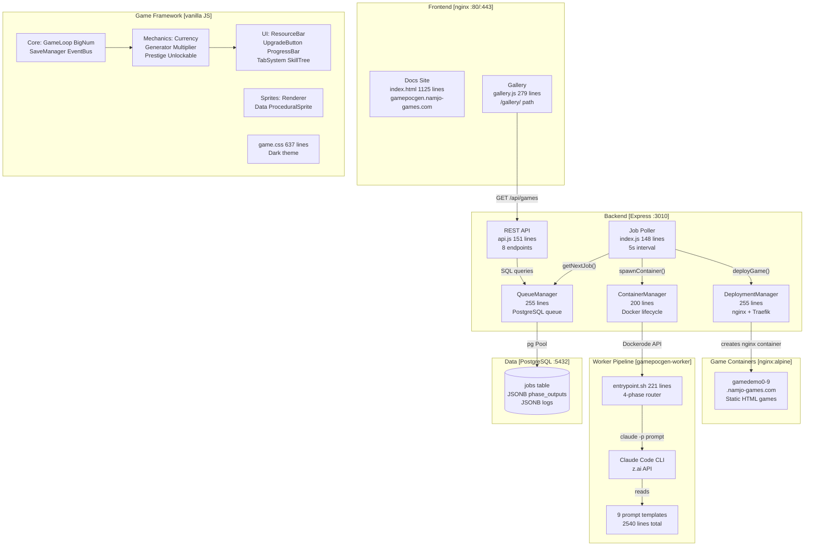
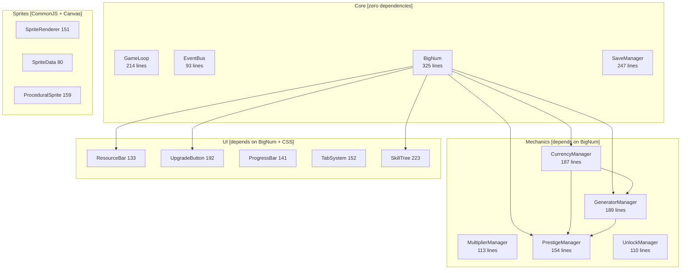

# System Architecture

```mermaid
graph TB
    subgraph "Frontend [nginx :80/:443]"
        DOCS["Docs Site\nindex.html 1125 lines\ngamepocgen.namjo-games.com"]
        GALLERY["Gallery\ngallery.js 279 lines\n/gallery/ path"]
    end

    subgraph "Backend [Express :3010]"
        API["REST API\napi.js 151 lines\n8 endpoints"]
        POLLER["Job Poller\nindex.js 148 lines\n5s interval"]
        QM["QueueManager\n255 lines\nPostgreSQL queue"]
        CM["ContainerManager\n200 lines\nDocker lifecycle"]
        DM["DeploymentManager\n255 lines\nnginx + Traefik"]
    end

    subgraph "Data [PostgreSQL :5432]"
        DB[("jobs table\nJSONB phase_outputs\nJSONB logs")]
    end

    subgraph "Worker Pipeline [gamepocgen-worker]"
        ENTRY["entrypoint.sh 221 lines\n4-phase router"]
        CLAUDE["Claude Code CLI\nz.ai API"]
        PROMPTS["9 prompt templates\n2540 lines total"]
    end

    subgraph "Game Framework [vanilla JS]"
        CORE["Core: GameLoop BigNum\nSaveManager EventBus"]
        MECH["Mechanics: Currency\nGenerator Multiplier\nPrestige Unlockable"]
        UI["UI: ResourceBar\nUpgradeButton ProgressBar\nTabSystem SkillTree"]
        SPRITES["Sprites: Renderer\nData ProceduralSprite"]
        CSS["game.css 637 lines\nDark theme"]
    end

    subgraph "Game Containers [nginx:alpine]"
        G1["gamedemo0-9\n.namjo-games.com\nStatic HTML games"]
    end

    GALLERY -->|"GET /api/games"| API
    API -->|"SQL queries"| QM
    QM -->|"pg Pool"| DB
    POLLER -->|"getNextJob()"| QM
    POLLER -->|"spawnContainer()"| CM
    CM -->|"Dockerode API"| ENTRY
    ENTRY -->|"claude -p prompt"| CLAUDE
    CLAUDE -->|"reads"| PROMPTS
    POLLER -->|"deployGame()"| DM
    DM -->|"creates nginx container"| G1
    CORE --> MECH
    MECH --> UI
```

# Framework Module Dependencies

```mermaid
graph TD
    subgraph "Core [zero dependencies]"
        GL["GameLoop\n214 lines"]
        EB["EventBus\n93 lines"]
        BN["BigNum\n325 lines"]
        SM["SaveManager\n247 lines"]
    end

    subgraph "Mechanics [depends on BigNum]"
        CM2["CurrencyManager\n187 lines"]
        GM["GeneratorManager\n189 lines"]
        MM["MultiplierManager\n113 lines"]
        PM["PrestigeManager\n154 lines"]
        UM["UnlockManager\n110 lines"]
    end

    subgraph "UI [depends on BigNum + CSS]"
        RB["ResourceBar 133"]
        UB["UpgradeButton 192"]
        PB["ProgressBar 141"]
        TS["TabSystem 152"]
        SK["SkillTree 223"]
    end

    subgraph "Sprites [CommonJS + Canvas]"
        SR["SpriteRenderer 151"]
        SD["SpriteData 80"]
        PS["ProceduralSprite 159"]
    end

    BN --> CM2
    BN --> GM
    CM2 --> GM
    BN --> PM
    CM2 --> PM
    GM --> PM
    BN --> RB
    BN --> UB
    BN --> SK
```
