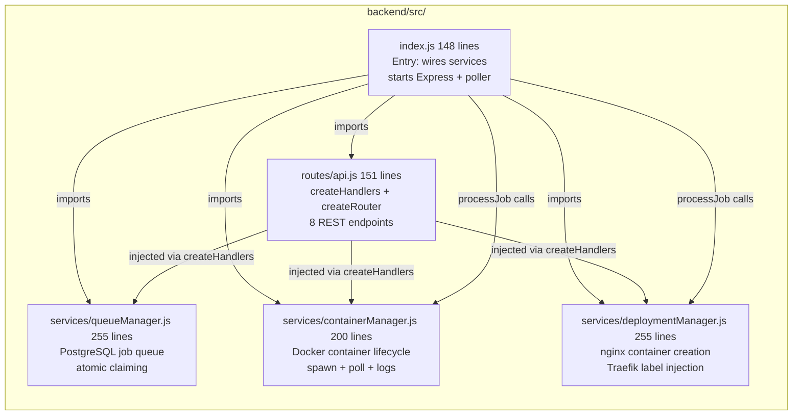
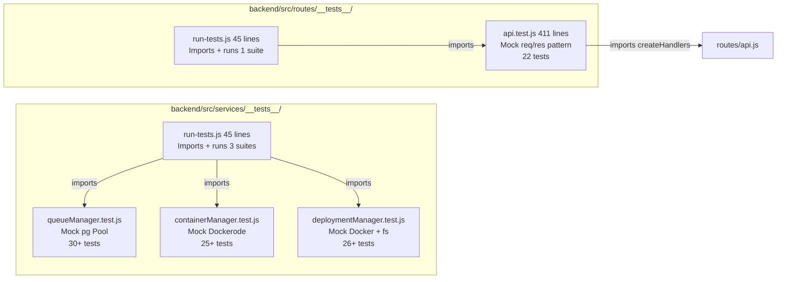
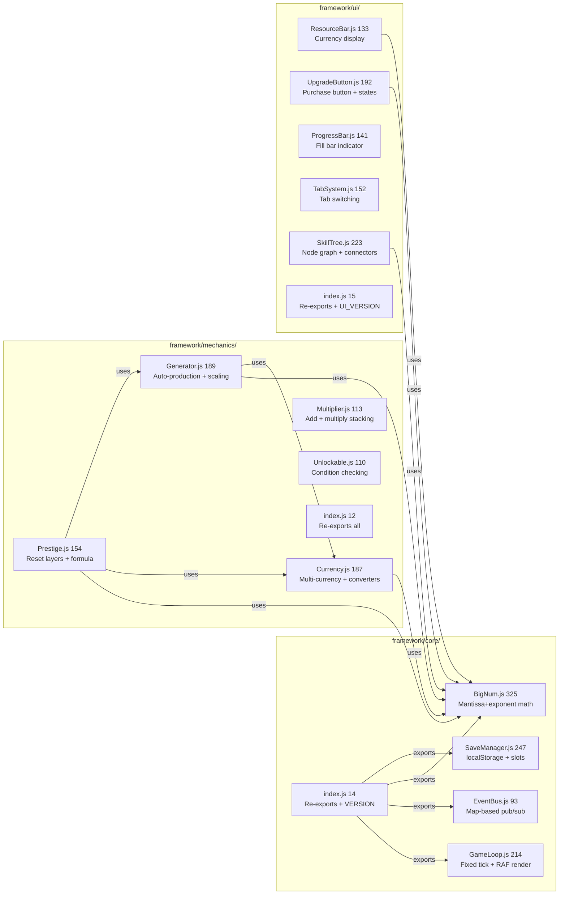
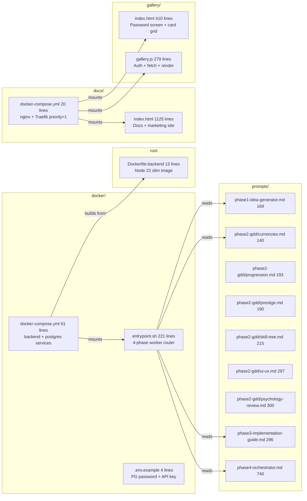

# Backend File Map

```mermaid
graph LR
    subgraph "backend/src/"
        IDX["index.js 148 lines\nEntry: wires services\nstarts Express + poller"]
        API["routes/api.js 151 lines\ncreateHandlers + createRouter\n8 REST endpoints"]
        QM["services/queueManager.js 255 lines\nPostgreSQL job queue\natomic claiming"]
        CM["services/containerManager.js 200 lines\nDocker container lifecycle\nspawn + poll + logs"]
        DM["services/deploymentManager.js 255 lines\nnginx container creation\nTraefik label injection"]
    end

    IDX -->|"imports"| API
    IDX -->|"imports"| QM
    IDX -->|"imports"| CM
    IDX -->|"imports"| DM
    API -->|"injected via createHandlers"| QM
    API -->|"injected via createHandlers"| CM
    API -->|"injected via createHandlers"| DM
    IDX -->|"processJob calls"| CM
    IDX -->|"processJob calls"| DM
```

# Backend Test File Map

```mermaid
graph LR
    subgraph "backend/src/services/__tests__/"
        SRR["run-tests.js 45 lines\nImports + runs 3 suites"]
        QMT["queueManager.test.js\nMock pg Pool\n30+ tests"]
        CMT["containerManager.test.js\nMock Dockerode\n25+ tests"]
        DMT["deploymentManager.test.js\nMock Docker + fs\n26+ tests"]
    end

    subgraph "backend/src/routes/__tests__/"
        RRR["run-tests.js 45 lines\nImports + runs 1 suite"]
        AT["api.test.js 411 lines\nMock req/res pattern\n22 tests"]
    end

    SRR -->|"imports"| QMT
    SRR -->|"imports"| CMT
    SRR -->|"imports"| DMT
    RRR -->|"imports"| AT
    AT -->|"imports createHandlers"| API2["routes/api.js"]
```

# Framework File Map

```mermaid
graph LR
    subgraph "framework/core/"
        GL["GameLoop.js 214\nFixed tick + RAF render"]
        EB["EventBus.js 93\nMap-based pub/sub"]
        BN["BigNum.js 325\nMantissa+exponent math"]
        SM["SaveManager.js 247\nlocalStorage + slots"]
        CI["index.js 14\nRe-exports + VERSION"]
    end

    subgraph "framework/mechanics/"
        CU["Currency.js 187\nMulti-currency + converters"]
        GE["Generator.js 189\nAuto-production + scaling"]
        MU["Multiplier.js 113\nAdd + multiply stacking"]
        PR["Prestige.js 154\nReset layers + formula"]
        UN["Unlockable.js 110\nCondition checking"]
        MI["index.js 12\nRe-exports all"]
    end

    subgraph "framework/ui/"
        RB["ResourceBar.js 133\nCurrency display"]
        UB["UpgradeButton.js 192\nPurchase button + states"]
        PB["ProgressBar.js 141\nFill bar indicator"]
        TS["TabSystem.js 152\nTab switching"]
        SK["SkillTree.js 223\nNode graph + connectors"]
        UI["index.js 15\nRe-exports + UI_VERSION"]
    end

    CI -->|"exports"| GL
    CI -->|"exports"| EB
    CI -->|"exports"| BN
    CI -->|"exports"| SM
    CU -->|"uses"| BN
    GE -->|"uses"| BN
    GE -->|"uses"| CU
    PR -->|"uses"| BN
    PR -->|"uses"| CU
    PR -->|"uses"| GE
    RB -->|"uses"| BN
    UB -->|"uses"| BN
    SK -->|"uses"| BN
```

# Infrastructure File Map

```mermaid
graph LR
    subgraph "docker/"
        DC["docker-compose.yml 61 lines\nbackend + postgres services"]
        ENT["entrypoint.sh 221 lines\n4-phase worker router"]
        ENV[".env.example 4 lines\nPG password + API key"]
    end

    subgraph "root"
        DBK["Dockerfile.backend 13 lines\nNode 22 slim image"]
    end

    subgraph "docs/"
        DDC["docker-compose.yml 20 lines\nnginx + Traefik priority=1"]
        DIX["index.html 1125 lines\nDocs + marketing site"]
    end

    subgraph "gallery/"
        GIX["index.html 410 lines\nPassword screen + card grid"]
        GJS["gallery.js 279 lines\nAuth + fetch + render"]
    end

    subgraph "prompts/"
        P1["phase1-idea-generator.md 169"]
        P2C["phase2-gdd/currencies.md 140"]
        P2P["phase2-gdd/progression.md 193"]
        P2PR["phase2-gdd/prestige.md 190"]
        P2S["phase2-gdd/skill-tree.md 215"]
        P2U["phase2-gdd/ui-ux.md 297"]
        P2PS["phase2-gdd/psychology-review.md 300"]
        P3["phase3-implementation-guide.md 296"]
        P4["phase4-orchestrator.md 740"]
    end

    DC -->|"builds from"| DBK
    DC -->|"mounts"| ENT
    DDC -->|"mounts"| DIX
    DDC -->|"mounts"| GIX
    DDC -->|"mounts"| GJS
    ENT -->|"reads"| P1
    ENT -->|"reads"| P2C
    ENT -->|"reads"| P3
    ENT -->|"reads"| P4
```
