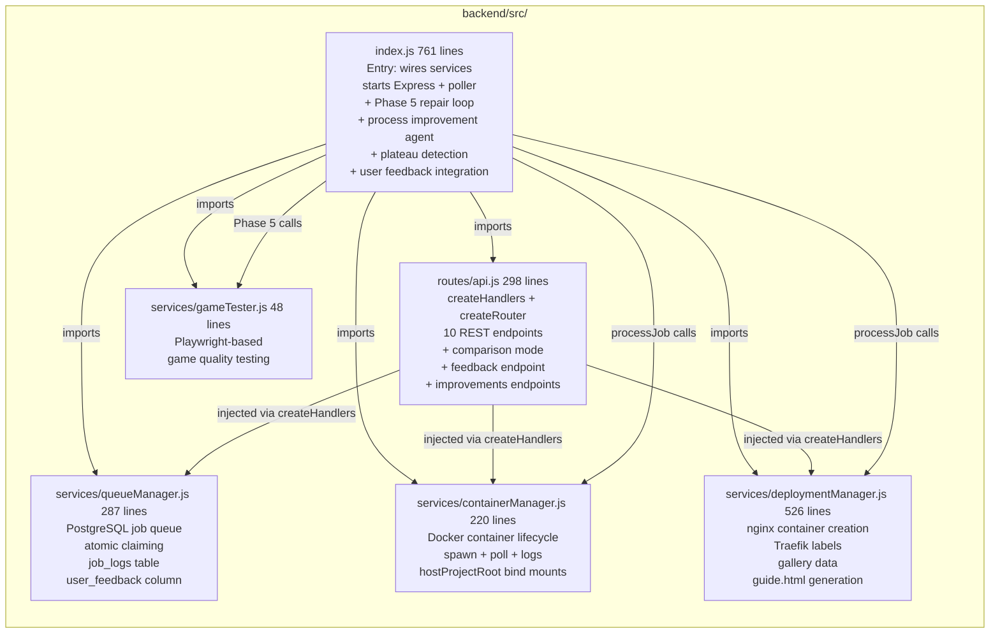
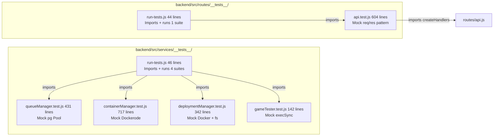
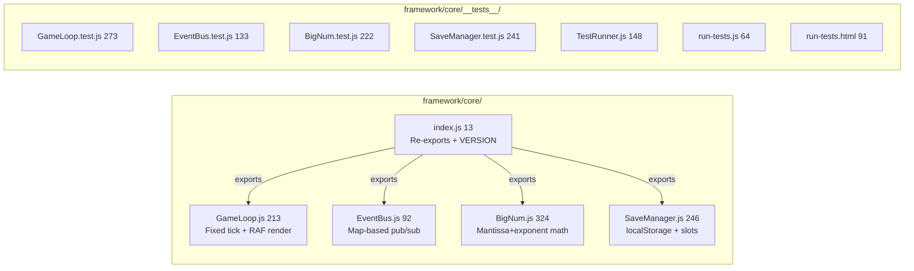
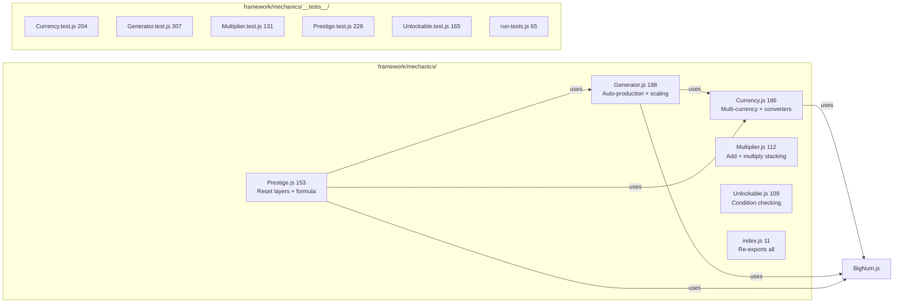
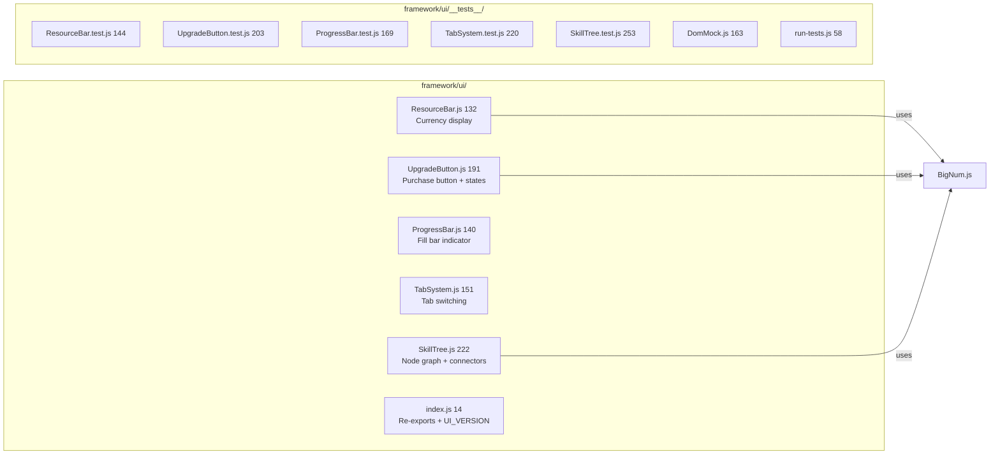
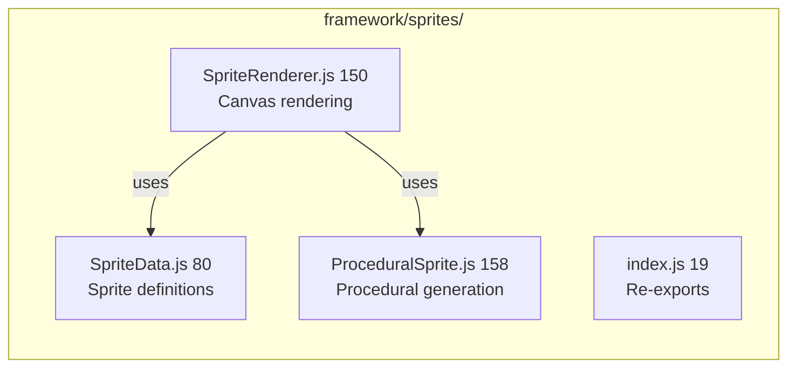
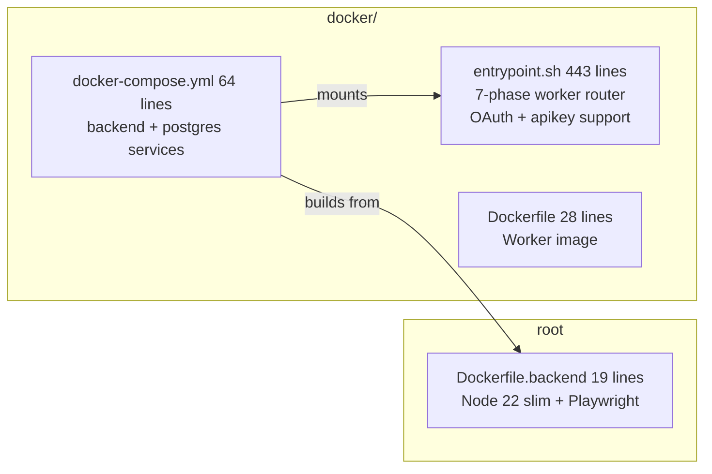
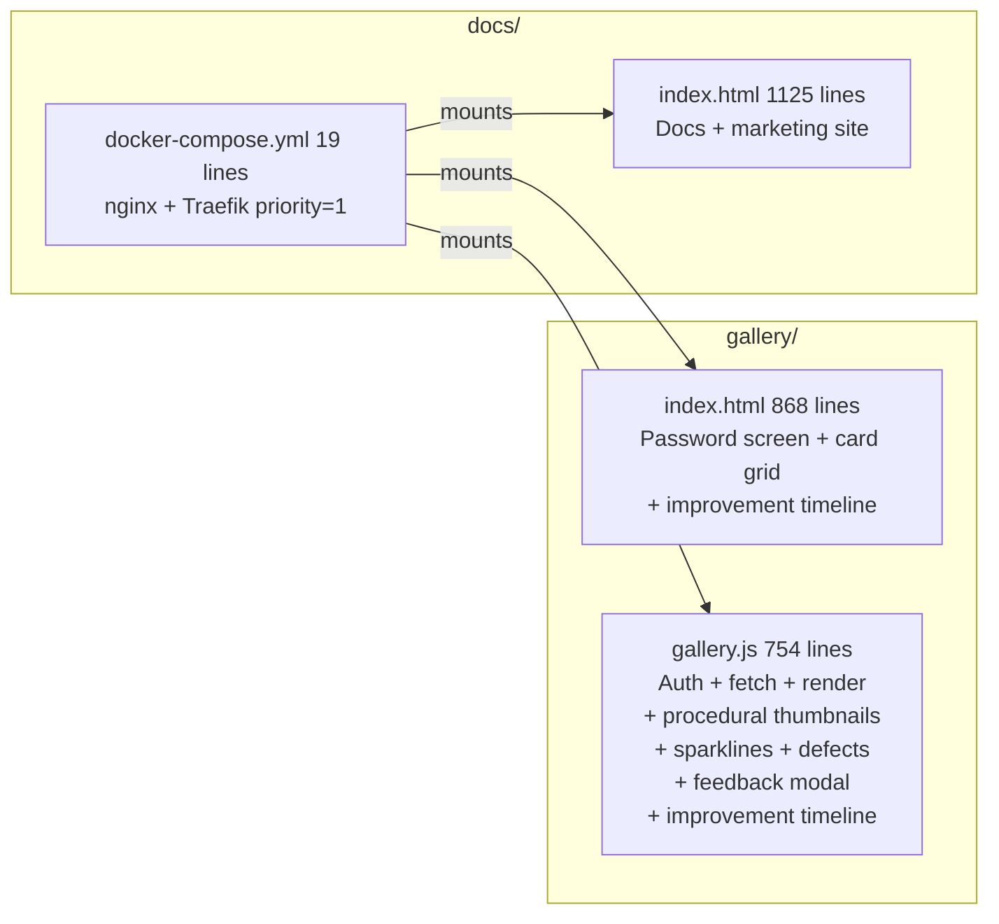
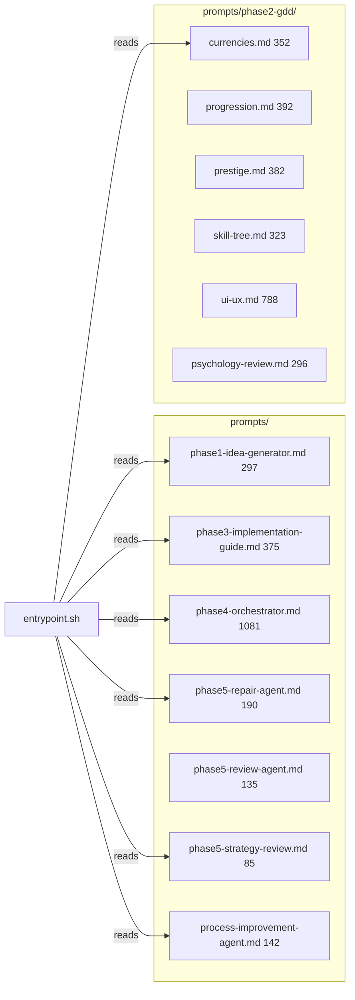
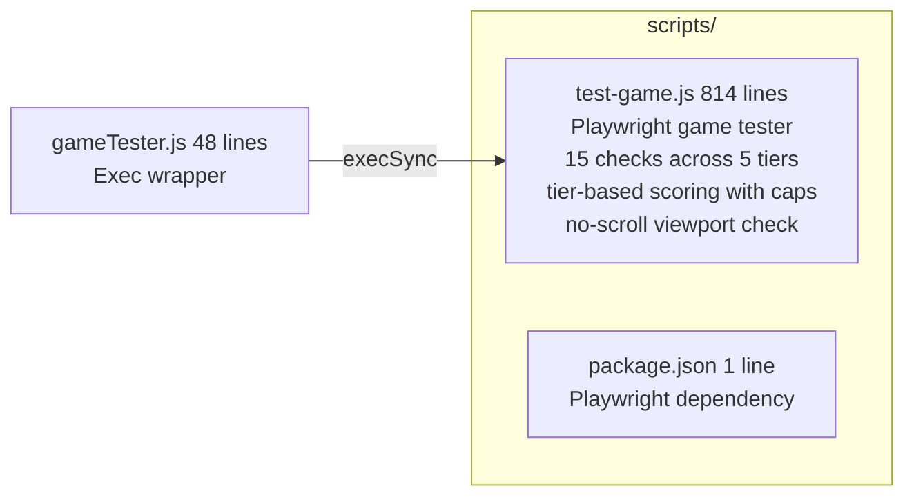

# Backend Source File Map

# Backend Test File Map

# Framework Core File Map

# Framework Mechanics File Map

# Framework UI File Map

# Framework Sprites File Map

# Infrastructure: Docker + Root

# Infrastructure: Docs + Gallery

# Prompts File Map

# Scripts + Test File Map

