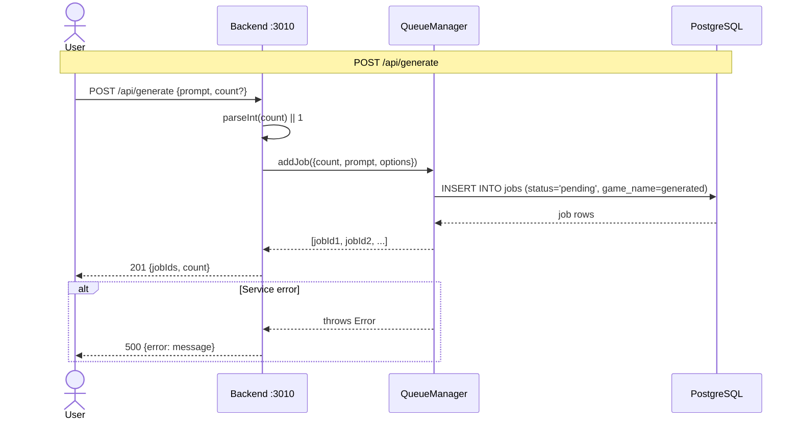
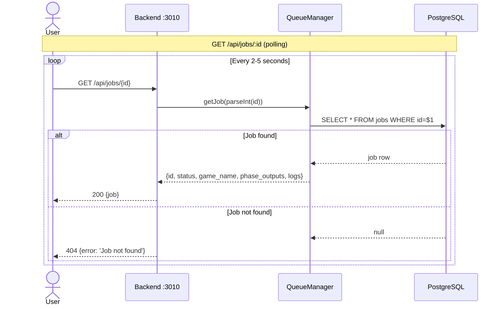
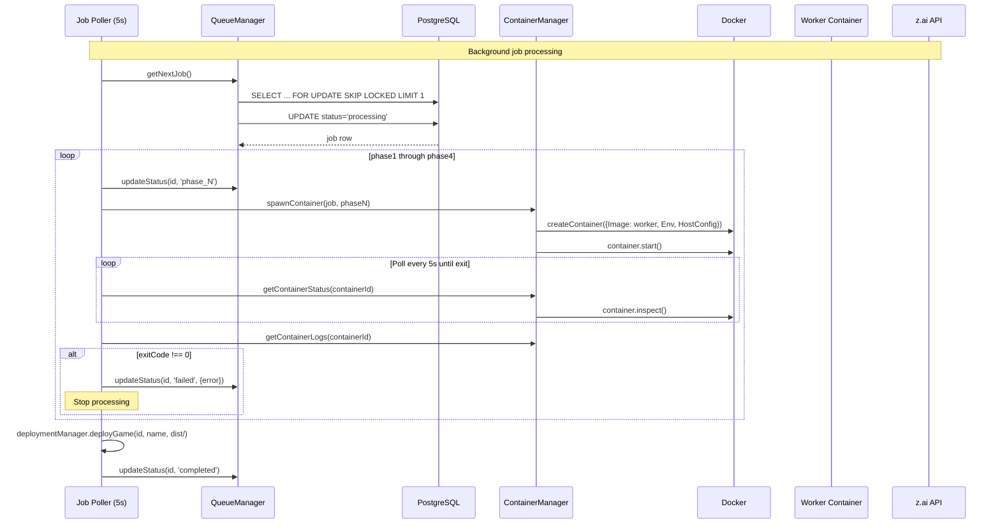
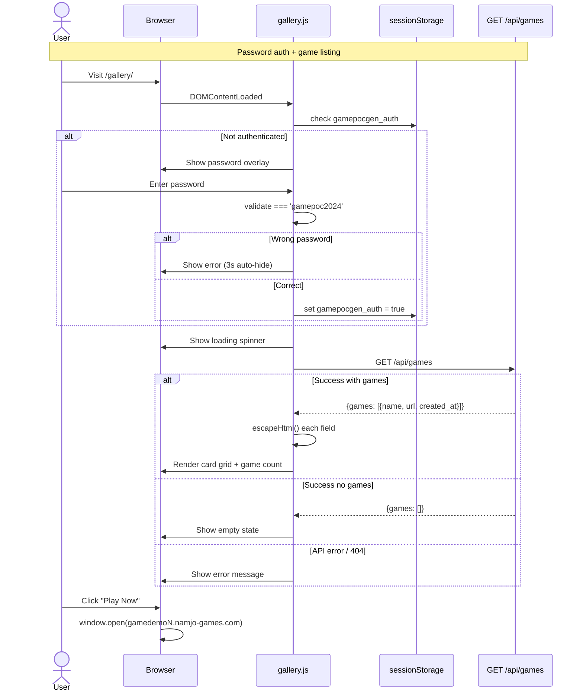
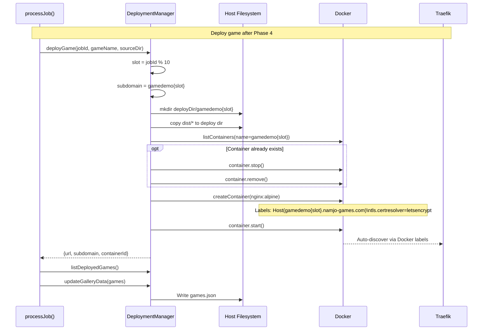
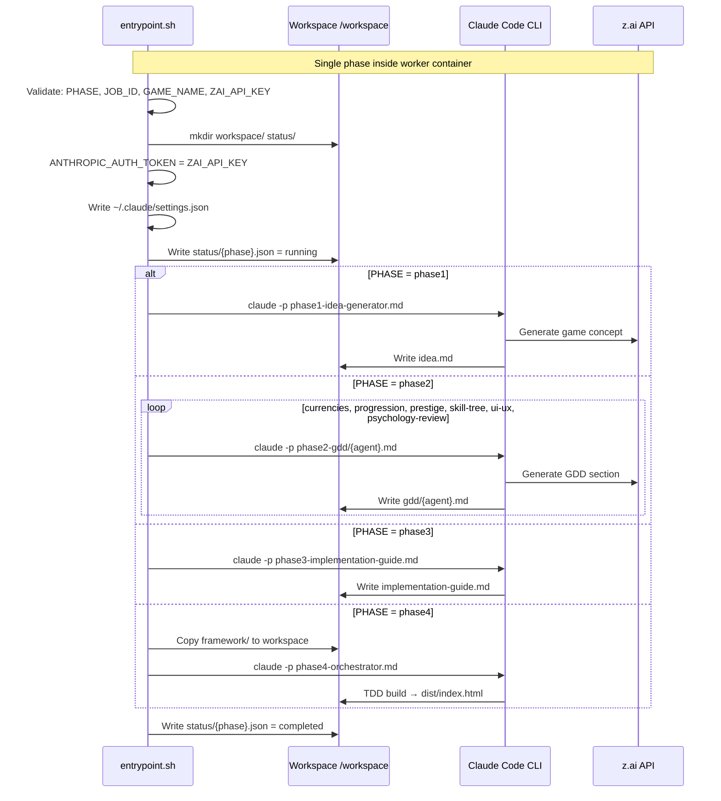

# Submit Game Generation Job

```mermaid
sequenceDiagram
    actor User
    participant API as Backend :3010
    participant QM as QueueManager
    participant DB as PostgreSQL

    Note over User,DB: POST /api/generate
    User->>API: POST /api/generate {prompt, count?}
    API->>API: parseInt(count) || 1
    API->>QM: addJob({count, prompt, options})
    QM->>DB: INSERT INTO jobs (status='pending', game_name=generated)
    DB-->>QM: job rows
    QM-->>API: [jobId1, jobId2, ...]
    API-->>User: 201 {jobIds, count}
    alt Service error
        QM-->>API: throws Error
        API-->>User: 500 {error: message}
    end
```

# Poll Job Status

```mermaid
sequenceDiagram
    actor User
    participant API as Backend :3010
    participant QM as QueueManager
    participant DB as PostgreSQL

    Note over User,DB: GET /api/jobs/:id (polling)
    loop Every 2-5 seconds
        User->>API: GET /api/jobs/{id}
        API->>QM: getJob(parseInt(id))
        QM->>DB: SELECT * FROM jobs WHERE id=$1
        alt Job found
            DB-->>QM: job row
            QM-->>API: {id, status, game_name, phase_outputs, logs}
            API-->>User: 200 {job}
        else Job not found
            DB-->>QM: null
            API-->>User: 404 {error: 'Job not found'}
        end
    end
```

# Job Execution Pipeline

```mermaid
sequenceDiagram
    participant Poller as Job Poller (5s)
    participant QM as QueueManager
    participant DB as PostgreSQL
    participant CM as ContainerManager
    participant Docker
    participant Worker as Worker Container
    participant ZAI as z.ai API

    Note over Poller,ZAI: Background job processing
    Poller->>QM: getNextJob()
    QM->>DB: SELECT ... FOR UPDATE SKIP LOCKED LIMIT 1
    QM->>DB: UPDATE status='processing'
    DB-->>QM: job row

    loop phase1 through phase4
        Poller->>QM: updateStatus(id, 'phase_N')
        Poller->>CM: spawnContainer(job, phaseN)
        CM->>Docker: createContainer({Image: worker, Env, HostConfig})
        CM->>Docker: container.start()

        loop Poll every 5s until exit
            Poller->>CM: getContainerStatus(containerId)
            CM->>Docker: container.inspect()
        end

        Poller->>CM: getContainerLogs(containerId)
        alt exitCode !== 0
            Poller->>QM: updateStatus(id, 'failed', {error})
            Note over Poller: Stop processing
        end
    end

    Poller->>Poller: deploymentManager.deployGame(id, name, dist/)
    Poller->>QM: updateStatus(id, 'completed')
```

# Gallery Authentication + Game Browsing

```mermaid
sequenceDiagram
    actor User
    participant Browser
    participant Gallery as gallery.js
    participant Session as sessionStorage
    participant API as GET /api/games

    Note over User,API: Password auth + game listing
    User->>Browser: Visit /gallery/
    Browser->>Gallery: DOMContentLoaded
    Gallery->>Session: check gamepocgen_auth

    alt Not authenticated
        Gallery->>Browser: Show password overlay
        User->>Gallery: Enter password
        Gallery->>Gallery: validate === 'gamepoc2024'
        alt Wrong password
            Gallery->>Browser: Show error (3s auto-hide)
        else Correct
            Gallery->>Session: set gamepocgen_auth = true
        end
    end

    Gallery->>Browser: Show loading spinner
    Gallery->>API: GET /api/games
    alt Success with games
        API-->>Gallery: {games: [{name, url, created_at}]}
        Gallery->>Gallery: escapeHtml() each field
        Gallery->>Browser: Render card grid + game count
    else Success no games
        API-->>Gallery: {games: []}
        Gallery->>Browser: Show empty state
    else API error / 404
        Gallery->>Browser: Show error message
    end

    User->>Browser: Click "Play Now"
    Browser->>Browser: window.open(gamedemoN.namjo-games.com)
```

# Game Deployment

```mermaid
sequenceDiagram
    participant Backend as processJob()
    participant DM as DeploymentManager
    participant FS as Host Filesystem
    participant Docker
    participant Traefik

    Note over Backend,Traefik: Deploy game after Phase 4
    Backend->>DM: deployGame(jobId, gameName, sourceDir)
    DM->>DM: slot = jobId % 10
    DM->>DM: subdomain = gamedemo{slot}
    DM->>FS: mkdir deployDir/gamedemo{slot}
    DM->>FS: copy dist/* to deploy dir

    DM->>Docker: listContainers(name=gamedemo{slot})
    opt Container already exists
        DM->>Docker: container.stop()
        DM->>Docker: container.remove()
    end

    DM->>Docker: createContainer(nginx:alpine)
    Note over Docker: Labels: Host(gamedemo{slot}.namjo-games.com)\ntls.certresolver=letsencrypt
    DM->>Docker: container.start()
    Docker-->>Traefik: Auto-discover via Docker labels
    DM-->>Backend: {url, subdomain, containerId}

    Backend->>DM: listDeployedGames()
    Backend->>DM: updateGalleryData(games)
    DM->>FS: Write games.json
```

# Worker Phase Execution

```mermaid
sequenceDiagram
    participant Entry as entrypoint.sh
    participant FS as Workspace /workspace
    participant Claude as Claude Code CLI
    participant ZAI as z.ai API

    Note over Entry,ZAI: Single phase inside worker container
    Entry->>Entry: Validate: PHASE, JOB_ID, GAME_NAME, ZAI_API_KEY
    Entry->>FS: mkdir workspace/ status/
    Entry->>Entry: ANTHROPIC_AUTH_TOKEN = ZAI_API_KEY
    Entry->>Entry: Write ~/.claude/settings.json
    Entry->>FS: Write status/{phase}.json = running

    alt PHASE = phase1
        Entry->>Claude: claude -p phase1-idea-generator.md
        Claude->>ZAI: Generate game concept
        Claude->>FS: Write idea.md
    else PHASE = phase2
        loop currencies, progression, prestige, skill-tree, ui-ux, psychology-review
            Entry->>Claude: claude -p phase2-gdd/{agent}.md
            Claude->>ZAI: Generate GDD section
            Claude->>FS: Write gdd/{agent}.md
        end
    else PHASE = phase3
        Entry->>Claude: claude -p phase3-implementation-guide.md
        Claude->>FS: Write implementation-guide.md
    else PHASE = phase4
        Entry->>FS: Copy framework/ to workspace
        Entry->>Claude: claude -p phase4-orchestrator.md
        Claude->>FS: TDD build → dist/index.html
    end

    Entry->>FS: Write status/{phase}.json = completed
```
