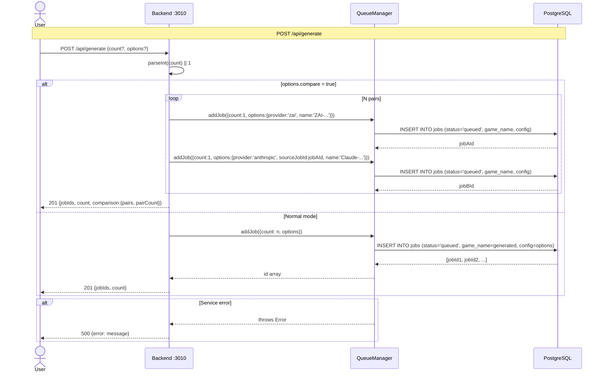
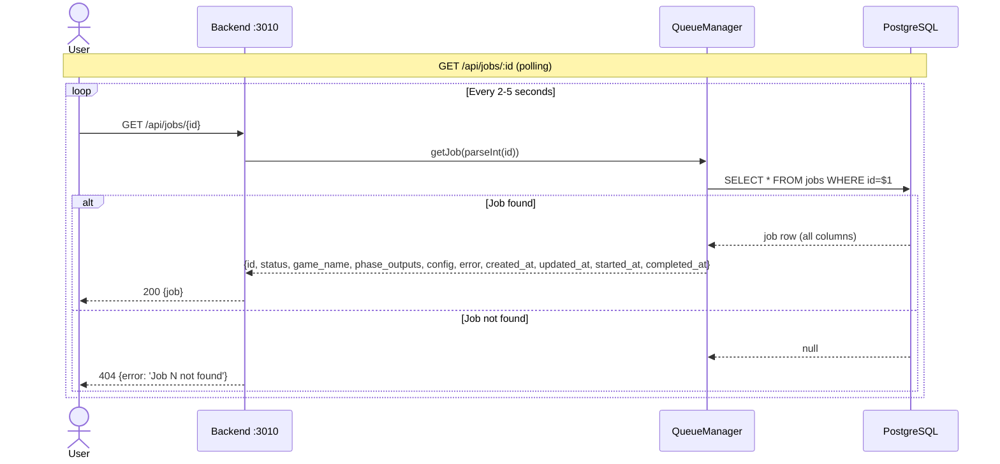
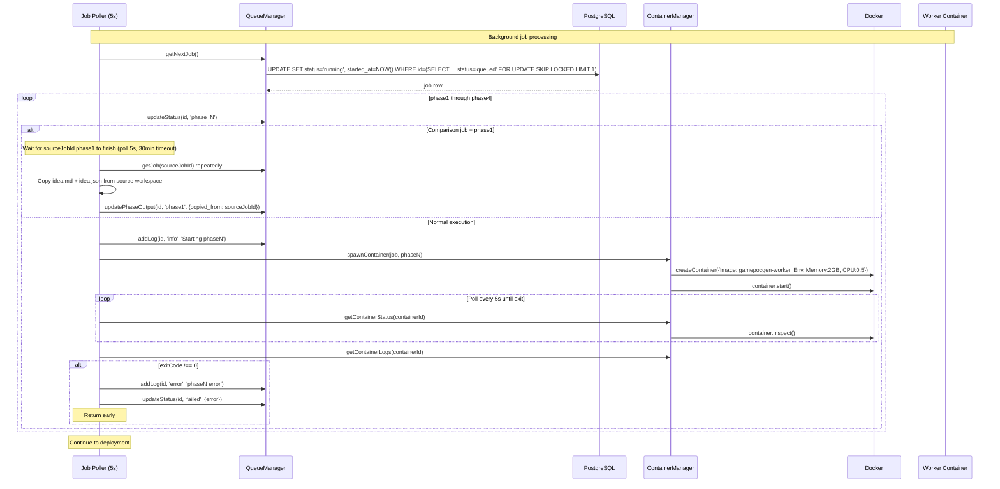
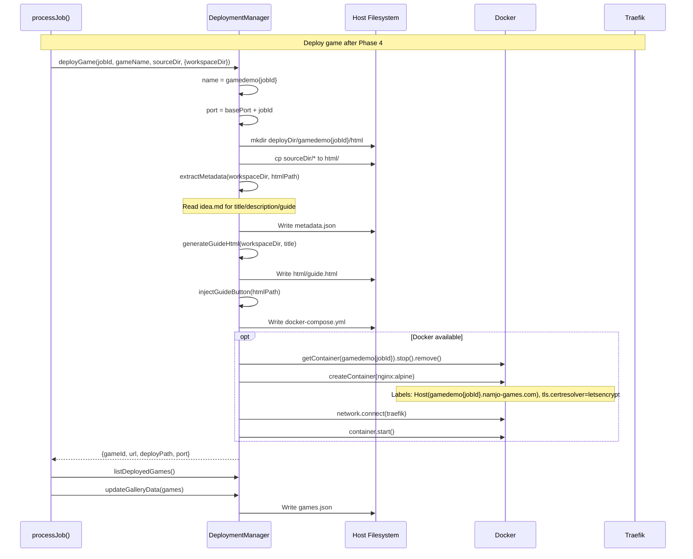
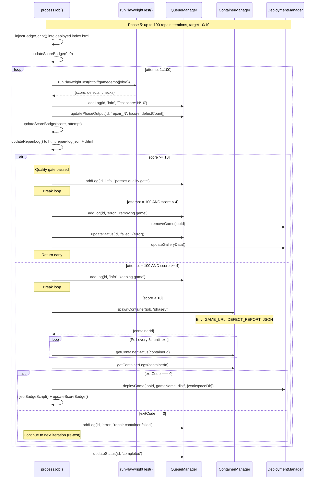
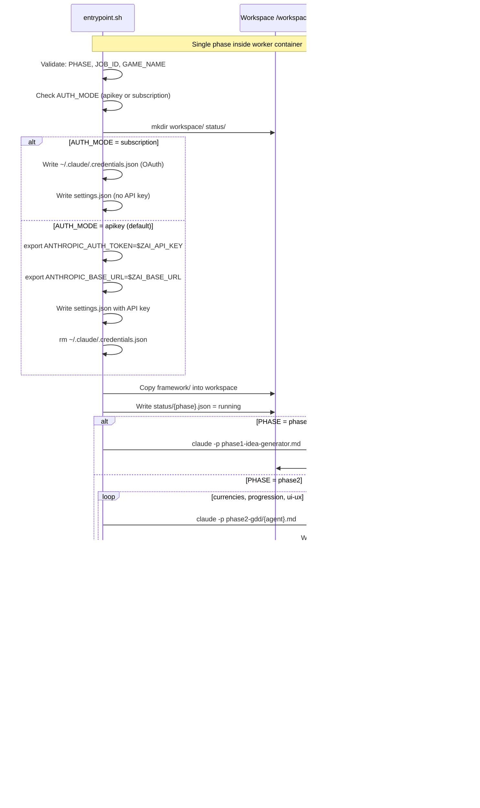
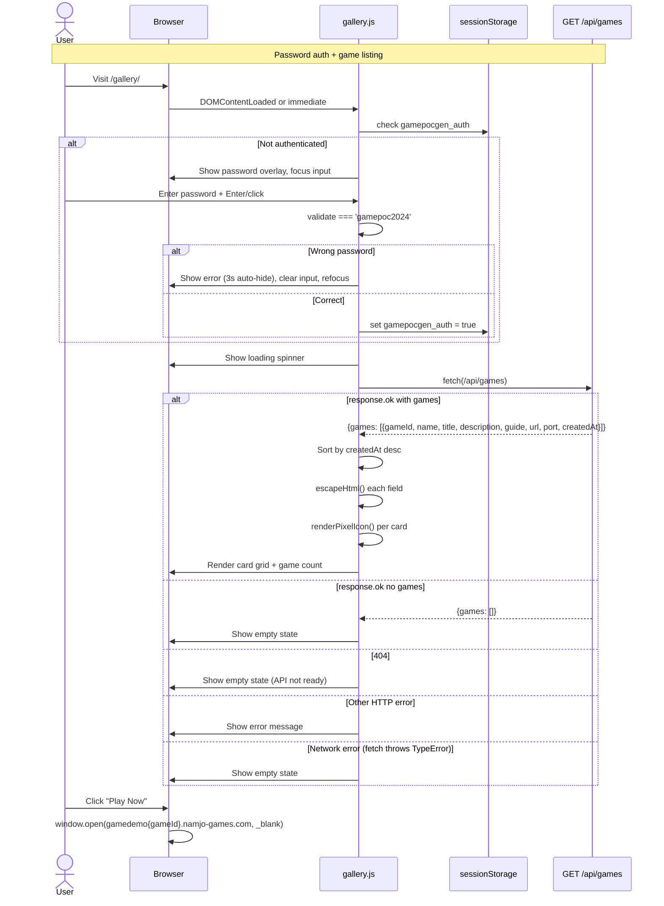

# Submit Game Generation Job

# Poll Job Status

# Job Execution Pipeline (Phases 1-4)

# Game Deployment

# Phase 5 Repair Loop

# Worker Phase Execution

# Gallery Authentication + Game Browsing

