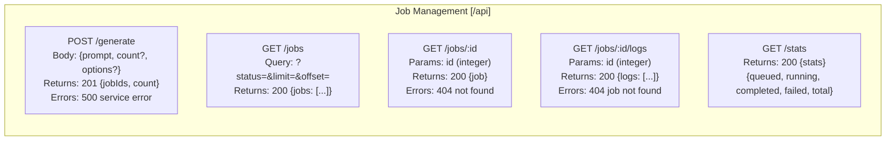
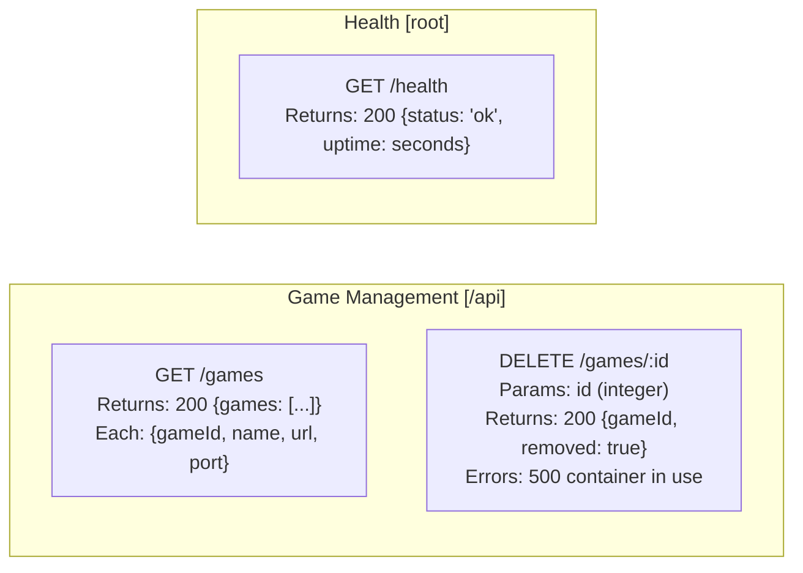
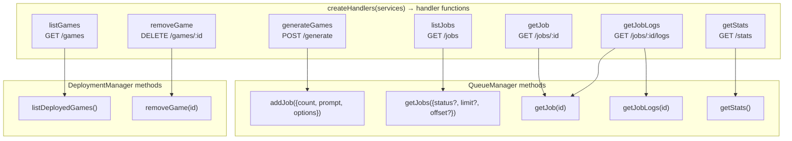

# REST API Endpoints

```mermaid
graph LR
    subgraph "Job Management [/api]"
        POST_GEN["POST /generate\nBody: {prompt, count?, options?}\nReturns: 201 {jobIds, count}\nErrors: 500 service error"]
        GET_JOBS["GET /jobs\nQuery: ?status=&limit=&offset=\nReturns: 200 {jobs: [...]}"]
        GET_JOB["GET /jobs/:id\nParams: id (integer)\nReturns: 200 {job}\nErrors: 404 not found"]
        GET_LOGS["GET /jobs/:id/logs\nParams: id (integer)\nReturns: 200 {logs: [...]}\nErrors: 404 job not found"]
        GET_STATS["GET /stats\nReturns: 200 {stats}\n{queued, running, completed, failed, total}"]
    end
```

```mermaid
graph LR
    subgraph "Game Management [/api]"
        GET_GAMES["GET /games\nReturns: 200 {games: [...]}\nEach: {gameId, name, url, port}"]
        DEL_GAME["DELETE /games/:id\nParams: id (integer)\nReturns: 200 {gameId, removed: true}\nErrors: 500 container in use"]
    end

    subgraph "Health [root]"
        HEALTH["GET /health\nReturns: 200 {status: 'ok', uptime: seconds}"]
    end
```

# Handler → Service Method Mapping

```mermaid
graph TD
    subgraph "createHandlers(services) → handler functions"
        H1["generateGames\nPOST /generate"]
        H2["listJobs\nGET /jobs"]
        H3["getJob\nGET /jobs/:id"]
        H4["getJobLogs\nGET /jobs/:id/logs"]
        H5["getStats\nGET /stats"]
        H6["listGames\nGET /games"]
        H7["removeGame\nDELETE /games/:id"]
    end

    subgraph "QueueManager methods"
        QA["addJob({count, prompt, options})"]
        QJ["getJobs({status?, limit?, offset?})"]
        QG["getJob(id)"]
        QL["getJobLogs(id)"]
        QS["getStats()"]
    end

    subgraph "DeploymentManager methods"
        DL["listDeployedGames()"]
        DR["removeGame(id)"]
    end

    H1 --> QA
    H2 --> QJ
    H3 --> QG
    H4 --> QG
    H4 --> QL
    H5 --> QS
    H6 --> DL
    H7 --> DR
```
