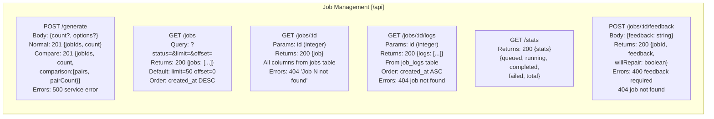
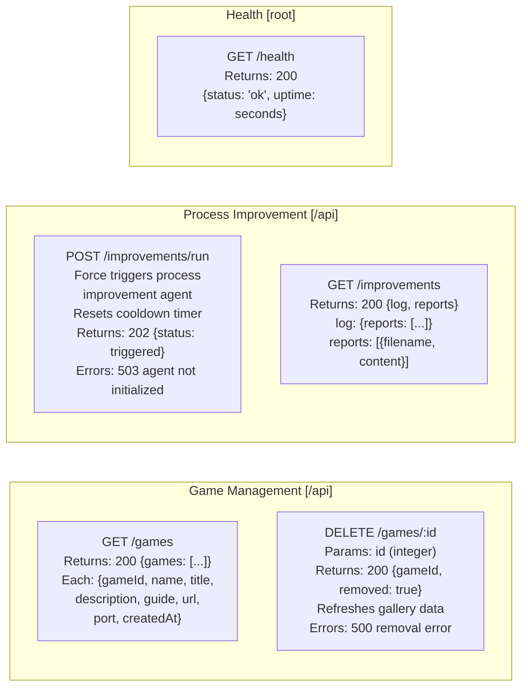
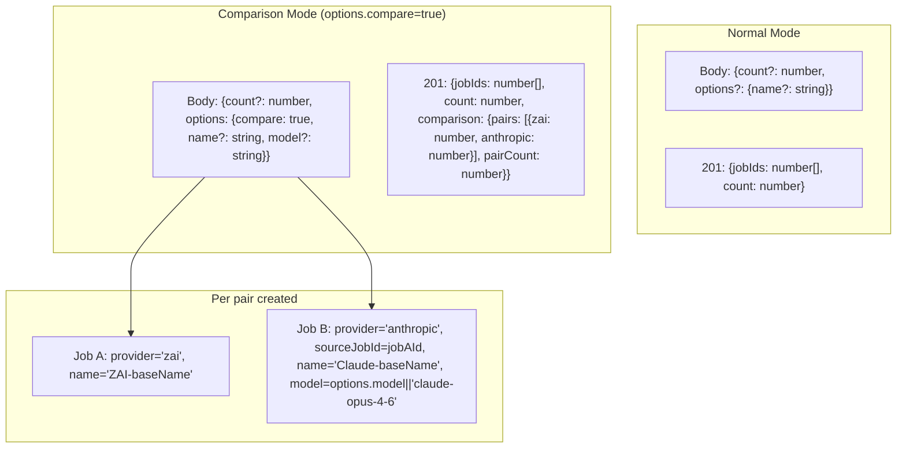
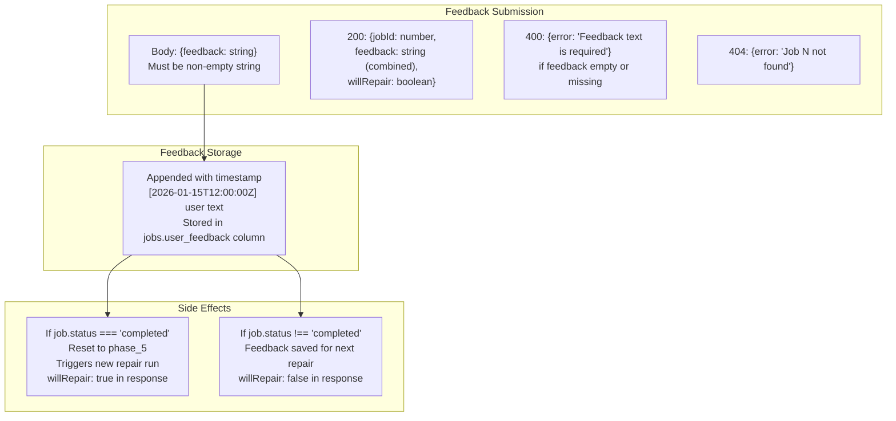
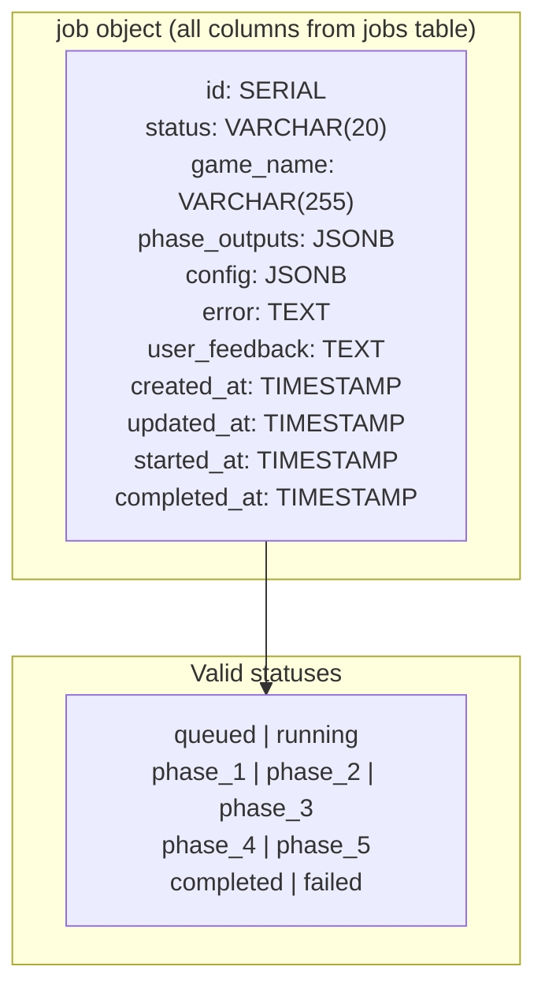

# REST API Endpoints

```mermaid
graph LR
    subgraph "Job Management [/api]"
        POST_GEN["POST /generate\nBody: {count?, options?}\nNormal: 201 {jobIds, count}\nCompare: 201 {jobIds, count,\ncomparison:{pairs, pairCount}}\nErrors: 500 service error"]
        GET_JOBS["GET /jobs\nQuery: ?status=&limit=&offset=\nReturns: 200 {jobs: [...]}\nDefault: limit=50 offset=0\nOrder: created_at DESC"]
        GET_JOB["GET /jobs/:id\nParams: id (integer)\nReturns: 200 {job}\nAll columns from jobs table\nErrors: 404 'Job N not found'"]
        GET_LOGS["GET /jobs/:id/logs\nParams: id (integer)\nReturns: 200 {logs: [...]}\nFrom job_logs table\nOrder: created_at ASC\nErrors: 404 job not found"]
        GET_STATS["GET /stats\nReturns: 200 {stats}\n{queued, running, completed,\nfailed, total}"]
        POST_FEEDBACK["POST /jobs/:id/feedback\nBody: {feedback: string}\nReturns: 200 {jobId, feedback,\nwillRepair: boolean}\nErrors: 400 feedback required\n404 job not found"]
    end
```

```mermaid
graph LR
    subgraph "Game Management [/api]"
        GET_GAMES["GET /games\nReturns: 200 {games: [...]}\nEach: {gameId, name, title,\ndescription, guide, url,\nport, createdAt}"]
        DEL_GAME["DELETE /games/:id\nParams: id (integer)\nReturns: 200 {gameId, removed: true}\nRefreshes gallery data\nErrors: 500 removal error"]
    end

    subgraph "Process Improvement [/api]"
        POST_IMP["POST /improvements/run\nForce triggers process\nimprovement agent\nResets cooldown timer\nReturns: 202 {status: triggered}\nErrors: 503 agent not initialized"]
        GET_IMP["GET /improvements\nReturns: 200 {log, reports}\nlog: {reports: [...]}\nreports: [{filename, content}]"]
    end

    subgraph "Health [root]"
        HEALTH["GET /health\nReturns: 200\n{status: 'ok', uptime: seconds}"]
    end
```

# POST /generate Request Shapes

```mermaid
graph TD
    subgraph "Normal Mode"
        NRM_REQ["Body: {count?: number, options?: {name?: string}}"]
        NRM_RES["201: {jobIds: number[], count: number}"]
    end

    subgraph "Comparison Mode (options.compare=true)"
        CMP_REQ["Body: {count?: number, options: {compare: true, name?: string, model?: string}}"]
        CMP_RES["201: {jobIds: number[], count: number, comparison: {pairs: [{zai: number, anthropic: number}], pairCount: number}}"]
    end

    subgraph "Per pair created"
        PAIR_A["Job A: provider='zai', name='ZAI-baseName'"]
        PAIR_B["Job B: provider='anthropic', sourceJobId=jobAId, name='Claude-baseName', model=options.model||'claude-opus-4-6'"]
    end

    CMP_REQ --> PAIR_A
    CMP_REQ --> PAIR_B
```

# POST /jobs/:id/feedback Request Shape

```mermaid
graph TD
    subgraph "Feedback Submission"
        FB_REQ["Body: {feedback: string}\nMust be non-empty string"]
        FB_RES["200: {jobId: number,\nfeedback: string (combined),\nwillRepair: boolean}"]
        FB_400["400: {error: 'Feedback text is required'}\nif feedback empty or missing"]
        FB_404["404: {error: 'Job N not found'}"]
    end

    subgraph "Feedback Storage"
        FB_STORE["Appended with timestamp\n[2026-01-15T12:00:00Z] user text\nStored in jobs.user_feedback column"]
    end

    subgraph "Side Effects"
        FB_REPAIR["If job.status === 'completed'\nReset to phase_5\nTriggers new repair run\nwillRepair: true in response"]
        FB_NOOP["If job.status !== 'completed'\nFeedback saved for next repair\nwillRepair: false in response"]
    end

    FB_REQ --> FB_STORE
    FB_STORE --> FB_REPAIR
    FB_STORE --> FB_NOOP
```

# GET /api/jobs/:id Response Shape

```mermaid
graph TD
    subgraph "job object (all columns from jobs table)"
        JOB["id: SERIAL\nstatus: VARCHAR(20)\ngame_name: VARCHAR(255)\nphase_outputs: JSONB\nconfig: JSONB\nerror: TEXT\nuser_feedback: TEXT\ncreated_at: TIMESTAMP\nupdated_at: TIMESTAMP\nstarted_at: TIMESTAMP\ncompleted_at: TIMESTAMP"]
    end

    subgraph "Valid statuses"
        STAT["queued | running\nphase_1 | phase_2 | phase_3\nphase_4 | phase_5\ncompleted | failed"]
    end

    JOB --> STAT
```

# Handler to Service Method Mapping

```mermaid
graph TD
    subgraph "createHandlers(services) -> handler functions"
        H1["generateGames\nPOST /generate"]
        H2["listJobs\nGET /jobs"]
        H3["getJob\nGET /jobs/:id"]
        H4["getJobLogs\nGET /jobs/:id/logs"]
        H5["getStats\nGET /stats"]
        H6["listGames\nGET /games"]
        H7["removeGame\nDELETE /games/:id"]
        H8["submitFeedback\nPOST /jobs/:id/feedback"]
        H9["runProcessImprovement\nPOST /improvements/run"]
        H10["getImprovements\nGET /improvements"]
    end

    subgraph "QueueManager methods"
        QA["addJob({count, options})"]
        QJ["getJobs({status?, limit?, offset?})"]
        QG["getJob(id)"]
        QL["getJobLogs(id)"]
        QS["getStats()"]
        QF["setUserFeedback(id, text)"]
        QGF["getUserFeedback(id)"]
    end

    subgraph "DeploymentManager methods"
        DL["listDeployedGames()"]
        DR["removeGame(id)"]
        DU["updateGalleryData(games)"]
    end

    H1 --> QA
    H2 --> QJ
    H3 --> QG
    H4 --> QG
    H4 --> QL
    H5 --> QS
    H6 --> DL
    H7 --> DR
    H7 --> DU
    H8 --> QG
    H8 --> QF
    H9 -->|"globalThis._maybeRunProcessImprovement"| PI["Process Improvement Agent"]
    H10 -->|"reads filesystem"| IMP["shared/improvements/"]
```
