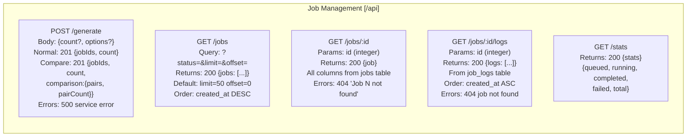
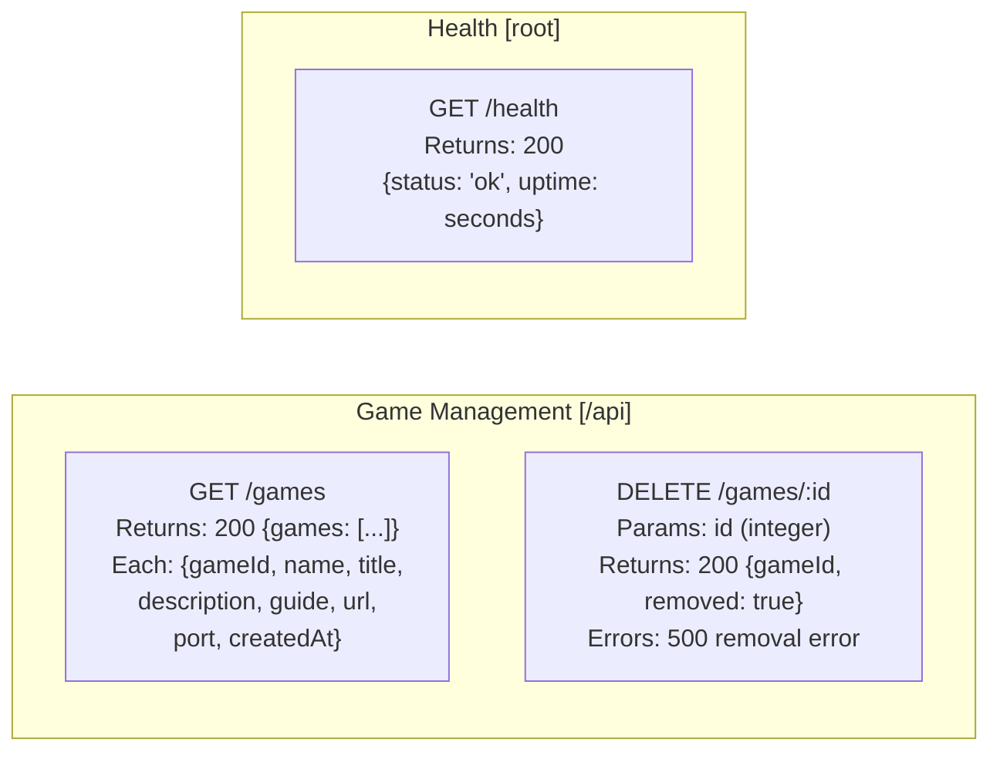
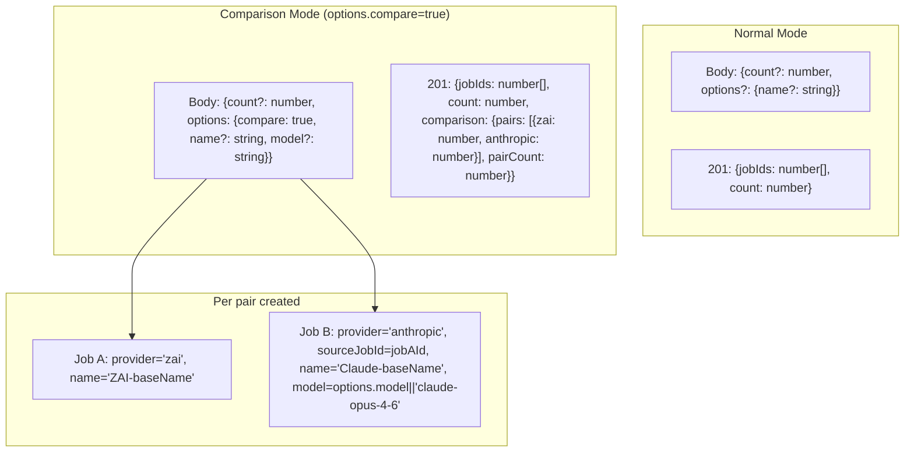
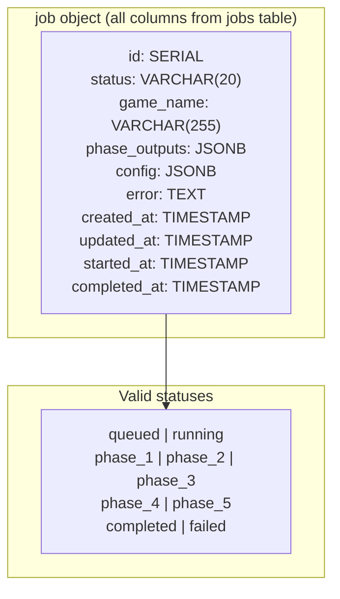
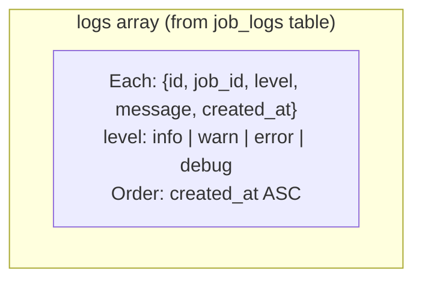
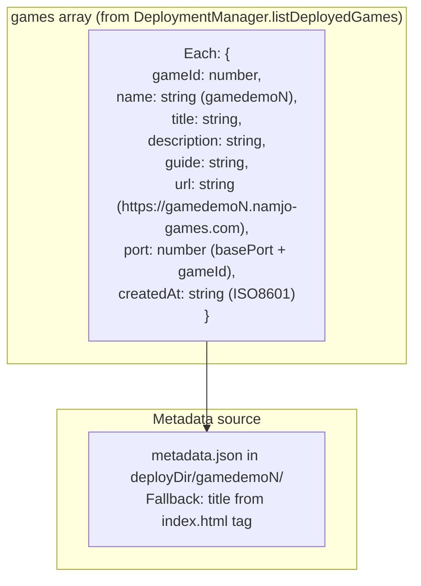
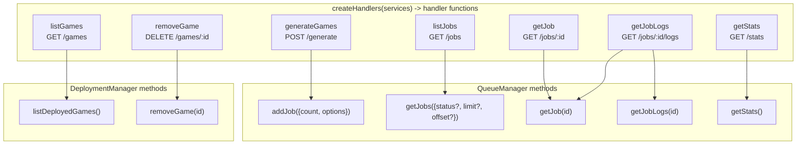

# REST API Endpoints

# POST /generate Request Shapes

# GET /api/jobs/:id Response Shape

# GET /api/jobs/:id/logs Response Shape

# GET /api/games Response Shape

# Handler to Service Method Mapping

