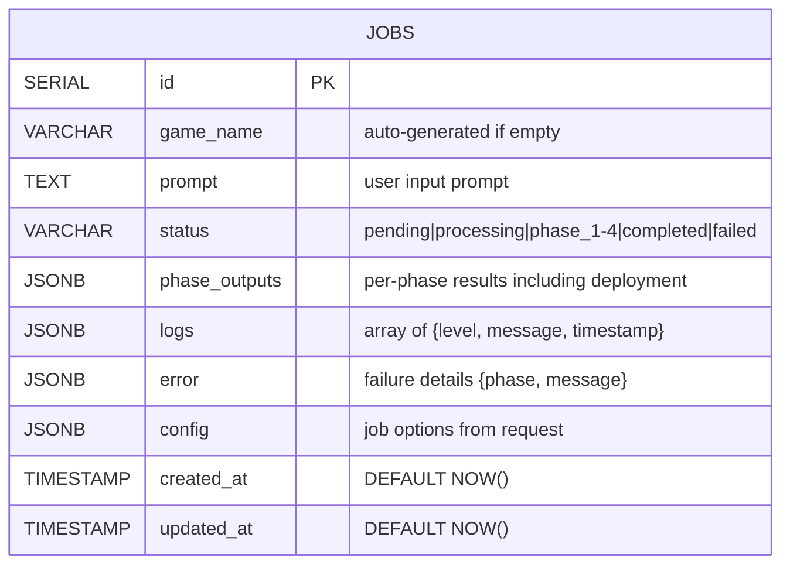
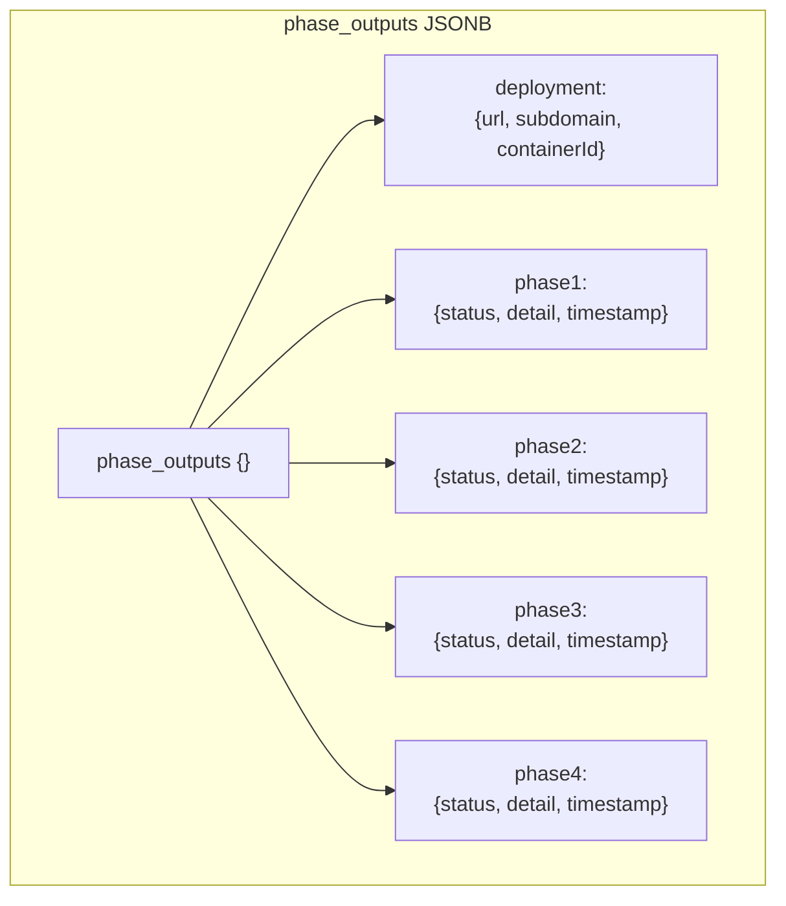
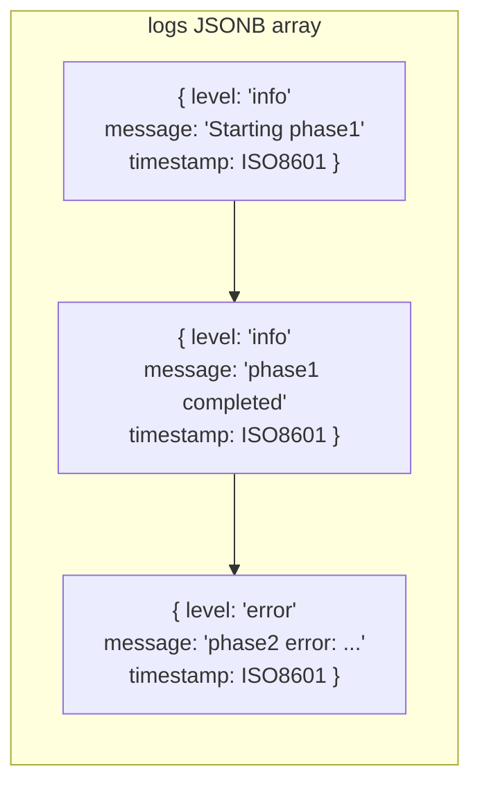
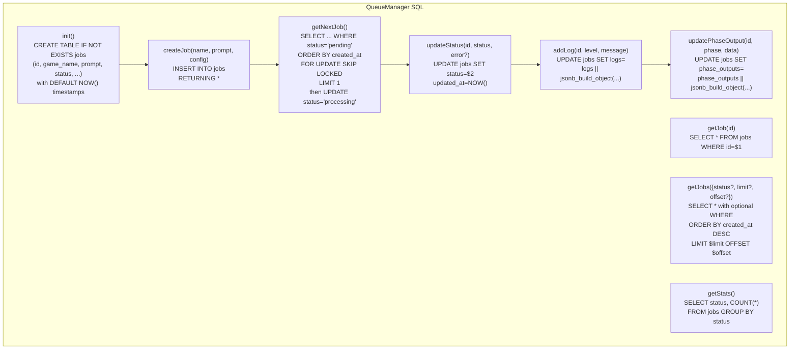

# Database Schema

```mermaid
erDiagram
    JOBS {
        SERIAL id PK
        VARCHAR game_name "auto-generated if empty"
        TEXT prompt "user input prompt"
        VARCHAR status "pending|processing|phase_1-4|completed|failed"
        JSONB phase_outputs "per-phase results including deployment"
        JSONB logs "array of {level, message, timestamp}"
        JSONB error "failure details {phase, message}"
        JSONB config "job options from request"
        TIMESTAMP created_at "DEFAULT NOW()"
        TIMESTAMP updated_at "DEFAULT NOW()"
    }
```

# Phase Outputs JSONB Structure

```mermaid
graph TD
    subgraph "phase_outputs JSONB"
        PO["phase_outputs {}"]
        DEP["deployment:\n{url, subdomain, containerId}"]
        P1O["phase1:\n{status, detail, timestamp}"]
        P2O["phase2:\n{status, detail, timestamp}"]
        P3O["phase3:\n{status, detail, timestamp}"]
        P4O["phase4:\n{status, detail, timestamp}"]
    end

    PO --> DEP
    PO --> P1O
    PO --> P2O
    PO --> P3O
    PO --> P4O
```

# Logs JSONB Array Structure

```mermaid
graph LR
    subgraph "logs JSONB array"
        L1["{ level: 'info'\nmessage: 'Starting phase1'\ntimestamp: ISO8601 }"]
        L2["{ level: 'info'\nmessage: 'phase1 completed'\ntimestamp: ISO8601 }"]
        L3["{ level: 'error'\nmessage: 'phase2 error: ...'\ntimestamp: ISO8601 }"]
    end

    L1 --> L2 --> L3
```

# SQL Operations

```mermaid
graph TD
    subgraph "QueueManager SQL"
        INIT["init()\nCREATE TABLE IF NOT EXISTS jobs\n(id, game_name, prompt, status, ...)\nwith DEFAULT NOW() timestamps"]
        CREATE["createJob(name, prompt, config)\nINSERT INTO jobs\nRETURNING *"]
        CLAIM["getNextJob()\nSELECT ... WHERE status='pending'\nORDER BY created_at\nFOR UPDATE SKIP LOCKED\nLIMIT 1\nthen UPDATE status='processing'"]
        GET["getJob(id)\nSELECT * FROM jobs WHERE id=$1"]
        LIST["getJobs({status?, limit?, offset?})\nSELECT * with optional WHERE\nORDER BY created_at DESC\nLIMIT $limit OFFSET $offset"]
        UPDATE["updateStatus(id, status, error?)\nUPDATE jobs SET status=$2\nupdated_at=NOW()"]
        LOG["addLog(id, level, message)\nUPDATE jobs SET logs=\nlogs || jsonb_build_object(...)"]
        PHASE["updatePhaseOutput(id, phase, data)\nUPDATE jobs SET phase_outputs=\nphase_outputs || jsonb_build_object(...)"]
        STATS["getStats()\nSELECT status, COUNT(*)\nFROM jobs GROUP BY status"]
    end

    INIT --> CREATE
    CREATE --> CLAIM
    CLAIM --> UPDATE
    UPDATE --> LOG
    LOG --> PHASE
```
