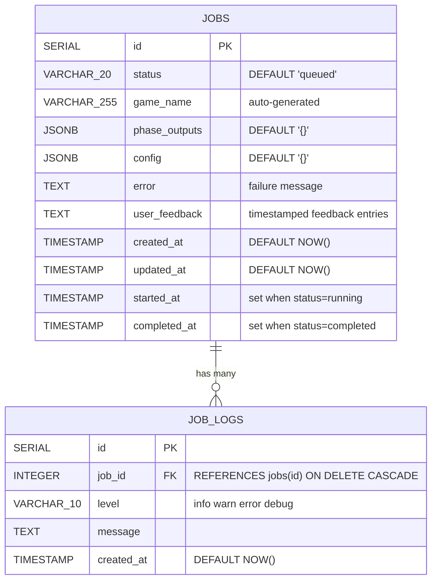
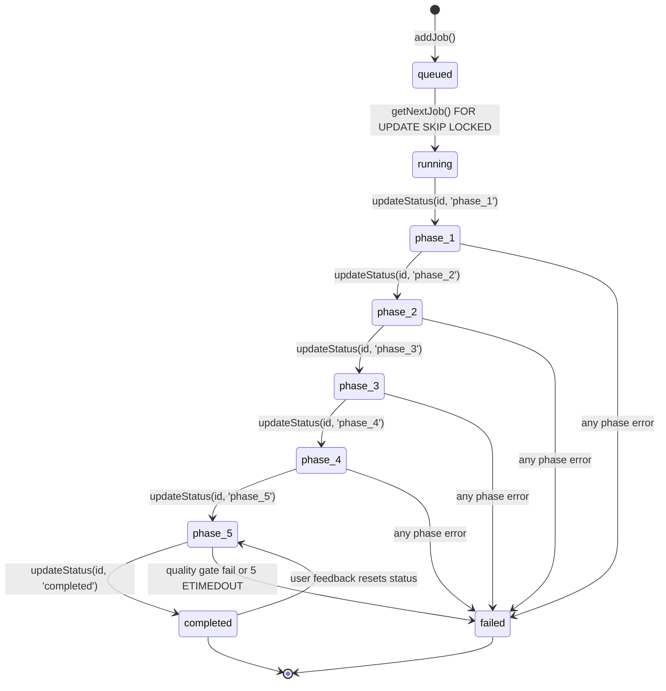
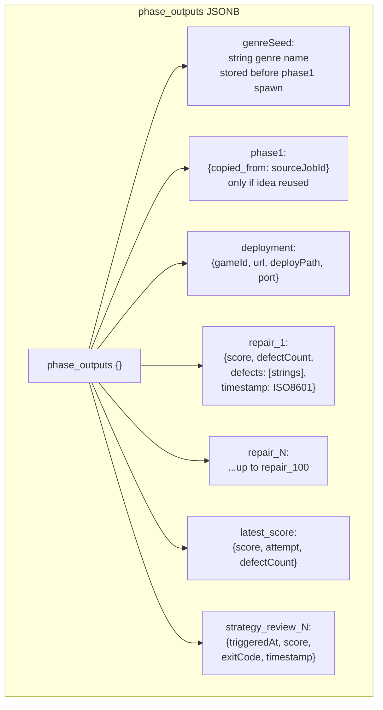

# Database Schema

```mermaid
erDiagram
    JOBS {
        SERIAL id PK
        VARCHAR_20 status "DEFAULT 'queued'"
        VARCHAR_255 game_name "auto-generated"
        JSONB phase_outputs "DEFAULT '{}'"
        JSONB config "DEFAULT '{}'"
        TEXT error "failure message"
        TEXT user_feedback "timestamped feedback entries"
        TIMESTAMP created_at "DEFAULT NOW()"
        TIMESTAMP updated_at "DEFAULT NOW()"
        TIMESTAMP started_at "set when status=running"
        TIMESTAMP completed_at "set when status=completed"
    }

    JOB_LOGS {
        SERIAL id PK
        INTEGER job_id FK "REFERENCES jobs(id) ON DELETE CASCADE"
        VARCHAR_10 level "info warn error debug"
        TEXT message
        TIMESTAMP created_at "DEFAULT NOW()"
    }

    JOBS ||--o{ JOB_LOGS : "has many"
```

# Job Status Lifecycle

```mermaid
stateDiagram-v2
    [*] --> queued: addJob()
    queued --> running: getNextJob() FOR UPDATE SKIP LOCKED
    running --> phase_1: updateStatus(id, 'phase_1')
    phase_1 --> phase_2: updateStatus(id, 'phase_2')
    phase_2 --> phase_3: updateStatus(id, 'phase_3')
    phase_3 --> phase_4: updateStatus(id, 'phase_4')
    phase_4 --> phase_5: updateStatus(id, 'phase_5')
    phase_5 --> completed: updateStatus(id, 'completed')
    phase_1 --> failed: any phase error
    phase_2 --> failed: any phase error
    phase_3 --> failed: any phase error
    phase_4 --> failed: any phase error
    phase_5 --> failed: quality gate fail or 5 ETIMEDOUT
    completed --> phase_5: user feedback resets status
    completed --> [*]
    failed --> [*]
```

# phase_outputs JSONB Structure

```mermaid
graph TD
    subgraph "phase_outputs JSONB"
        PO["phase_outputs {}"]
        GS["genreSeed:\nstring genre name\nstored before phase1 spawn"]
        P1["phase1:\n{copied_from: sourceJobId}\nonly if idea reused"]
        DEP["deployment:\n{gameId, url, deployPath, port}"]
        R1["repair_1:\n{score, defectCount,\ndefects: [strings],\ntimestamp: ISO8601}"]
        RN["repair_N:\n...up to repair_100"]
        LS["latest_score:\n{score, attempt, defectCount}"]
        SR["strategy_review_N:\n{triggeredAt, score,\nexitCode, timestamp}"]
    end

    PO --> GS
    PO --> P1
    PO --> DEP
    PO --> R1
    PO --> RN
    PO --> LS
    PO --> SR
```

# SQL Operations

```mermaid
graph TD
    subgraph "QueueManager Methods"
        INIT["init()\nCREATE TABLE IF NOT EXISTS jobs\nALTER TABLE ADD COLUMN IF NOT EXISTS user_feedback\nCREATE TABLE IF NOT EXISTS job_logs"]
        ADD["addJob({count?, options?})\nINSERT INTO jobs\n(status='queued', game_name, config)\nRETURNING id\nreturns number[]"]
        CLAIM["getNextJob()\nUPDATE jobs SET status='running'\nstarted_at=NOW()\nWHERE id = subselect\nstatus='queued' ORDER BY created_at\nFOR UPDATE SKIP LOCKED LIMIT 1\nRETURNING *"]
        GET["getJob(jobId)\nSELECT * FROM jobs\nWHERE id=$1"]
        LIST["getJobs({status?, limit=50, offset=0})\nSELECT * FROM jobs\noptional WHERE status=$1\nORDER BY created_at DESC\nLIMIT $N OFFSET $N"]
        UPDATE["updateStatus(jobId, status, data?)\nUPDATE jobs SET status=$1\n+error if failed\n+completed_at if completed\n+started_at if running\nupdated_at=NOW()"]
        PHASE["updatePhaseOutput(jobId, phase, output)\nUPDATE jobs SET phase_outputs =\nphase_outputs || jsonb_build_object\nupdated_at=NOW()"]
        LOG["addLog(jobId, level, message)\nINSERT INTO job_logs\n(job_id, level, message)"]
        GETLOG["getJobLogs(jobId)\nSELECT * FROM job_logs\nWHERE job_id=$1\nORDER BY created_at ASC"]
        SETFB["setUserFeedback(jobId, feedback)\nUPDATE jobs SET user_feedback=$1\nupdated_at=NOW()\nRETURNING *"]
        GETFB["getUserFeedback(jobId)\nSELECT user_feedback FROM jobs\nWHERE id=$1\nreturns string or null"]
        CLEAN["cleanupOld(daysOld)\nDELETE FROM job_logs WHERE job_id IN\n(SELECT id FROM jobs WHERE created_at older)\nDELETE FROM jobs WHERE created_at older\nreturns rowCount"]
        STATS["getStats()\nSELECT status, COUNT(*)::int\nFROM jobs GROUP BY status\nreturns {queued, running,\ncompleted, failed, total}"]
    end

    INIT --> ADD
    ADD --> CLAIM
    CLAIM --> UPDATE
    UPDATE --> PHASE
    PHASE --> LOG
    LOG --> GETLOG
    GETLOG --> SETFB
    SETFB --> GETFB
    GETFB --> STATS
    STATS --> CLEAN
```
