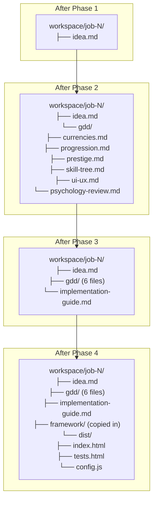
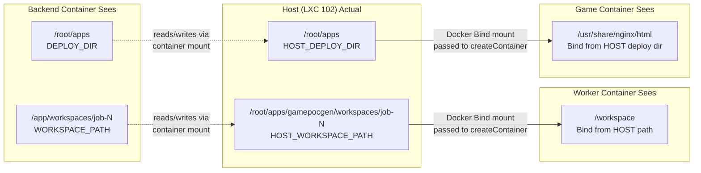
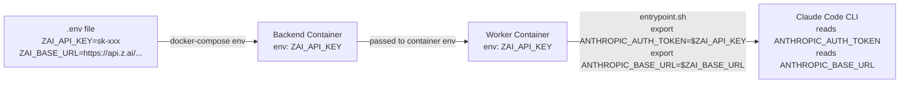

# Game Generation Pipeline

```mermaid
flowchart LR
    A["User Prompt\ntext string"] -->|"POST /api/generate"| B["Job Record\nstatus: pending\npostgresql"]
    B -->|"poller claims\nFOR UPDATE SKIP LOCKED"| C["Phase 1 Container\nClaude Code CLI"]
    C -->|"idea-generator prompt\n+ z.ai API"| D["idea.md\nGame concept\ntheme + mechanics"]
    D -->|"shared workspace\nbind mount"| E["Phase 2 Container\n6 sequential agents"]
    E -->|"6 GDD prompts\ncurrencies → psychology"| F["gdd/*.md\n6 design documents\ncurrencies progression\nprestige skill-tree\nui-ux psychology-review"]
    F -->|"shared workspace"| G["Phase 3 Container\nimplementation planner"]
    G -->|"implementation-guide prompt\nreads all GDD"| H["implementation-guide.md\n6-10 TDD phases"]
    H -->|"shared workspace\n+ framework/ copy"| I["Phase 4 Container\nTDD orchestrator"]
    I -->|"orchestrator prompt\nwrite tests → implement"| J["dist/\nindex.html\ntests.html\nconfig.js"]
    J -->|"copy to deploy dir"| K["nginx:alpine\ngamedemoN.namjo-games.com\nTraefik auto-SSL"]
```

# Workspace File Accumulation

```mermaid
flowchart TD
    subgraph "After Phase 1"
        W1["workspace/job-N/\n├── idea.md"]
    end

    subgraph "After Phase 2"
        W2["workspace/job-N/\n├── idea.md\n└── gdd/\n    ├── currencies.md\n    ├── progression.md\n    ├── prestige.md\n    ├── skill-tree.md\n    ├── ui-ux.md\n    └── psychology-review.md"]
    end

    subgraph "After Phase 3"
        W3["workspace/job-N/\n├── idea.md\n├── gdd/ (6 files)\n└── implementation-guide.md"]
    end

    subgraph "After Phase 4"
        W4["workspace/job-N/\n├── idea.md\n├── gdd/ (6 files)\n├── implementation-guide.md\n├── framework/ (copied in)\n└── dist/\n    ├── index.html\n    ├── tests.html\n    └── config.js"]
    end

    W1 --> W2 --> W3 --> W4
```

# Docker Bind Mount Path Translation

```mermaid
flowchart LR
    subgraph "Backend Container Sees"
        BC_WS["/app/workspaces/job-N\nWORKSPACE_PATH"]
        BC_DD["/root/apps\nDEPLOY_DIR"]
    end

    subgraph "Host (LXC 102) Actual"
        HOST_WS["/root/apps/gamepocgen/workspaces/job-N\nHOST_WORKSPACE_PATH"]
        HOST_DD["/root/apps\nHOST_DEPLOY_DIR"]
    end

    subgraph "Worker Container Sees"
        WC["/workspace\nBind from HOST path"]
    end

    subgraph "Game Container Sees"
        GC["/usr/share/nginx/html\nBind from HOST deploy dir"]
    end

    BC_WS -.->|"reads/writes via\ncontainer mount"| HOST_WS
    HOST_WS -->|"Docker Bind mount\npassed to createContainer"| WC
    BC_DD -.->|"reads/writes via\ncontainer mount"| HOST_DD
    HOST_DD -->|"Docker Bind mount\npassed to createContainer"| GC
```

# Environment Variable Translation

```mermaid
flowchart LR
    ENV[".env file\nZAI_API_KEY=sk-xxx\nZAI_BASE_URL=https://api.z.ai/..."]
    -->|"docker-compose env"| BACKEND["Backend Container\nenv: ZAI_API_KEY"]
    -->|"passed to container env"| WORKER["Worker Container\nenv: ZAI_API_KEY"]

    WORKER -->|"entrypoint.sh\nexport ANTHROPIC_AUTH_TOKEN=$ZAI_API_KEY\nexport ANTHROPIC_BASE_URL=$ZAI_BASE_URL"| CLAUDE["Claude Code CLI\nreads ANTHROPIC_AUTH_TOKEN\nreads ANTHROPIC_BASE_URL"]
```
