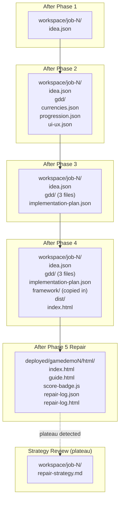
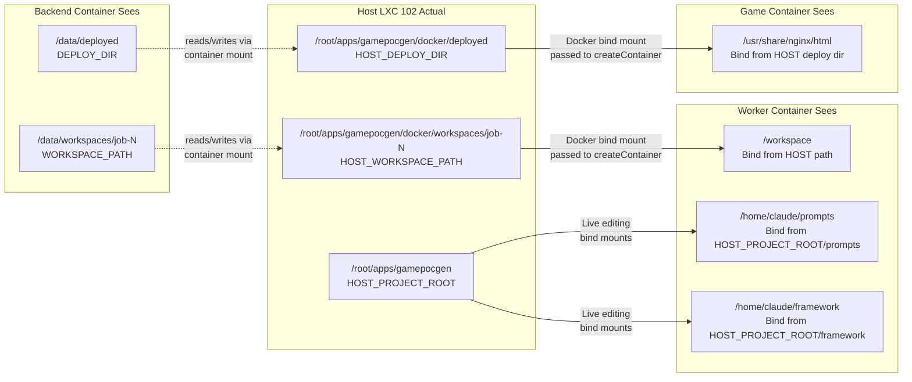
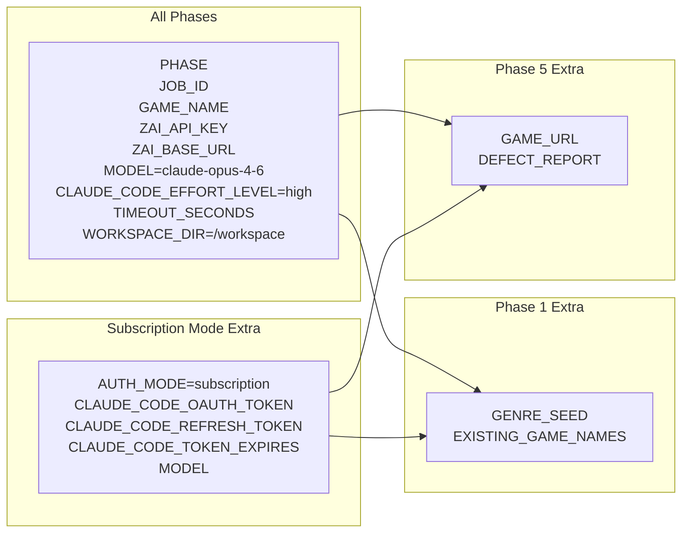
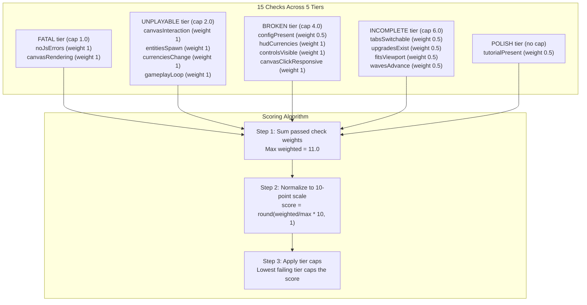
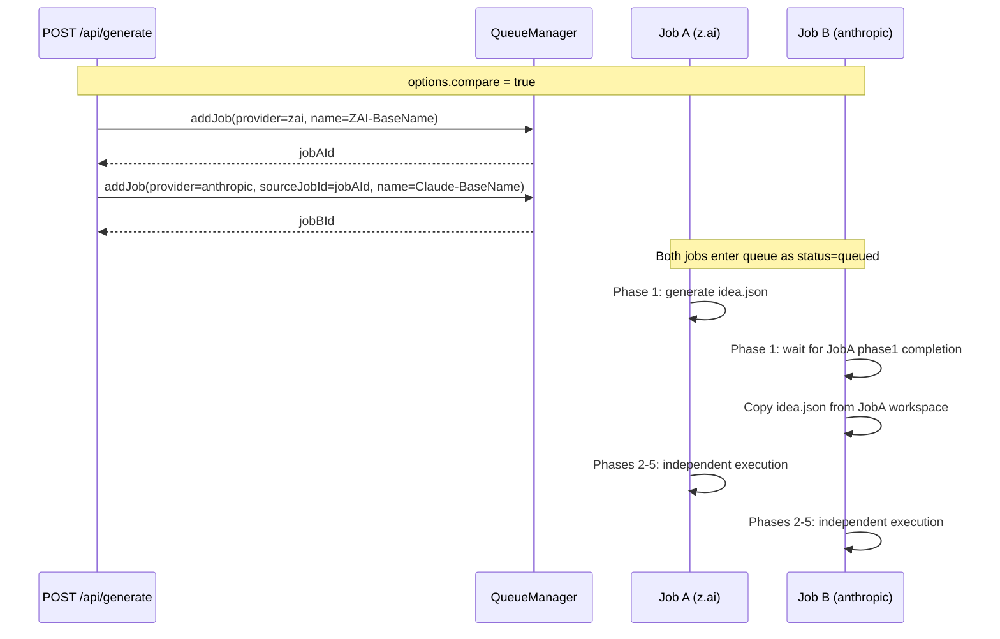

# Game Generation Pipeline

```mermaid
flowchart LR
    A["User Prompt\ntext string"] -->|"POST /api/generate"| B["Job Record\nstatus: queued\nPostgreSQL"]
    B -->|"poller claims\nFOR UPDATE SKIP LOCKED"| C["Phase 1 Container\nClaude Code CLI"]
    C -->|"idea-generator prompt"| D["idea.json\nGame concept\ntheme + mechanics"]
    D -->|"shared workspace\nbind mount"| E["Phase 2 Container\n3 sequential agents"]
    E -->|"3 GDD prompts\ncurrencies progression ui-ux"| F["gdd/*.json\n3 design documents\ncurrencies progression ui-ux"]
    F -->|"shared workspace"| G["Phase 3 Container\nimplementation planner"]
    G -->|"implementation-guide prompt\nreads all GDD"| H["implementation-plan.json\nTDD phases"]
    H -->|"shared workspace\n+ framework/ copy"| I["Phase 4 Container\nTDD orchestrator"]
    I -->|"orchestrator prompt\nwrite tests then implement"| J["dist/\nindex.html"]
    J -->|"copy to deploy dir"| K["nginx:alpine\ngamedemoN.namjo-games.com\nTraefik auto-SSL"]
    K -->|"Playwright test\nrunPlaywrightTest()"| L["Phase 5 Repair Loop\nup to 100 iterations\ntarget 10/10 score"]
    L -->|"redeploy after\neach repair"| K
```

# Workspace File Accumulation

# Docker Bind Mount Path Translation

# Environment Variable Translation

```mermaid
flowchart TD
    subgraph "API Key Mode AUTH_MODE=apikey"
        ENV_A[".env file\nZAI_API_KEY=sk-xxx\nZAI_BASE_URL=https://api.z.ai/..."]
        -->|"docker-compose env"| BACKEND_A["Backend Container\nenv: ZAI_API_KEY"]
        -->|"passed to container env"| WORKER_A["Worker Container\nenv: ZAI_API_KEY ZAI_BASE_URL"]
        WORKER_A -->|"entrypoint.sh\nexport ANTHROPIC_AUTH_TOKEN=$ZAI_API_KEY\nexport ANTHROPIC_BASE_URL=$ZAI_BASE_URL"| CLAUDE_A["Claude Code CLI\nreads ANTHROPIC_AUTH_TOKEN\nreads ANTHROPIC_BASE_URL"]
    end

    subgraph "Subscription Mode AUTH_MODE=subscription"
        ENV_B[".env file\nCLAUDE_CODE_OAUTH_TOKEN=...\nCLAUDE_CODE_REFRESH_TOKEN=...\nCLAUDE_CODE_TOKEN_EXPIRES=..."]
        -->|"docker-compose env"| BACKEND_B["Backend Container\nenv: CLAUDE_CODE_OAUTH_TOKEN"]
        -->|"processJob() builds\nproviderEnv array"| WORKER_B["Worker Container\nenv: AUTH_MODE=subscription\nCLAUDE_CODE_OAUTH_TOKEN\nCLAUDE_CODE_REFRESH_TOKEN\nCLAUDE_CODE_TOKEN_EXPIRES\nMODEL"]
        WORKER_B -->|"entrypoint.sh\nwrites .credentials.json\nrefresh_oauth_token()"| CLAUDE_B["Claude Code CLI\nreads OAuth credentials\nfrom .credentials.json"]
    end
```

# Worker Container Environment Variables

# Tier-Based Scoring System

# Comparison Job Pipeline

