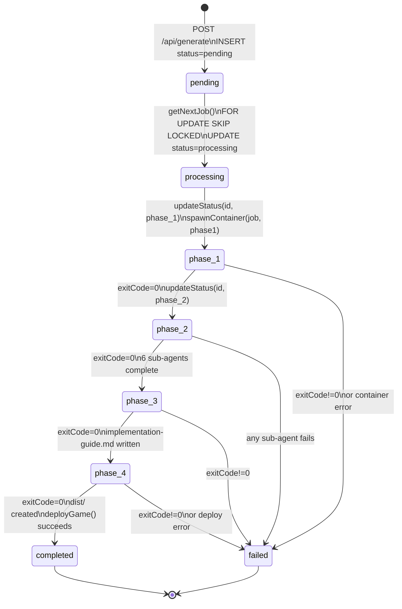
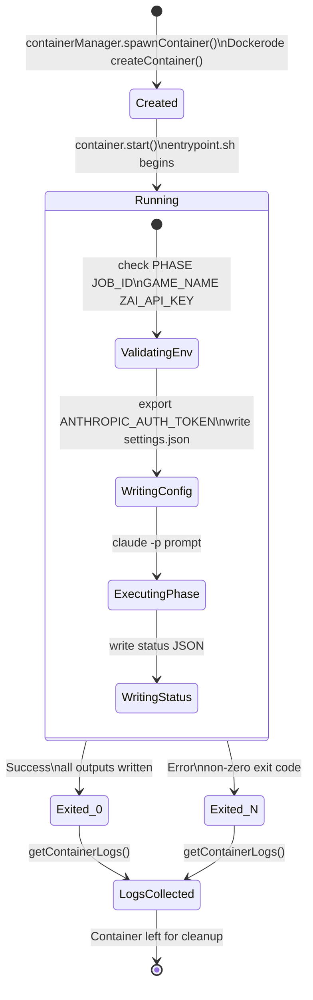
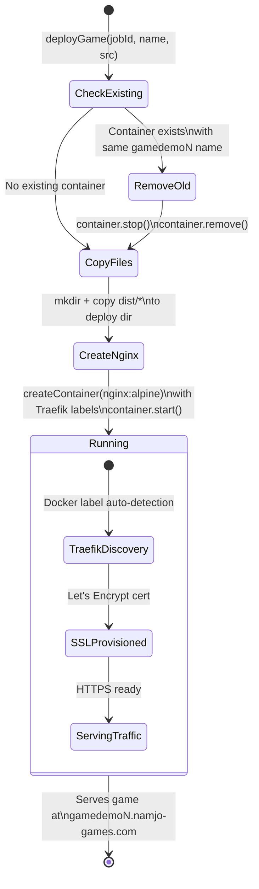
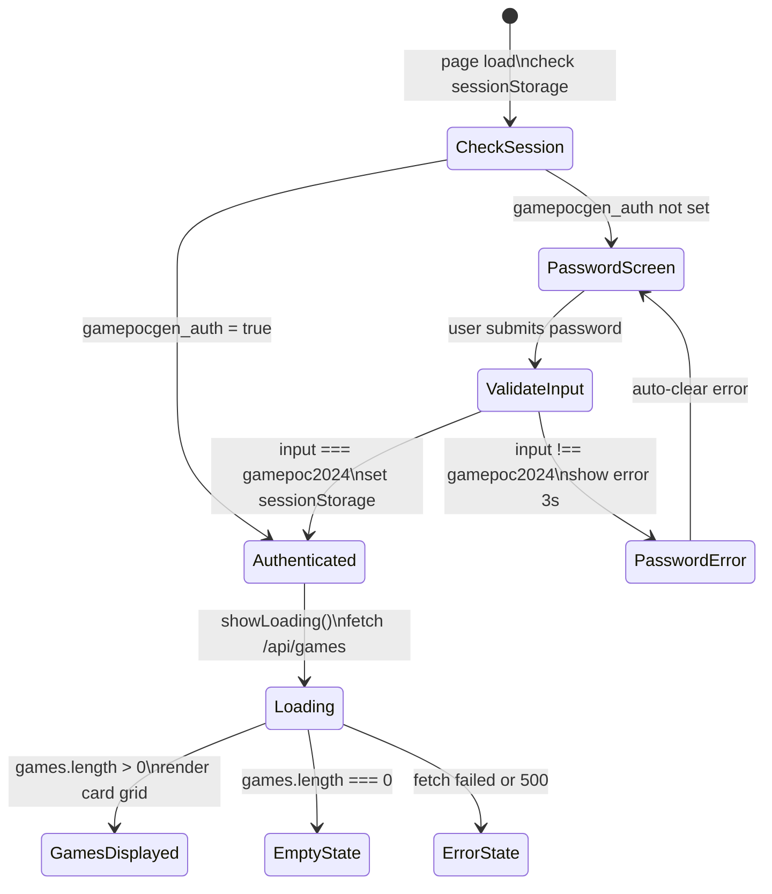

# Job Status Lifecycle

```mermaid
stateDiagram-v2
    [*] --> pending: POST /api/generate\nINSERT status=pending

    pending --> processing: getNextJob()\nFOR UPDATE SKIP LOCKED\nUPDATE status=processing

    processing --> phase_1: updateStatus(id, phase_1)\nspawnContainer(job, phase1)

    phase_1 --> phase_2: exitCode=0\nupdateStatus(id, phase_2)
    phase_1 --> failed: exitCode!=0\nor container error

    phase_2 --> phase_3: exitCode=0\n6 sub-agents complete
    phase_2 --> failed: any sub-agent fails

    phase_3 --> phase_4: exitCode=0\nimplementation-guide.md written
    phase_3 --> failed: exitCode!=0

    phase_4 --> completed: exitCode=0\ndist/ created\ndeployGame() succeeds
    phase_4 --> failed: exitCode!=0\nor deploy error

    completed --> [*]
    failed --> [*]
```

# Worker Container Lifecycle

```mermaid
stateDiagram-v2
    [*] --> Created: containerManager.spawnContainer()\nDockerode createContainer()

    Created --> Running: container.start()\nentrypoint.sh begins

    state Running {
        [*] --> ValidatingEnv: check PHASE JOB_ID\nGAME_NAME ZAI_API_KEY
        ValidatingEnv --> WritingConfig: export ANTHROPIC_AUTH_TOKEN\nwrite settings.json
        WritingConfig --> ExecutingPhase: claude -p prompt
        ExecutingPhase --> WritingStatus: write status JSON
    }

    Running --> Exited_0: Success\nall outputs written
    Running --> Exited_N: Error\nnon-zero exit code

    Exited_0 --> LogsCollected: getContainerLogs()
    Exited_N --> LogsCollected: getContainerLogs()

    LogsCollected --> [*]: Container left for cleanup
```

# Game Container Lifecycle

```mermaid
stateDiagram-v2
    [*] --> CheckExisting: deployGame(jobId, name, src)

    CheckExisting --> RemoveOld: Container exists\nwith same gamedemoN name
    CheckExisting --> CopyFiles: No existing container

    RemoveOld --> CopyFiles: container.stop()\ncontainer.remove()

    CopyFiles --> CreateNginx: mkdir + copy dist/*\nto deploy dir

    CreateNginx --> Running: createContainer(nginx:alpine)\nwith Traefik labels\ncontainer.start()

    Running --> [*]: Serves game at\ngamedemoN.namjo-games.com

    state Running {
        [*] --> TraefikDiscovery: Docker label auto-detection
        TraefikDiscovery --> SSLProvisioned: Let's Encrypt cert
        SSLProvisioned --> ServingTraffic: HTTPS ready
    }
```

# Gallery Auth State

```mermaid
stateDiagram-v2
    [*] --> CheckSession: page load\ncheck sessionStorage

    CheckSession --> PasswordScreen: gamepocgen_auth not set
    CheckSession --> Authenticated: gamepocgen_auth = true

    PasswordScreen --> ValidateInput: user submits password

    ValidateInput --> PasswordError: input !== gamepoc2024\nshow error 3s
    ValidateInput --> Authenticated: input === gamepoc2024\nset sessionStorage

    PasswordError --> PasswordScreen: auto-clear error

    Authenticated --> Loading: showLoading()\nfetch /api/games

    Loading --> GamesDisplayed: games.length > 0\nrender card grid
    Loading --> EmptyState: games.length === 0
    Loading --> ErrorState: fetch failed or 500
```
