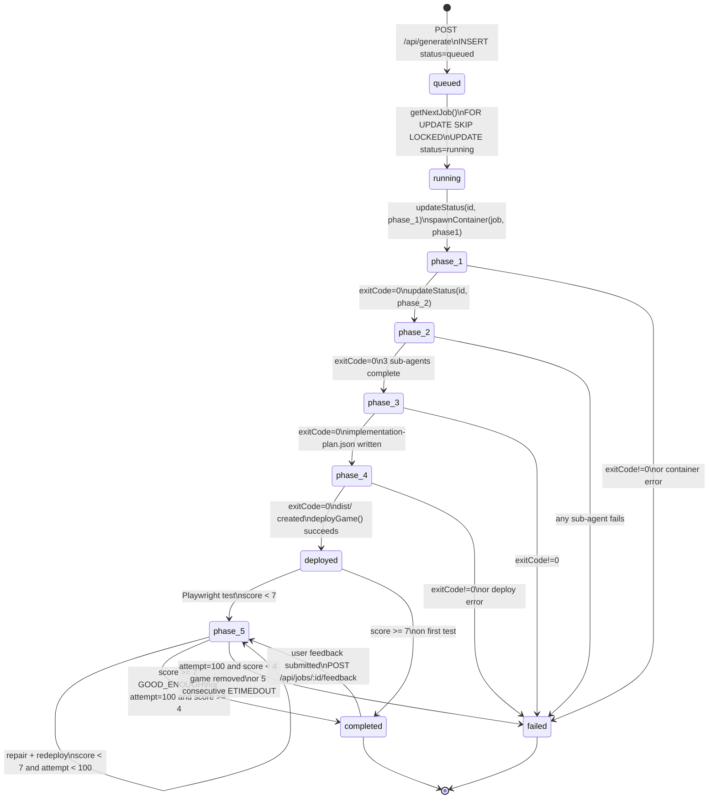
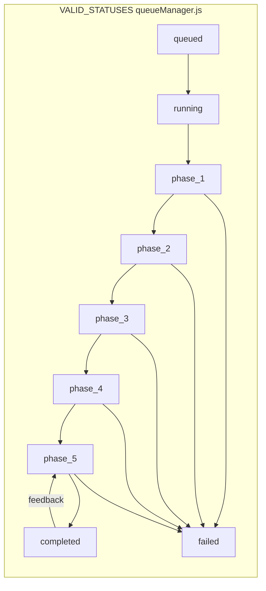
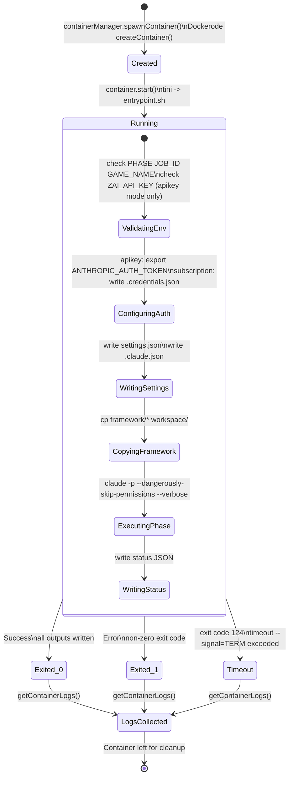
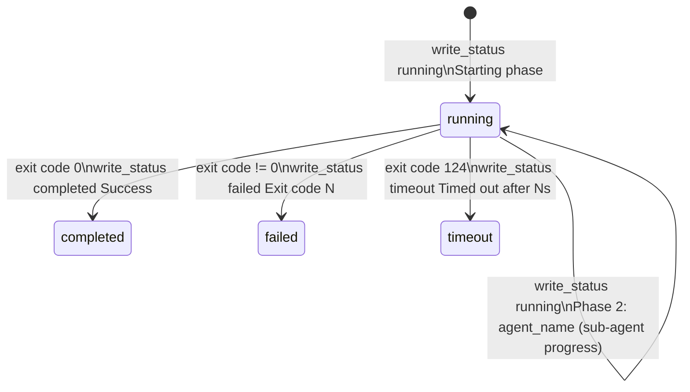
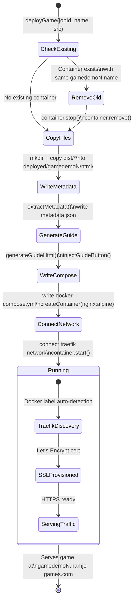
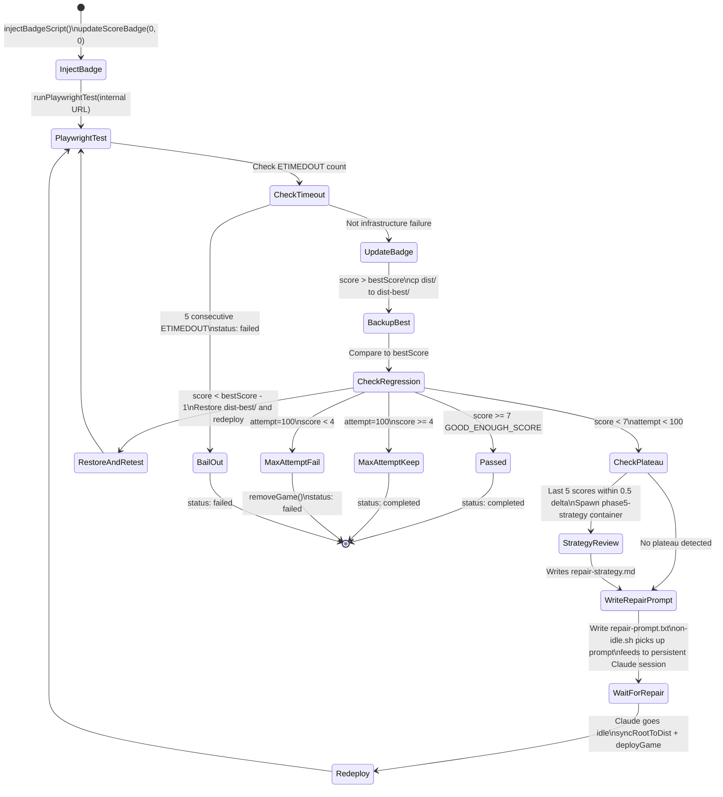
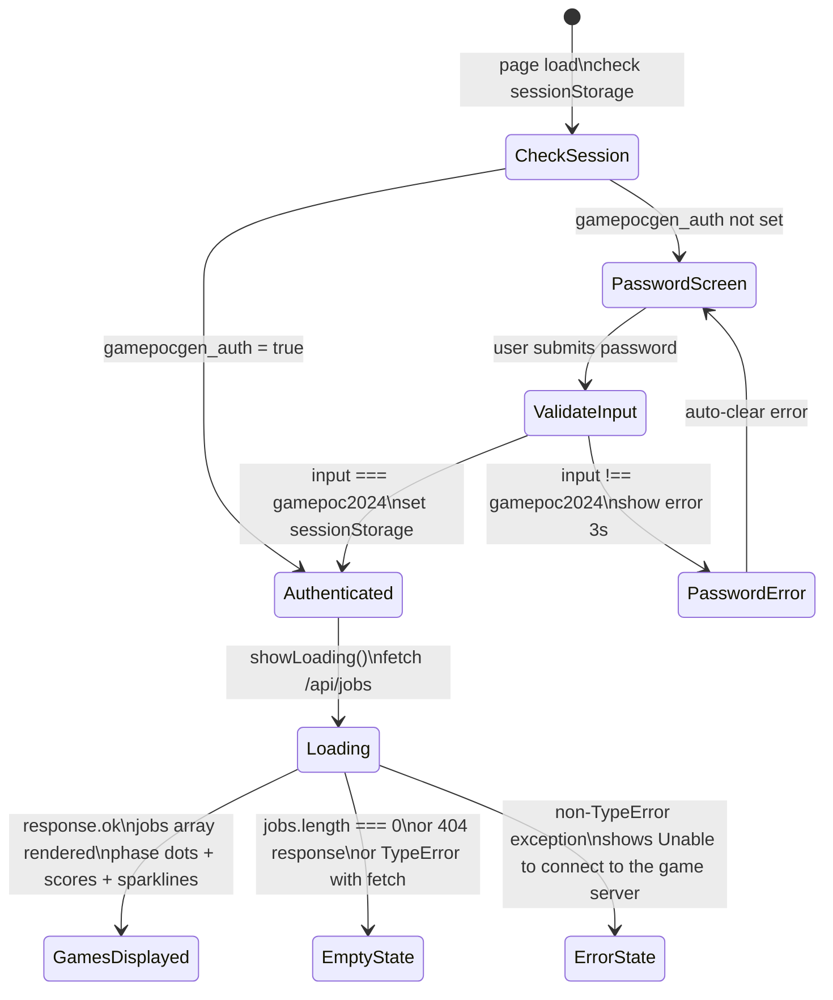
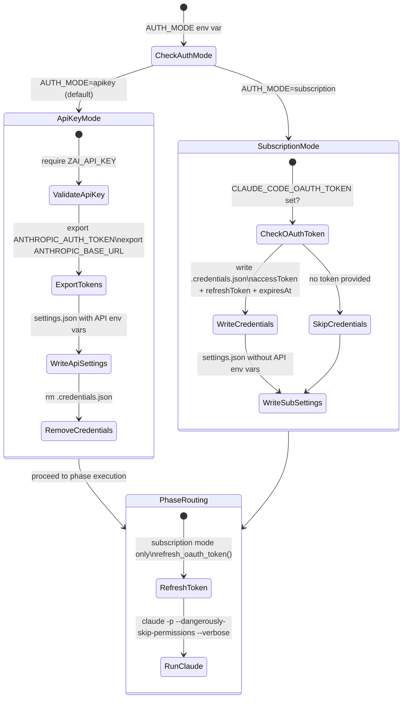

# Job Status Lifecycle

# Valid Status Values

# Worker Container Lifecycle

# Worker Status File States

# Game Container Lifecycle

# Phase 5 Repair Iteration Lifecycle

# Gallery Auth State

# Entrypoint Auth Mode Branching

