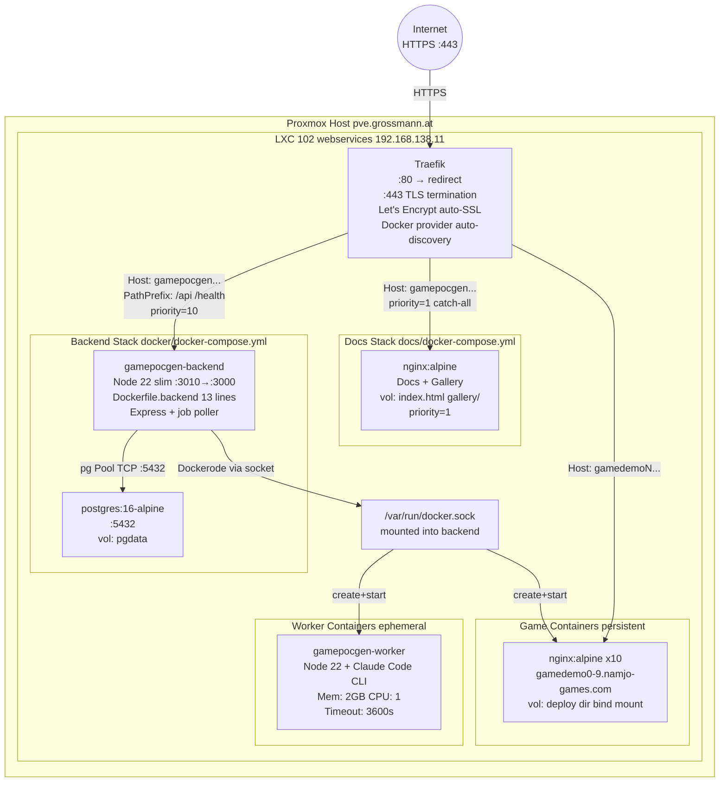
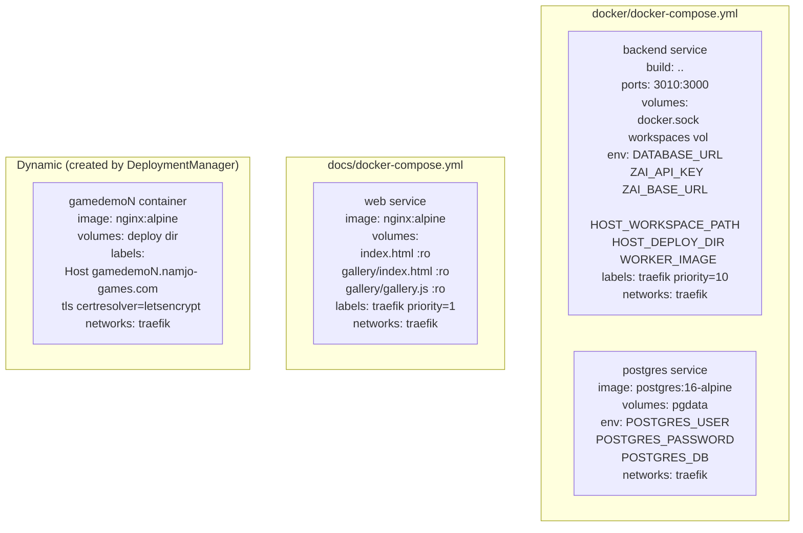
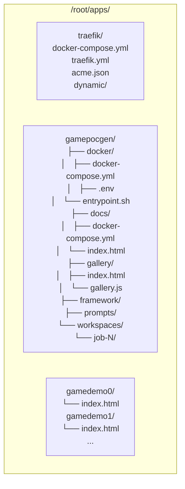
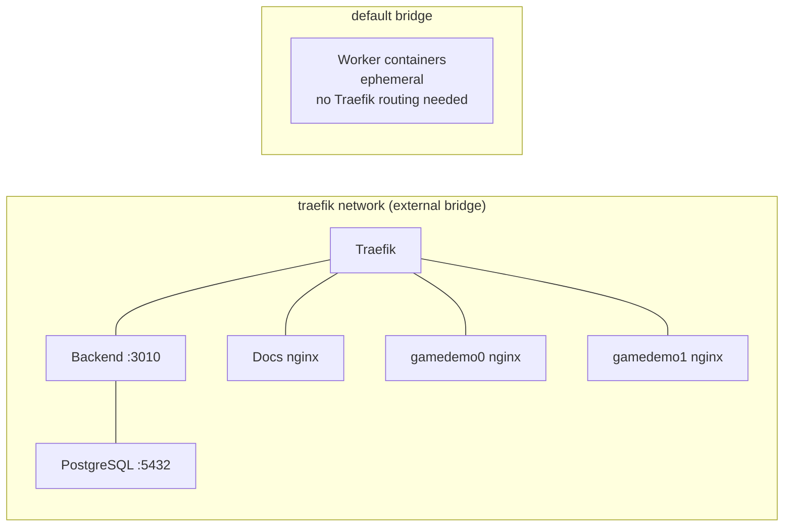
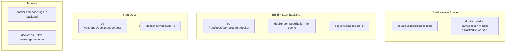

# Infrastructure Topology

```mermaid
graph TB
    INET((Internet\nHTTPS :443))

    subgraph "Proxmox Host pve.grossmann.at"
        subgraph "LXC 102 webservices 192.168.138.11"
            TRAEFIK["Traefik\n:80 → redirect\n:443 TLS termination\nLet's Encrypt auto-SSL\nDocker provider auto-discovery"]

            subgraph "Backend Stack docker/docker-compose.yml"
                BACK["gamepocgen-backend\nNode 22 slim :3010→:3000\nDockerfile.backend 13 lines\nExpress + job poller"]
                PG["postgres:16-alpine\n:5432\nvol: pgdata"]
            end

            subgraph "Docs Stack docs/docker-compose.yml"
                NGINX_DOCS["nginx:alpine\nDocs + Gallery\nvol: index.html gallery/\npriority=1"]
            end

            subgraph "Worker Containers ephemeral"
                WORKER["gamepocgen-worker\nNode 22 + Claude Code CLI\nMem: 2GB CPU: 1\nTimeout: 3600s"]
            end

            subgraph "Game Containers persistent"
                GAME["nginx:alpine x10\ngamedemo0-9.namjo-games.com\nvol: deploy dir bind mount"]
            end

            DOCKER_SOCK["/var/run/docker.sock\nmounted into backend"]
        end
    end

    INET -->|"HTTPS"| TRAEFIK
    TRAEFIK -->|"Host: gamepocgen...\nPathPrefix: /api /health\npriority=10"| BACK
    TRAEFIK -->|"Host: gamepocgen...\npriority=1 catch-all"| NGINX_DOCS
    TRAEFIK -->|"Host: gamedemoN..."| GAME
    BACK -->|"pg Pool TCP :5432"| PG
    BACK -->|"Dockerode via socket"| DOCKER_SOCK
    DOCKER_SOCK -->|"create+start"| WORKER
    DOCKER_SOCK -->|"create+start"| GAME
```

# Docker Compose Services

```mermaid
graph TD
    subgraph "docker/docker-compose.yml"
        B_SVC["backend service\nbuild: ..\nports: 3010:3000\nvolumes:\n  docker.sock\n  workspaces vol\nenv: DATABASE_URL\n  ZAI_API_KEY ZAI_BASE_URL\n  HOST_WORKSPACE_PATH\n  HOST_DEPLOY_DIR\n  WORKER_IMAGE\nlabels: traefik priority=10\nnetworks: traefik"]

        P_SVC["postgres service\nimage: postgres:16-alpine\nvolumes: pgdata\nenv: POSTGRES_USER\n  POSTGRES_PASSWORD\n  POSTGRES_DB\nnetworks: traefik"]
    end

    subgraph "docs/docker-compose.yml"
        D_SVC["web service\nimage: nginx:alpine\nvolumes:\n  index.html :ro\n  gallery/index.html :ro\n  gallery/gallery.js :ro\nlabels: traefik priority=1\nnetworks: traefik"]
    end

    subgraph "Dynamic (created by DeploymentManager)"
        G_SVC["gamedemoN container\nimage: nginx:alpine\nvolumes: deploy dir\nlabels:\n  Host gamedemoN.namjo-games.com\n  tls certresolver=letsencrypt\nnetworks: traefik"]
    end
```

# Filesystem Layout LXC 102

```mermaid
graph TD
    subgraph "/root/apps/"
        T_DIR["traefik/\ndocker-compose.yml\ntraefik.yml\nacme.json\ndynamic/"]
        G_DIR["gamepocgen/\n├── docker/\n│   ├── docker-compose.yml\n│   ├── .env\n│   └── entrypoint.sh\n├── docs/\n│   ├── docker-compose.yml\n│   └── index.html\n├── gallery/\n│   ├── index.html\n│   └── gallery.js\n├── framework/\n├── prompts/\n└── workspaces/\n    └── job-N/"]
        DEMO["gamedemo0/\n└── index.html\ngamedemo1/\n└── index.html\n..."]
    end
```

# Docker Network

```mermaid
graph LR
    subgraph "traefik network (external bridge)"
        TF["Traefik"]
        BE["Backend :3010"]
        PG2["PostgreSQL :5432"]
        DOC["Docs nginx"]
        GD0["gamedemo0 nginx"]
        GD1["gamedemo1 nginx"]
    end

    subgraph "default bridge"
        WK["Worker containers\nephemeral\nno Traefik routing needed"]
    end

    TF --- BE
    TF --- DOC
    TF --- GD0
    TF --- GD1
    BE --- PG2
```

# Build and Deploy Commands

```mermaid
flowchart TD
    subgraph "Build Worker Image"
        BW1["cd /root/apps/gamepocgen"] --> BW2["docker build -t gamepocgen-worker\n-f Dockerfile.worker ."]
    end

    subgraph "Build + Start Backend"
        BB1["cd /root/apps/gamepocgen/docker"] --> BB2["docker compose build --no-cache"] --> BB3["docker compose up -d"]
    end

    subgraph "Start Docs"
        BD1["cd /root/apps/gamepocgen/docs"] --> BD2["docker compose up -d"]
    end

    subgraph "Monitor"
        M1["docker compose logs -f backend"]
        M2["docker ps --filter name=gamedemo"]
    end
```
