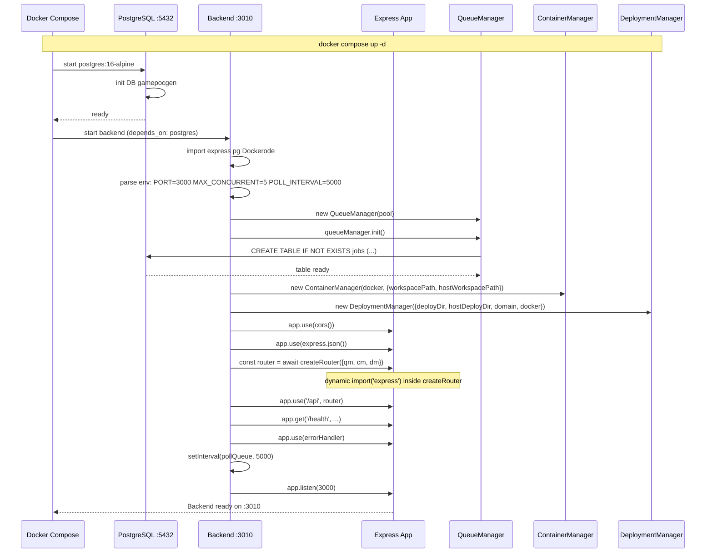
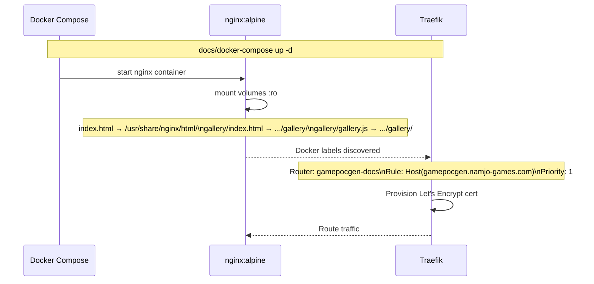
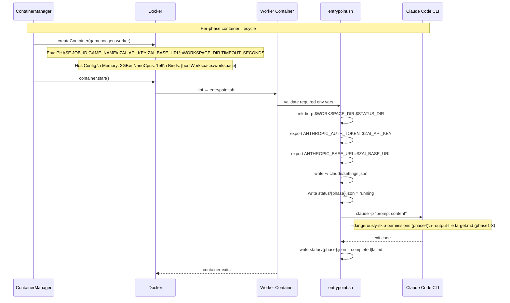
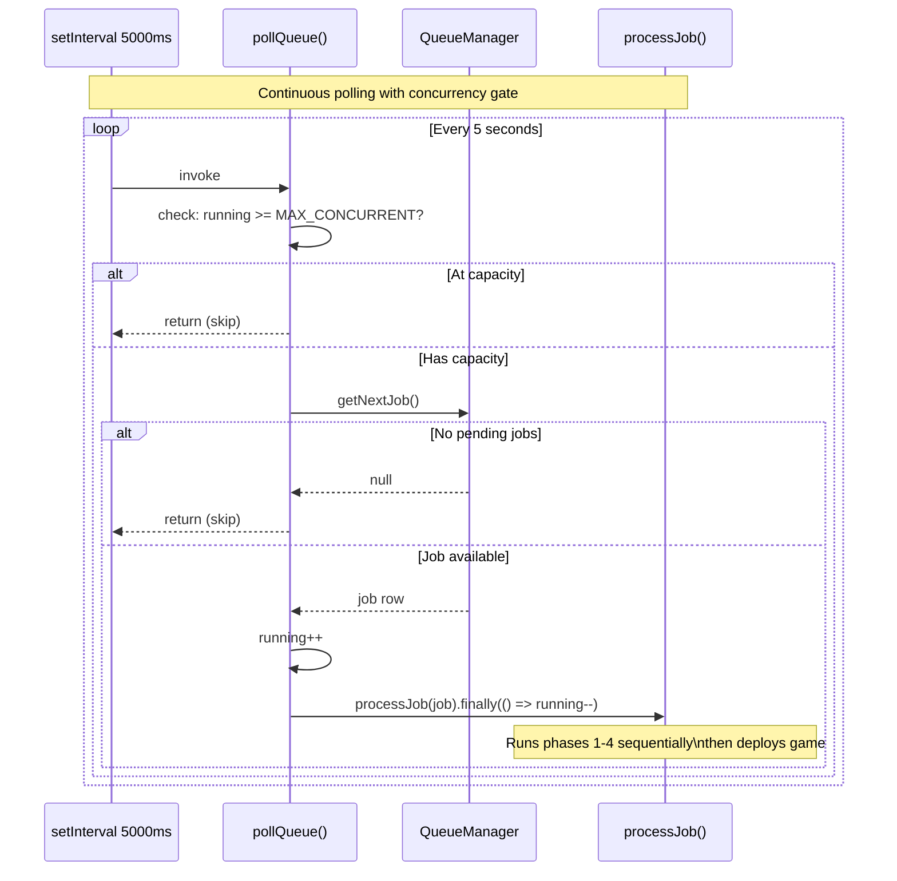

# Backend Boot Sequence

```mermaid
sequenceDiagram
    participant DC as Docker Compose
    participant PG as PostgreSQL :5432
    participant BE as Backend :3010
    participant EXP as Express App
    participant QM as QueueManager
    participant CM as ContainerManager
    participant DM as DeploymentManager

    Note over DC,DM: docker compose up -d

    DC->>PG: start postgres:16-alpine
    PG->>PG: init DB gamepocgen
    PG-->>DC: ready

    DC->>BE: start backend (depends_on: postgres)
    BE->>BE: import express pg Dockerode
    BE->>BE: parse env: PORT=3000 MAX_CONCURRENT=5 POLL_INTERVAL=5000

    BE->>QM: new QueueManager(pool)
    BE->>QM: queueManager.init()
    QM->>PG: CREATE TABLE IF NOT EXISTS jobs (...)
    PG-->>QM: table ready

    BE->>CM: new ContainerManager(docker, {workspacePath, hostWorkspacePath})
    BE->>DM: new DeploymentManager({deployDir, hostDeployDir, domain, docker})

    BE->>EXP: app.use(cors())
    BE->>EXP: app.use(express.json())
    BE->>EXP: const router = await createRouter({qm, cm, dm})
    Note over EXP: dynamic import('express') inside createRouter
    BE->>EXP: app.use('/api', router)
    BE->>EXP: app.get('/health', ...)
    BE->>EXP: app.use(errorHandler)

    BE->>BE: setInterval(pollQueue, 5000)
    BE->>EXP: app.listen(3000)
    EXP-->>DC: Backend ready on :3010
```

# Docs + Gallery Boot

```mermaid
sequenceDiagram
    participant DC as Docker Compose
    participant NG as nginx:alpine
    participant TF as Traefik

    Note over DC,TF: docs/docker-compose up -d

    DC->>NG: start nginx container
    NG->>NG: mount volumes :ro
    Note over NG: index.html → /usr/share/nginx/html/\ngallery/index.html → .../gallery/\ngallery/gallery.js → .../gallery/

    NG-->>TF: Docker labels discovered
    Note over TF: Router: gamepocgen-docs\nRule: Host(gamepocgen.namjo-games.com)\nPriority: 1

    TF->>TF: Provision Let's Encrypt cert
    TF-->>NG: Route traffic
```

# Worker Container Boot

```mermaid
sequenceDiagram
    participant CM as ContainerManager
    participant Docker
    participant Worker as Worker Container
    participant Entry as entrypoint.sh
    participant Claude as Claude Code CLI

    Note over CM,Claude: Per-phase container lifecycle

    CM->>Docker: createContainer(gamepocgen-worker)
    Note over Docker: Env: PHASE JOB_ID GAME_NAME\nZAI_API_KEY ZAI_BASE_URL\nWORKSPACE_DIR TIMEOUT_SECONDS
    Note over Docker: HostConfig:\n  Memory: 2GB\n  NanoCpus: 1e9\n  Binds: [hostWorkspace:/workspace]

    CM->>Docker: container.start()
    Docker->>Worker: tini → entrypoint.sh

    Worker->>Entry: validate required env vars
    Entry->>Entry: mkdir -p $WORKSPACE_DIR $STATUS_DIR
    Entry->>Entry: export ANTHROPIC_AUTH_TOKEN=$ZAI_API_KEY
    Entry->>Entry: export ANTHROPIC_BASE_URL=$ZAI_BASE_URL
    Entry->>Entry: write ~/.claude/settings.json
    Entry->>Entry: write status/{phase}.json = running

    Entry->>Claude: claude -p "prompt content"
    Note over Claude: --dangerously-skip-permissions (phase4)\n--output-file target.md (phase1-3)
    Claude-->>Entry: exit code

    Entry->>Entry: write status/{phase}.json = completed|failed
    Worker-->>Docker: container exits
```

# Job Polling Loop

```mermaid
sequenceDiagram
    participant Timer as setInterval 5000ms
    participant Poller as pollQueue()
    participant QM as QueueManager
    participant Process as processJob()

    Note over Timer,Process: Continuous polling with concurrency gate

    loop Every 5 seconds
        Timer->>Poller: invoke
        Poller->>Poller: check: running >= MAX_CONCURRENT?
        alt At capacity
            Poller-->>Timer: return (skip)
        else Has capacity
            Poller->>QM: getNextJob()
            alt No pending jobs
                QM-->>Poller: null
                Poller-->>Timer: return (skip)
            else Job available
                QM-->>Poller: job row
                Poller->>Poller: running++
                Poller->>Process: processJob(job).finally(() => running--)
                Note over Process: Runs phases 1-4 sequentially\nthen deploys game
            end
        end
    end
```
