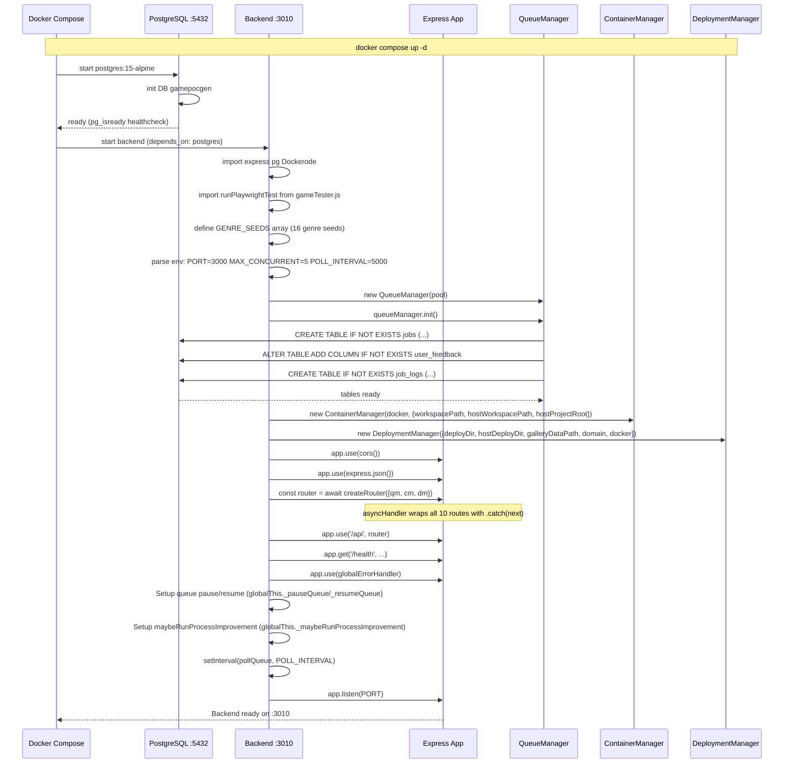
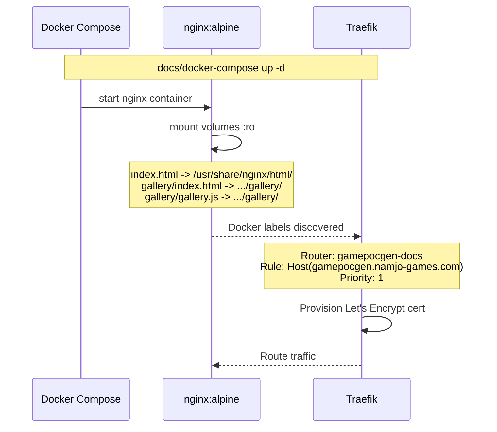
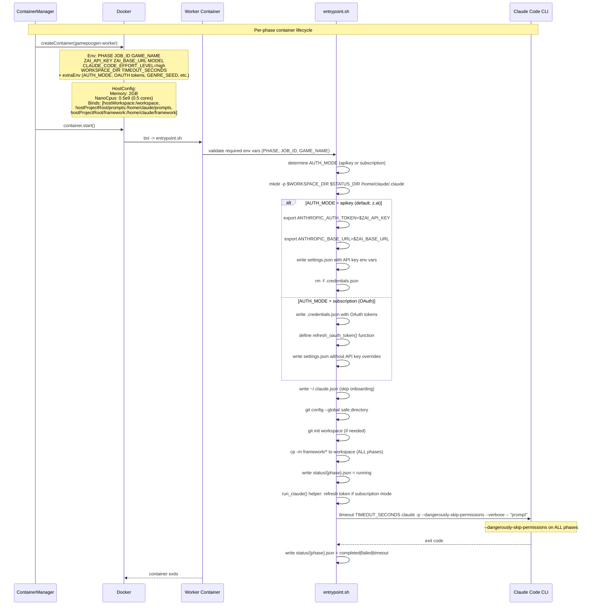
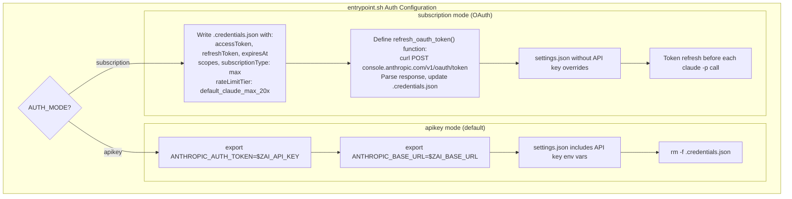
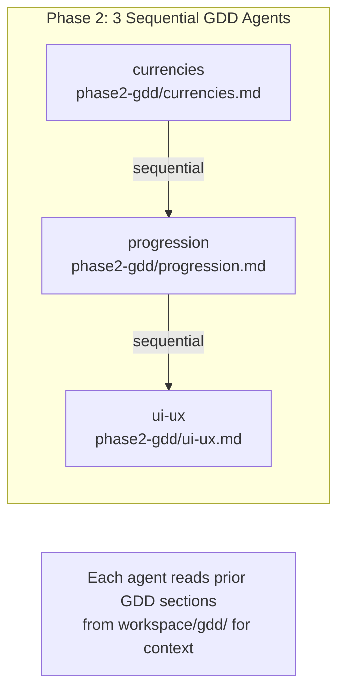
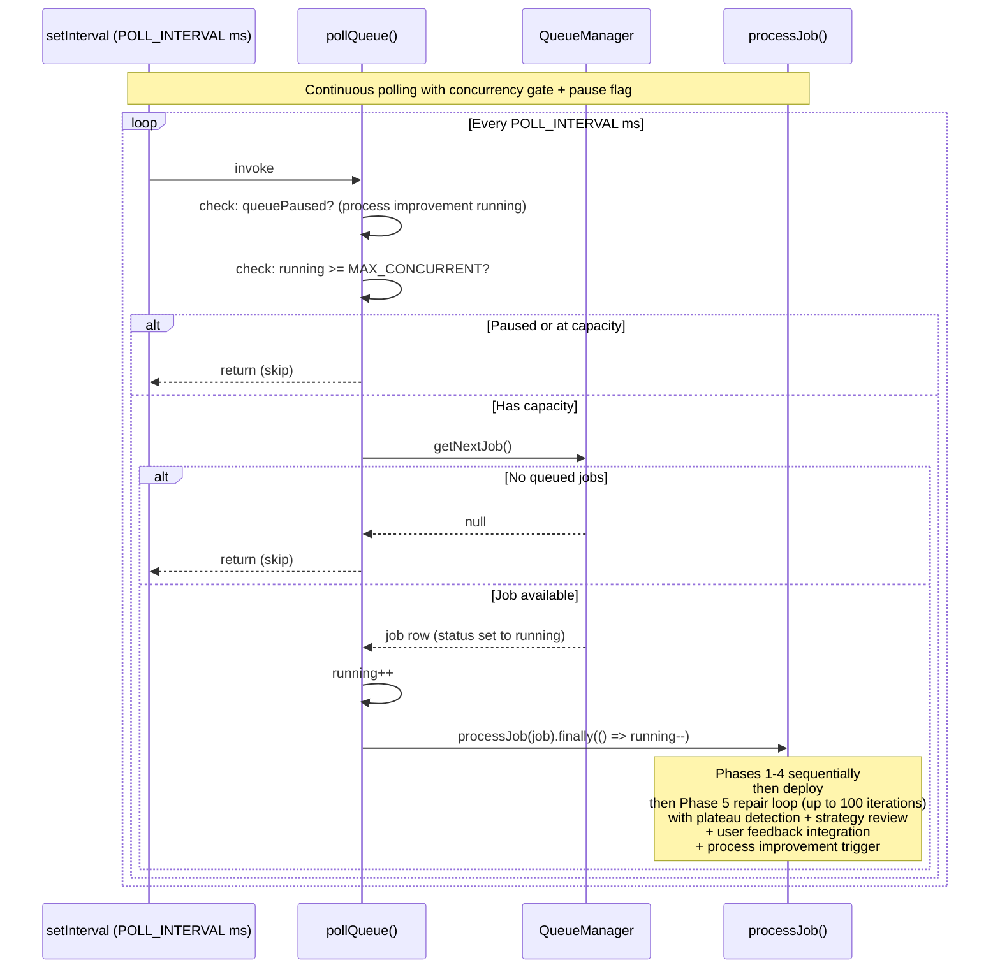

# Backend Boot Sequence

```mermaid
sequenceDiagram
    participant DC as Docker Compose
    participant PG as PostgreSQL :5432
    participant BE as Backend :3010
    participant EXP as Express App
    participant QM as QueueManager
    participant CM as ContainerManager
    participant DM as DeploymentManager

    Note over DC,DM: docker compose up -d

    DC->>PG: start postgres:15-alpine
    PG->>PG: init DB gamepocgen
    PG-->>DC: ready (pg_isready healthcheck)

    DC->>BE: start backend (depends_on: postgres)
    BE->>BE: import express pg Dockerode
    BE->>BE: import runPlaywrightTest from gameTester.js
    BE->>BE: define GENRE_SEEDS array (16 genre seeds)
    BE->>BE: parse env: PORT=3000 MAX_CONCURRENT=5 POLL_INTERVAL=5000

    BE->>QM: new QueueManager(pool)
    BE->>QM: queueManager.init()
    QM->>PG: CREATE TABLE IF NOT EXISTS jobs (...)
    QM->>PG: ALTER TABLE ADD COLUMN IF NOT EXISTS user_feedback
    QM->>PG: CREATE TABLE IF NOT EXISTS job_logs (...)
    PG-->>QM: tables ready

    BE->>CM: new ContainerManager(docker, {workspacePath, hostWorkspacePath, hostProjectRoot})
    BE->>DM: new DeploymentManager({deployDir, hostDeployDir, galleryDataPath, domain, docker})

    BE->>EXP: app.use(cors())
    BE->>EXP: app.use(express.json())
    BE->>EXP: const router = await createRouter({qm, cm, dm})
    Note over EXP: asyncHandler wraps all 10 routes with .catch(next)
    BE->>EXP: app.use('/api', router)
    BE->>EXP: app.get('/health', ...)
    BE->>EXP: app.use(globalErrorHandler)

    BE->>BE: Setup queue pause/resume (globalThis._pauseQueue/_resumeQueue)
    BE->>BE: Setup maybeRunProcessImprovement (globalThis._maybeRunProcessImprovement)
    BE->>BE: setInterval(pollQueue, POLL_INTERVAL)
    BE->>EXP: app.listen(PORT)
    EXP-->>DC: Backend ready on :3010
```

# Docs + Gallery Boot

```mermaid
sequenceDiagram
    participant DC as Docker Compose
    participant NG as nginx:alpine
    participant TF as Traefik

    Note over DC,TF: docs/docker-compose up -d

    DC->>NG: start nginx container
    NG->>NG: mount volumes :ro
    Note over NG: index.html -> /usr/share/nginx/html/<br/>gallery/index.html -> .../gallery/<br/>gallery/gallery.js -> .../gallery/

    NG-->>TF: Docker labels discovered
    Note over TF: Router: gamepocgen-docs<br/>Rule: Host(gamepocgen.namjo-games.com)<br/>Priority: 1

    TF->>TF: Provision Let's Encrypt cert
    TF-->>NG: Route traffic
```

# Worker Container Boot

```mermaid
sequenceDiagram
    participant CM as ContainerManager
    participant Docker
    participant Worker as Worker Container
    participant Entry as entrypoint.sh
    participant Claude as Claude Code CLI

    Note over CM,Claude: Per-phase container lifecycle

    CM->>Docker: createContainer(gamepocgen-worker)
    Note over Docker: Env: PHASE JOB_ID GAME_NAME<br/>ZAI_API_KEY ZAI_BASE_URL MODEL<br/>CLAUDE_CODE_EFFORT_LEVEL=high<br/>WORKSPACE_DIR TIMEOUT_SECONDS<br/>+ extraEnv (AUTH_MODE, OAUTH tokens, GENRE_SEED, etc.)
    Note over Docker: HostConfig:<br/>  Memory: 2GB<br/>  NanoCpus: 0.5e9 (0.5 cores)<br/>  Binds: [hostWorkspace:/workspace,<br/>  hostProjectRoot/prompts:/home/claude/prompts,<br/>  hostProjectRoot/framework:/home/claude/framework]

    CM->>Docker: container.start()
    Docker->>Worker: tini -> entrypoint.sh

    Worker->>Entry: validate required env vars (PHASE, JOB_ID, GAME_NAME)
    Entry->>Entry: determine AUTH_MODE (apikey or subscription)
    Entry->>Entry: mkdir -p $WORKSPACE_DIR $STATUS_DIR /home/claude/.claude

    alt AUTH_MODE = apikey (default, z.ai)
        Entry->>Entry: export ANTHROPIC_AUTH_TOKEN=$ZAI_API_KEY
        Entry->>Entry: export ANTHROPIC_BASE_URL=$ZAI_BASE_URL
        Entry->>Entry: write settings.json with API key env vars
        Entry->>Entry: rm -f .credentials.json
    else AUTH_MODE = subscription (OAuth)
        Entry->>Entry: write .credentials.json with OAuth tokens
        Entry->>Entry: define refresh_oauth_token() function
        Entry->>Entry: write settings.json without API key overrides
    end

    Entry->>Entry: write ~/.claude.json (skip onboarding)
    Entry->>Entry: git config --global safe.directory
    Entry->>Entry: git init workspace (if needed)
    Entry->>Entry: cp -rn framework/* to workspace (ALL phases)
    Entry->>Entry: write status/{phase}.json = running

    Entry->>Entry: run_claude() helper: refresh token if subscription mode

    Entry->>Claude: timeout TIMEOUT_SECONDS claude -p --dangerously-skip-permissions --verbose -- "prompt"
    Note over Claude: --dangerously-skip-permissions on ALL phases
    Claude-->>Entry: exit code

    Entry->>Entry: write status/{phase}.json = completed|failed|timeout
    Worker-->>Docker: container exits
```

# Worker Auth Modes

```mermaid
graph TD
    subgraph "entrypoint.sh Auth Configuration"
        CHECK{"AUTH_MODE?"}

        subgraph "apikey mode (default)"
            AK1["export ANTHROPIC_AUTH_TOKEN=$ZAI_API_KEY"]
            AK2["export ANTHROPIC_BASE_URL=$ZAI_BASE_URL"]
            AK3["settings.json includes API key env vars"]
            AK4["rm -f .credentials.json"]
        end

        subgraph "subscription mode (OAuth)"
            SUB1["Write .credentials.json with:\naccessToken, refreshToken, expiresAt\nscopes, subscriptionType: max\nrateLimitTier: default_claude_max_20x"]
            SUB2["Define refresh_oauth_token() function:\ncurl POST console.anthropic.com/v1/oauth/token\nParse response, update .credentials.json"]
            SUB3["settings.json without API key overrides"]
            SUB4["Token refresh before each claude -p call"]
        end

        CHECK -->|"apikey"| AK1
        AK1 --> AK2 --> AK3 --> AK4

        CHECK -->|"subscription"| SUB1
        SUB1 --> SUB2 --> SUB3 --> SUB4
    end
```

# Phase 2 Sub-Agents

```mermaid
graph LR
    subgraph "Phase 2: 3 Sequential GDD Agents"
        A1["currencies\nphase2-gdd/currencies.md"]
        A2["progression\nphase2-gdd/progression.md"]
        A3["ui-ux\nphase2-gdd/ui-ux.md"]

        A1 -->|"sequential"| A2
        A2 -->|"sequential"| A3
    end

    NOTE["Each agent reads prior GDD sections\nfrom workspace/gdd/ for context"]
```

# Job Polling Loop

```mermaid
sequenceDiagram
    participant Timer as setInterval (POLL_INTERVAL ms)
    participant Poller as pollQueue()
    participant QM as QueueManager
    participant Process as processJob()

    Note over Timer,Process: Continuous polling with concurrency gate + pause flag

    loop Every POLL_INTERVAL ms
        Timer->>Poller: invoke
        Poller->>Poller: check: queuePaused? (process improvement running)
        Poller->>Poller: check: running >= MAX_CONCURRENT?
        alt Paused or at capacity
            Poller-->>Timer: return (skip)
        else Has capacity
            Poller->>QM: getNextJob()
            alt No queued jobs
                QM-->>Poller: null
                Poller-->>Timer: return (skip)
            else Job available
                QM-->>Poller: job row (status set to running)
                Poller->>Poller: running++
                Poller->>Process: processJob(job).finally(() => running--)
                Note over Process: Phases 1-4 sequentially<br/>then deploy<br/>then Phase 5 repair loop (up to 100 iterations)<br/>with plateau detection + strategy review<br/>+ user feedback integration<br/>+ process improvement trigger
            end
        end
    end
```
