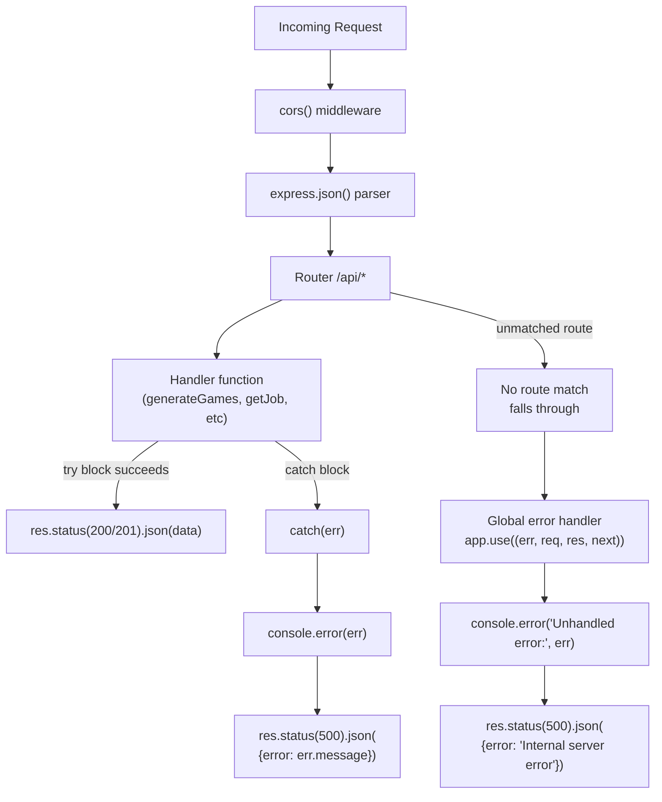
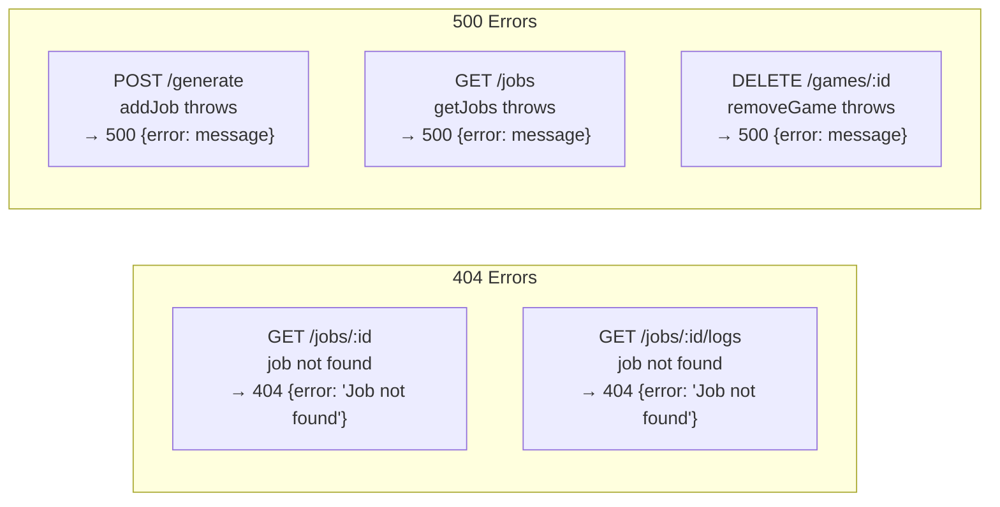
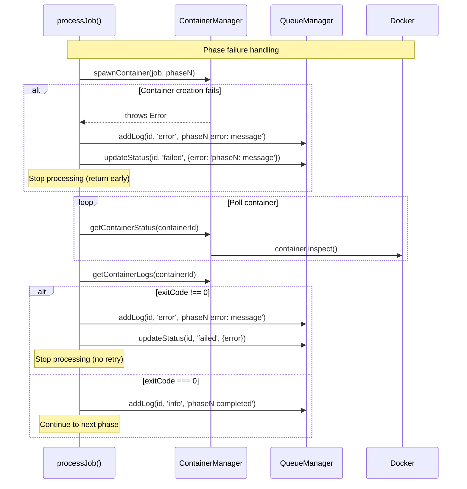
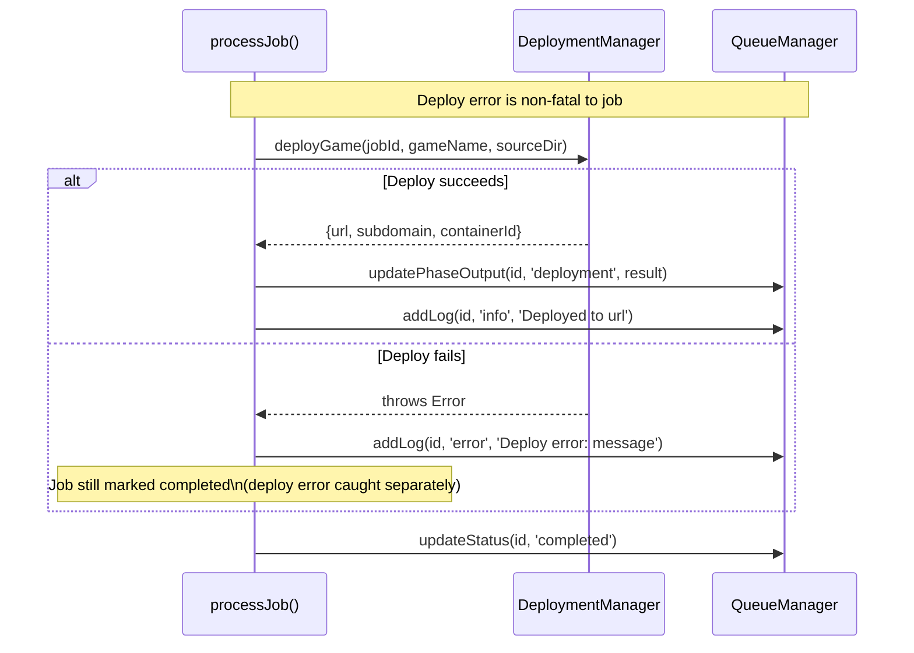
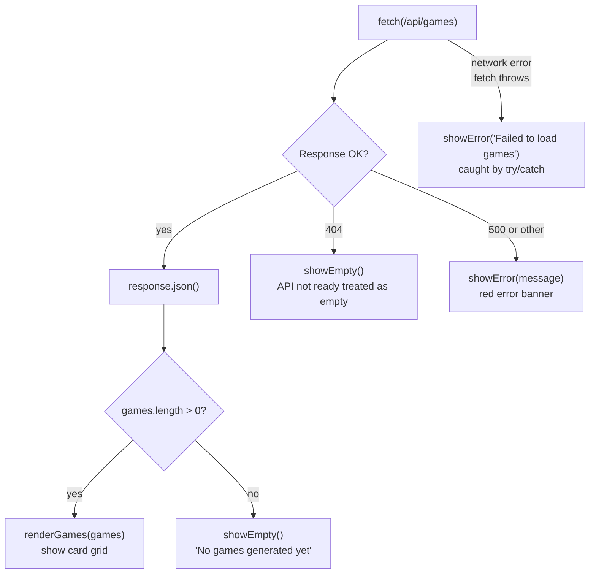

# API Error Flow

```mermaid
graph TD
    REQ["Incoming Request"] --> CORS["cors() middleware"]
    CORS --> JSON["express.json() parser"]
    JSON --> ROUTER["Router /api/*"]

    ROUTER --> HANDLER["Handler function\n(generateGames, getJob, etc)"]

    HANDLER -->|"try block succeeds"| SUCCESS["res.status(200/201).json(data)"]
    HANDLER -->|"catch block"| CATCH["catch(err)"]
    CATCH --> LOG["console.error(err)"]
    LOG --> ERR500["res.status(500).json(\n{error: err.message})"]

    ROUTER -->|"unmatched route"| MISS["No route match\nfalls through"]

    MISS --> GLOBAL["Global error handler\napp.use((err, req, res, next))"]
    GLOBAL --> LOG2["console.error('Unhandled error:', err)"]
    LOG2 --> ERR500_2["res.status(500).json(\n{error: 'Internal server error'})"]
```

# Specific API Error Responses

```mermaid
graph LR
    subgraph "404 Errors"
        JOB_404["GET /jobs/:id\njob not found\n→ 404 {error: 'Job not found'}"]
        LOG_404["GET /jobs/:id/logs\njob not found\n→ 404 {error: 'Job not found'}"]
    end

    subgraph "500 Errors"
        GEN_500["POST /generate\naddJob throws\n→ 500 {error: message}"]
        LIST_500["GET /jobs\ngetJobs throws\n→ 500 {error: message}"]
        DEL_500["DELETE /games/:id\nremoveGame throws\n→ 500 {error: message}"]
    end
```

# Job Processing Error Flow

```mermaid
sequenceDiagram
    participant Poller as processJob()
    participant CM as ContainerManager
    participant QM as QueueManager
    participant Docker

    Note over Poller,Docker: Phase failure handling

    Poller->>CM: spawnContainer(job, phaseN)

    alt Container creation fails
        CM-->>Poller: throws Error
        Poller->>QM: addLog(id, 'error', 'phaseN error: message')
        Poller->>QM: updateStatus(id, 'failed', {error: 'phaseN: message'})
        Note over Poller: Stop processing (return early)
    end

    loop Poll container
        Poller->>CM: getContainerStatus(containerId)
        CM->>Docker: container.inspect()
    end

    Poller->>CM: getContainerLogs(containerId)

    alt exitCode !== 0
        Poller->>QM: addLog(id, 'error', 'phaseN error: message')
        Poller->>QM: updateStatus(id, 'failed', {error})
        Note over Poller: Stop processing (no retry)
    else exitCode === 0
        Poller->>QM: addLog(id, 'info', 'phaseN completed')
        Note over Poller: Continue to next phase
    end
```

# Deployment Error Handling

```mermaid
sequenceDiagram
    participant Poller as processJob()
    participant DM as DeploymentManager
    participant QM as QueueManager

    Note over Poller,QM: Deploy error is non-fatal to job

    Poller->>DM: deployGame(jobId, gameName, sourceDir)
    alt Deploy succeeds
        DM-->>Poller: {url, subdomain, containerId}
        Poller->>QM: updatePhaseOutput(id, 'deployment', result)
        Poller->>QM: addLog(id, 'info', 'Deployed to url')
    else Deploy fails
        DM-->>Poller: throws Error
        Poller->>QM: addLog(id, 'error', 'Deploy error: message')
        Note over Poller: Job still marked completed\n(deploy error caught separately)
    end

    Poller->>QM: updateStatus(id, 'completed')
```

# Gallery Error States

```mermaid
graph TD
    FETCH["fetch(/api/games)"] --> CHECK{Response OK?}

    CHECK -->|"yes"| PARSE["response.json()"]
    PARSE --> GAMES{games.length > 0?}
    GAMES -->|"yes"| RENDER["renderGames(games)\nshow card grid"]
    GAMES -->|"no"| EMPTY["showEmpty()\n'No games generated yet'"]

    CHECK -->|"404"| EMPTY2["showEmpty()\nAPI not ready treated as empty"]
    CHECK -->|"500 or other"| ERROR["showError(message)\nred error banner"]

    FETCH -->|"network error\nfetch throws"| ERROR2["showError('Failed to load games')\ncaught by try/catch"]
```
