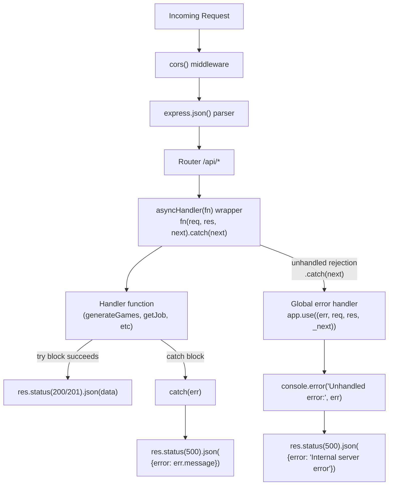
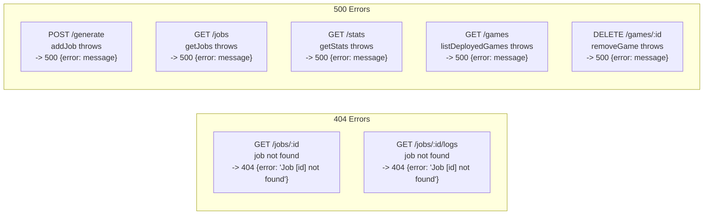
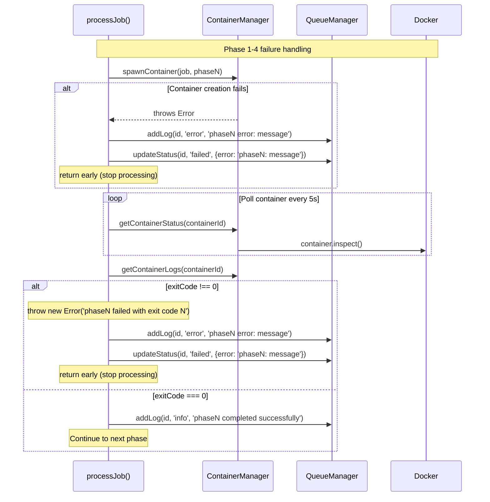
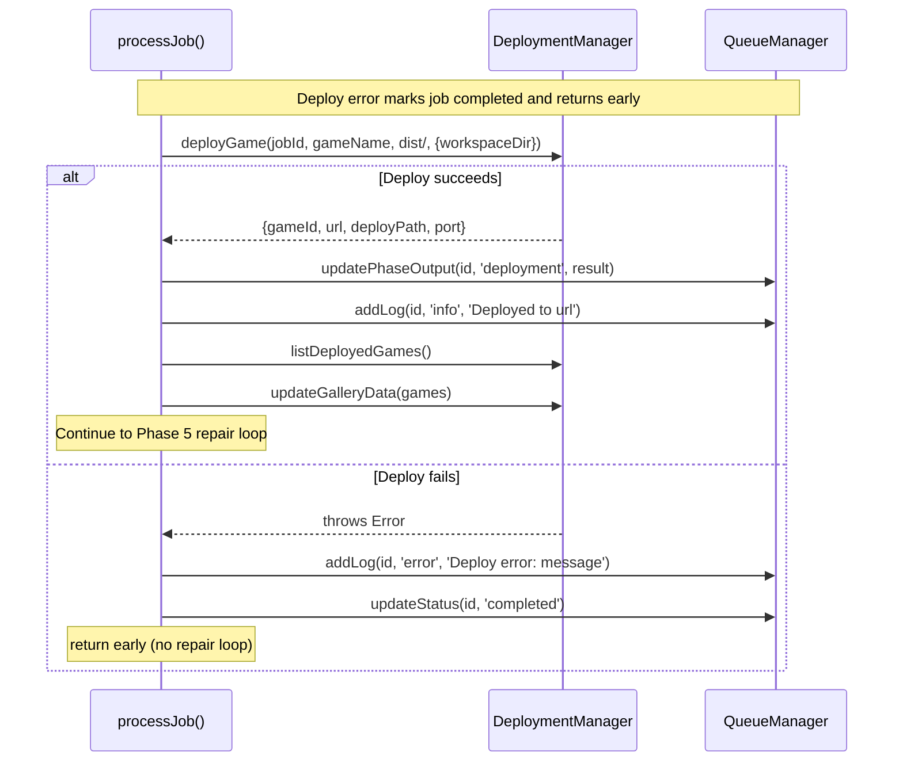
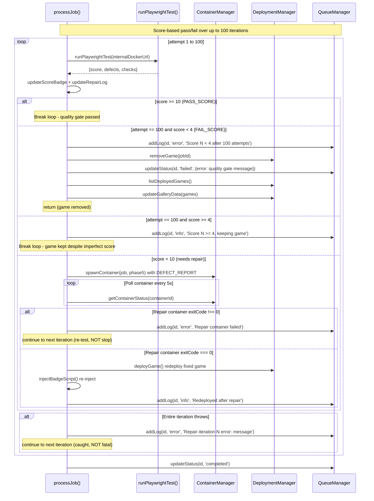
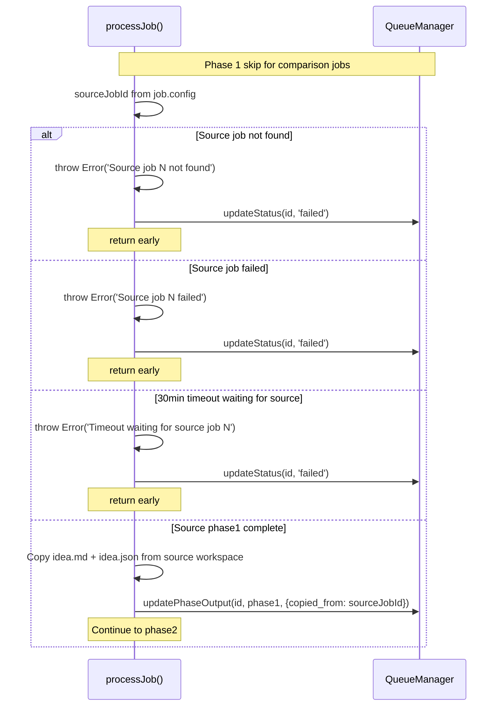
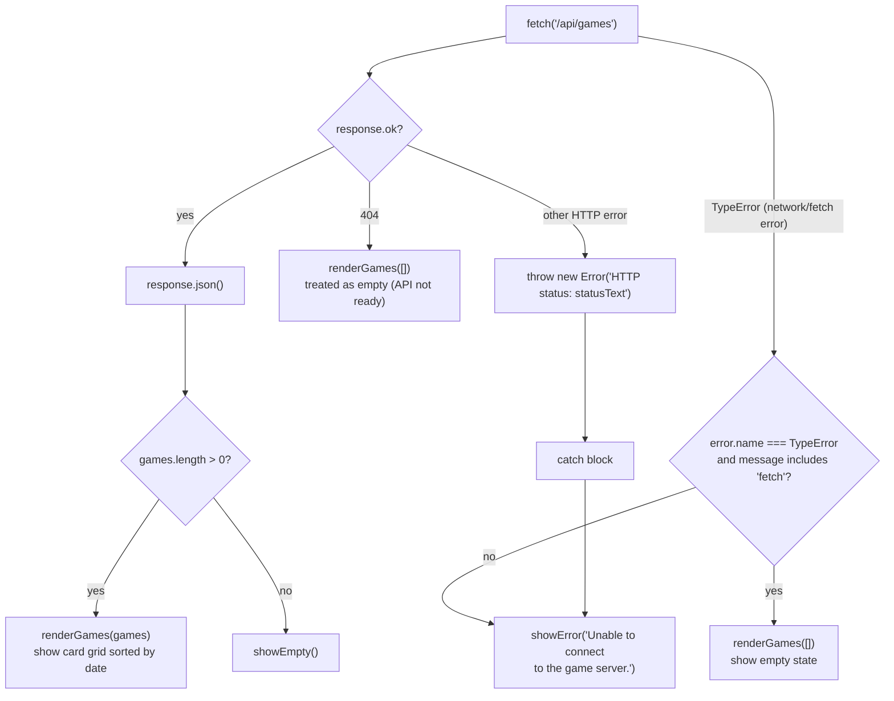
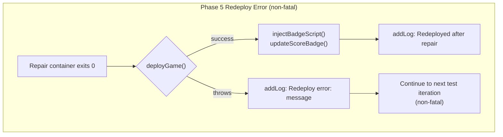
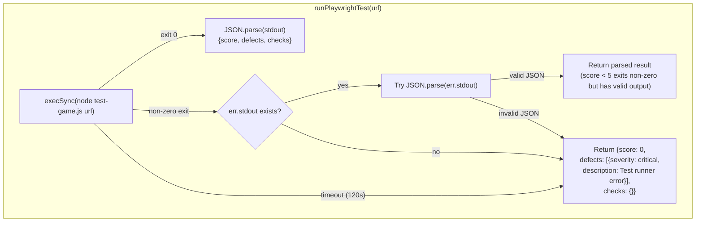

# API Error Flow

# Specific API Error Responses

# Job Processing Error Flow (Phases 1-4)

# Deployment Error Handling

# Phase 5 Repair Loop Error Handling

# Comparison Job Error Handling

# Gallery Error States

# Redeploy After Repair Error

# gameTester.js Error Handling

