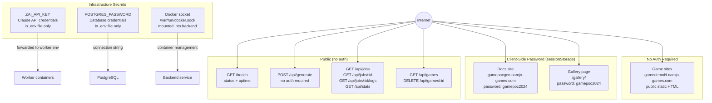
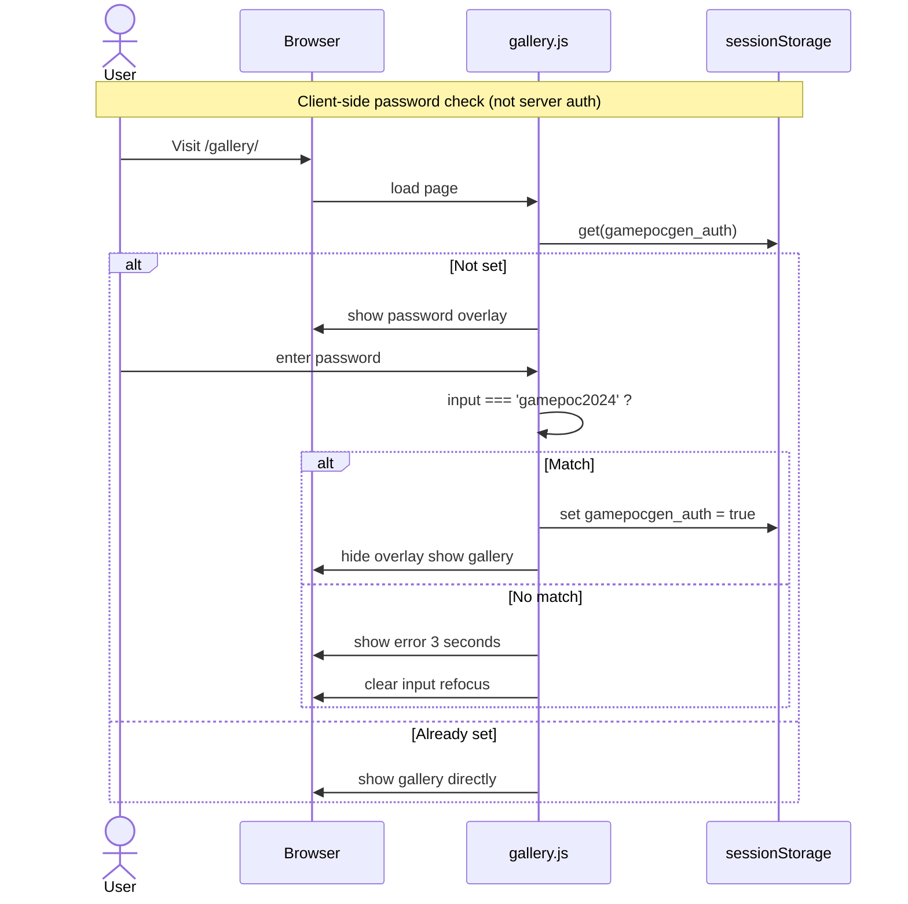
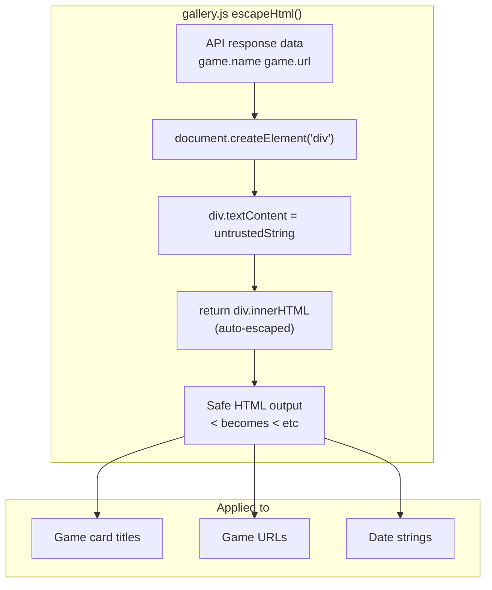
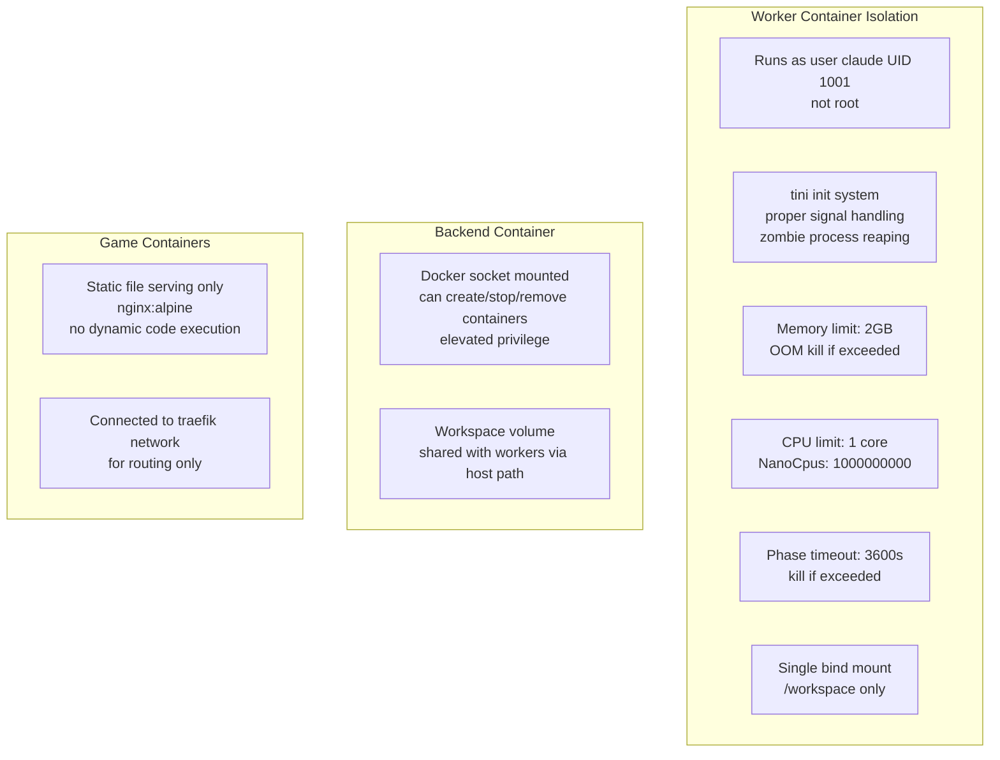
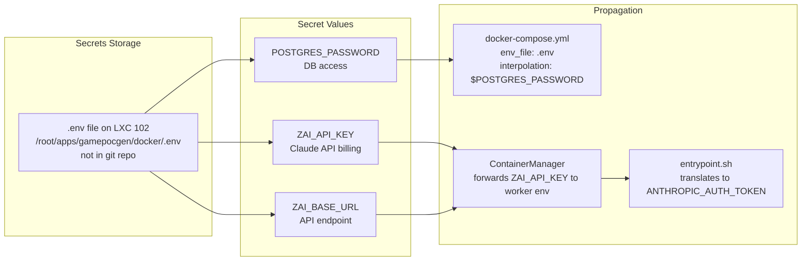

# Security Boundaries

```mermaid
graph TB
    subgraph "Public (no auth)"
        HEALTH["GET /health\nstatus + uptime"]
        GENERATE["POST /api/generate\nno auth required"]
        JOBS["GET /api/jobs\nGET /api/jobs/:id\nGET /api/jobs/:id/logs\nGET /api/stats"]
        GAMES["GET /api/games\nDELETE /api/games/:id"]
    end

    subgraph "Client-Side Password (sessionStorage)"
        DOCS["Docs site\ngamepocgen.namjo-games.com\npassword: gamepoc2024"]
        GALLERY["Gallery page\n/gallery/\npassword: gamepoc2024"]
    end

    subgraph "No Auth Required"
        GAME_SITES["Game sites\ngamedemoN.namjo-games.com\npublic static HTML"]
    end

    subgraph "Infrastructure Secrets"
        ZAI["ZAI_API_KEY\nClaude API credentials\nin .env file only"]
        PG_CRED["POSTGRES_PASSWORD\nDatabase credentials\nin .env file only"]
        DOCKER_SOCK["Docker socket\n/var/run/docker.sock\nmounted into backend"]
    end

    REQ((Internet)) --> HEALTH
    REQ --> GENERATE
    REQ --> JOBS
    REQ --> GAMES
    REQ --> DOCS
    REQ --> GALLERY
    REQ --> GAME_SITES

    ZAI -->|"forwarded to worker env"| WORKER["Worker containers"]
    PG_CRED -->|"connection string"| DB["PostgreSQL"]
    DOCKER_SOCK -->|"container management"| BACKEND["Backend service"]
```

# Authentication Flow

```mermaid
sequenceDiagram
    actor User
    participant Browser
    participant Gallery as gallery.js
    participant Session as sessionStorage

    Note over User,Session: Client-side password check (not server auth)

    User->>Browser: Visit /gallery/
    Browser->>Gallery: load page
    Gallery->>Session: get(gamepocgen_auth)

    alt Not set
        Gallery->>Browser: show password overlay
        User->>Gallery: enter password
        Gallery->>Gallery: input === 'gamepoc2024' ?
        alt Match
            Gallery->>Session: set gamepocgen_auth = true
            Gallery->>Browser: hide overlay show gallery
        else No match
            Gallery->>Browser: show error 3 seconds
            Gallery->>Browser: clear input refocus
        end
    else Already set
        Gallery->>Browser: show gallery directly
    end
```

# XSS Prevention

```mermaid
graph TD
    subgraph "gallery.js escapeHtml()"
        INPUT["API response data\ngame.name game.url"] --> CREATE["document.createElement('div')"]
        CREATE --> SET["div.textContent = untrustedString"]
        SET --> READ["return div.innerHTML\n(auto-escaped)"]
        READ --> SAFE["Safe HTML output\n< becomes &lt; etc"]
    end

    subgraph "Applied to"
        CARD_TITLE["Game card titles"]
        CARD_URL["Game URLs"]
        CARD_DATE["Date strings"]
    end

    SAFE --> CARD_TITLE
    SAFE --> CARD_URL
    SAFE --> CARD_DATE
```

# Container Security

```mermaid
graph TD
    subgraph "Worker Container Isolation"
        NONROOT["Runs as user claude UID 1001\nnot root"]
        TINI["tini init system\nproper signal handling\nzombie process reaping"]
        MEM["Memory limit: 2GB\nOOM kill if exceeded"]
        CPU["CPU limit: 1 core\nNanoCpus: 1000000000"]
        TIMEOUT["Phase timeout: 3600s\nkill if exceeded"]
        BIND["Single bind mount\n/workspace only"]
    end

    subgraph "Backend Container"
        SOCK["Docker socket mounted\ncan create/stop/remove containers\nelevated privilege"]
        WS_VOL["Workspace volume\nshared with workers via host path"]
    end

    subgraph "Game Containers"
        READONLY["Static file serving only\nnginx:alpine\nno dynamic code execution"]
        TRAEFIK_NET["Connected to traefik network\nfor routing only"]
    end
```

# Secret Management

```mermaid
graph LR
    subgraph "Secrets Storage"
        DOTENV[".env file on LXC 102\n/root/apps/gamepocgen/docker/.env\nnot in git repo"]
    end

    subgraph "Secret Values"
        PG["POSTGRES_PASSWORD\nDB access"]
        ZAI2["ZAI_API_KEY\nClaude API billing"]
        ZAI_B["ZAI_BASE_URL\nAPI endpoint"]
    end

    subgraph "Propagation"
        DC2["docker-compose.yml\nenv_file: .env\ninterpolation: $POSTGRES_PASSWORD"]
        CM3["ContainerManager\nforwards ZAI_API_KEY to worker env"]
        ENTRY2["entrypoint.sh\ntranslates to ANTHROPIC_AUTH_TOKEN"]
    end

    DOTENV --> PG
    DOTENV --> ZAI2
    DOTENV --> ZAI_B
    PG --> DC2
    ZAI2 --> CM3
    ZAI_B --> CM3
    CM3 --> ENTRY2
```
