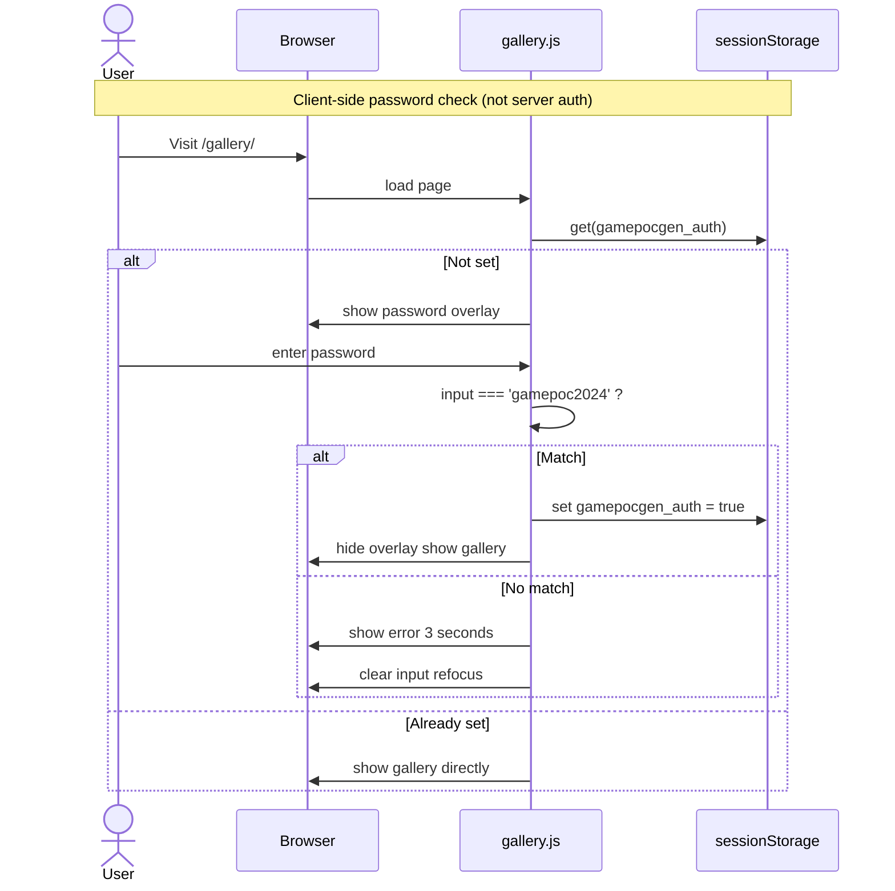
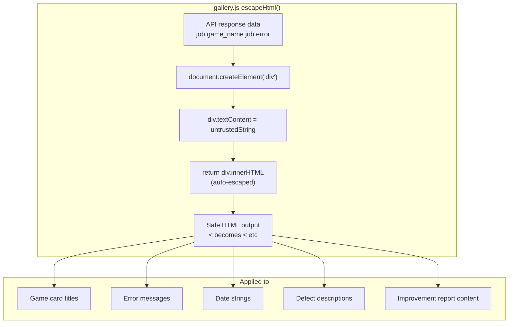
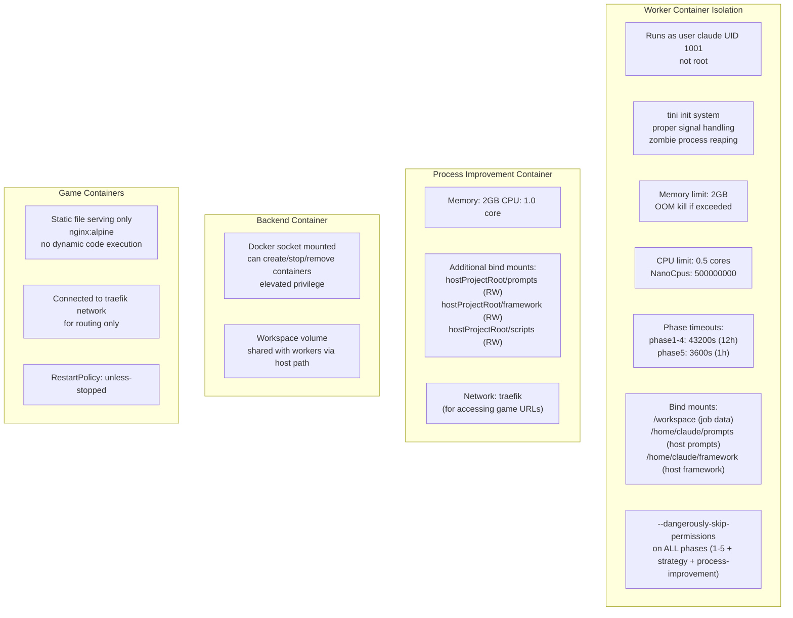
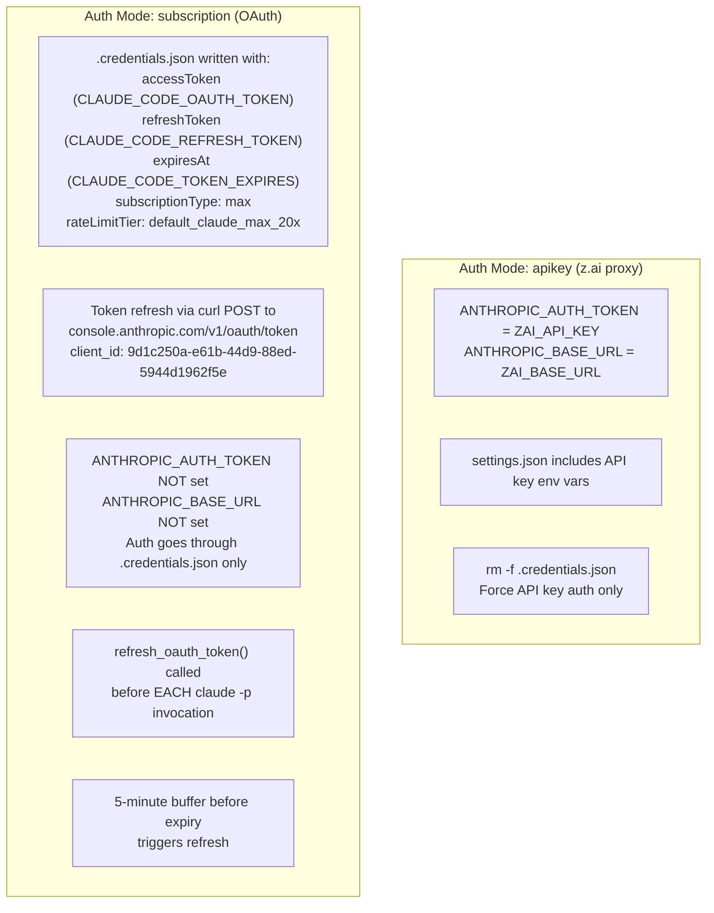
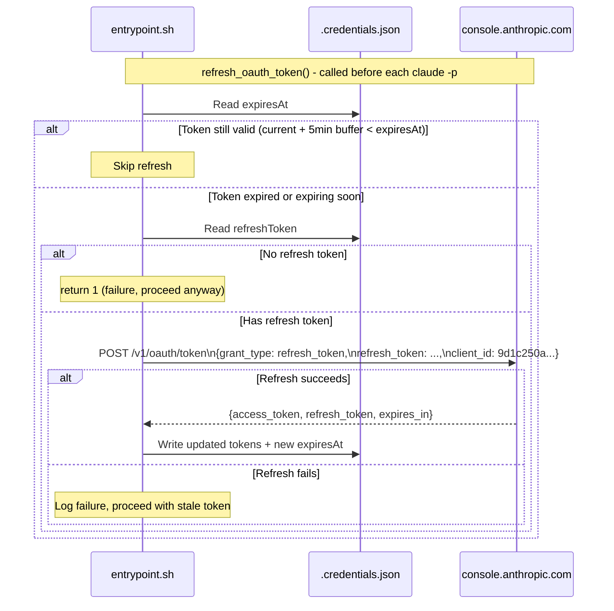
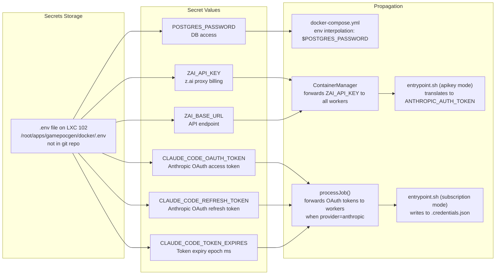
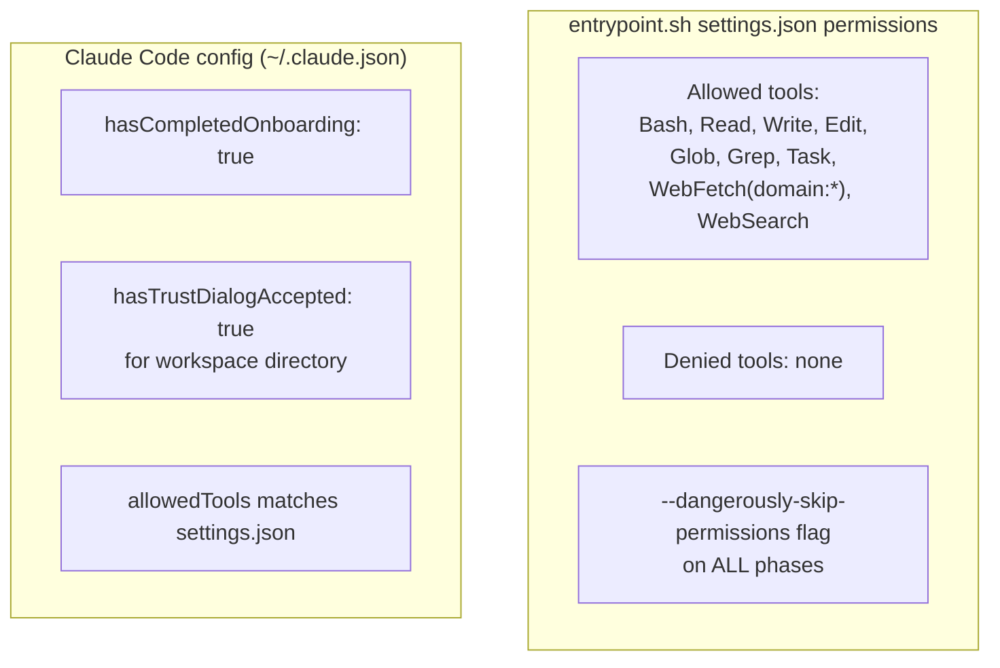

# Security Boundaries

```mermaid
graph TB
    subgraph "Public (no auth)"
        HEALTH["GET /health\nstatus + uptime"]
        GENERATE["POST /api/generate\nno auth required"]
        JOBS["GET /api/jobs\nGET /api/jobs/:id\nGET /api/jobs/:id/logs\nGET /api/stats"]
        GAMES["GET /api/games\nDELETE /api/games/:id"]
        FEEDBACK["POST /api/jobs/:id/feedback"]
        IMPROVEMENTS["POST /api/improvements/run\nGET /api/improvements"]
    end

    subgraph "Client-Side Password (sessionStorage)"
        GALLERY["Gallery page\n/gallery/\npassword: gamepoc2024"]
    end

    subgraph "No Auth Required"
        GAME_SITES["Game sites\ngamedemoN.namjo-games.com\npublic static HTML"]
    end

    subgraph "Infrastructure Secrets"
        ZAI["ZAI_API_KEY\nz.ai proxy API credentials"]
        OAUTH["CLAUDE_CODE_OAUTH_TOKEN\nCLAUDE_CODE_REFRESH_TOKEN\nCLAUDE_CODE_TOKEN_EXPIRES\nAnthropic OAuth credentials"]
        PG_CRED["POSTGRES_PASSWORD\nDatabase credentials"]
        DOCKER_SOCK["Docker socket\n/var/run/docker.sock\nmounted into backend"]
    end

    REQ((Internet)) --> HEALTH
    REQ --> GENERATE
    REQ --> JOBS
    REQ --> GAMES
    REQ --> FEEDBACK
    REQ --> IMPROVEMENTS
    REQ --> GALLERY
    REQ --> GAME_SITES

    ZAI -->|"forwarded to worker env\n(apikey mode)"| WORKER["Worker containers"]
    OAUTH -->|"forwarded to worker env\n(subscription mode)"| WORKER
    PG_CRED -->|"connection string"| DB["PostgreSQL"]
    DOCKER_SOCK -->|"container management"| BACKEND["Backend service"]
```

# Authentication Flow

# XSS Prevention

# Container Security

# Worker Auth Mode Security

# OAuth Token Refresh Flow

# Secret Management

# Claude Code Permissions in Workers

# Container Name Collision Prevention

```mermaid
graph TD
    subgraph "ContainerManager.spawnContainer()"
        NAME["containerName = gamepocgen-worker-{jobId}-{phase}"]
        NAME --> CHECK["Try docker.getContainer(name)"]
        CHECK -->|"exists"| REMOVE["container.remove({force: true})"]
        REMOVE --> CREATE["docker.createContainer()"]
        CHECK -->|"not found"| CREATE
    end

    subgraph "DeploymentManager._startGameContainer()"
        GNAME["containerName = gamedemo{gameId}"]
        GNAME --> GCHECK["Try docker.getContainer(name)"]
        GCHECK -->|"exists"| GSTOP["container.stop() then container.remove()"]
        GSTOP --> GCREATE["docker.createContainer()"]
        GCHECK -->|"not found"| GCREATE
    end

    subgraph "Process Improvement Container"
        PINAME["containerName = gamepocgen-process-improvement-{timestamp}"]
        PINAME --> PICREATE["docker.createContainer()\nUnique name via Date.now()"]
    end
```

