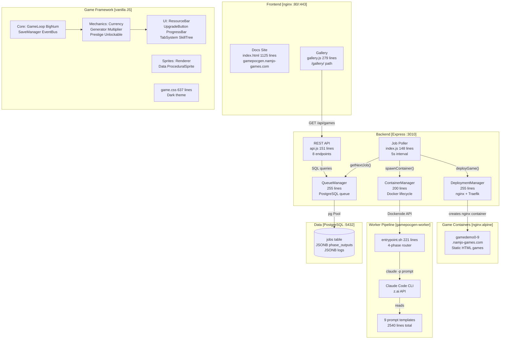
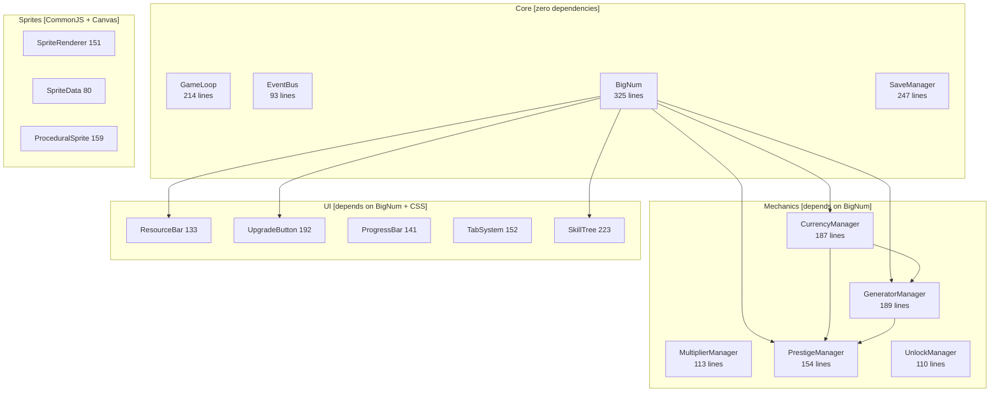
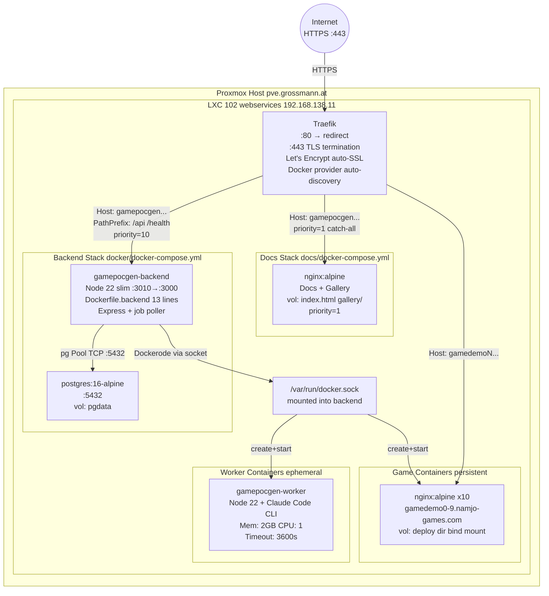
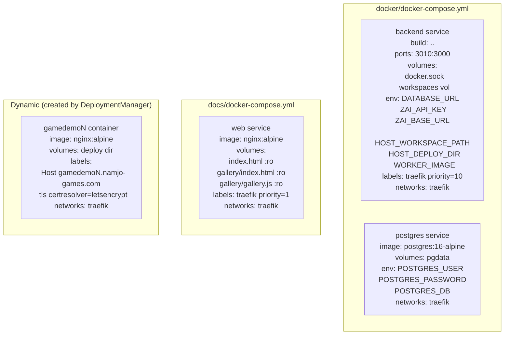
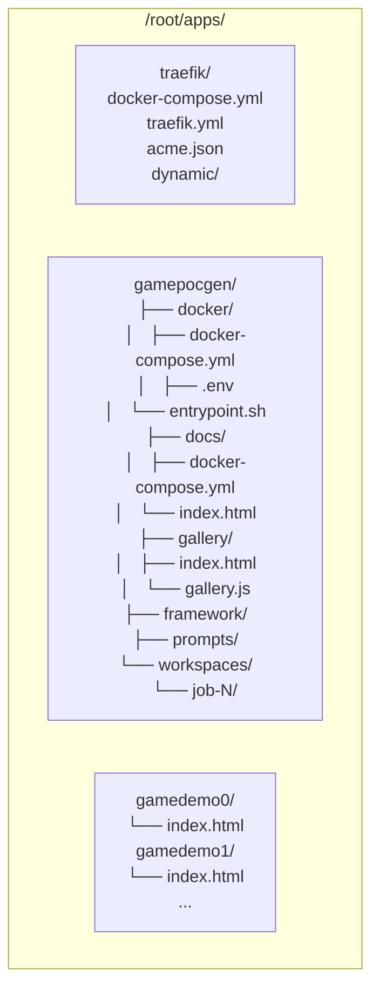
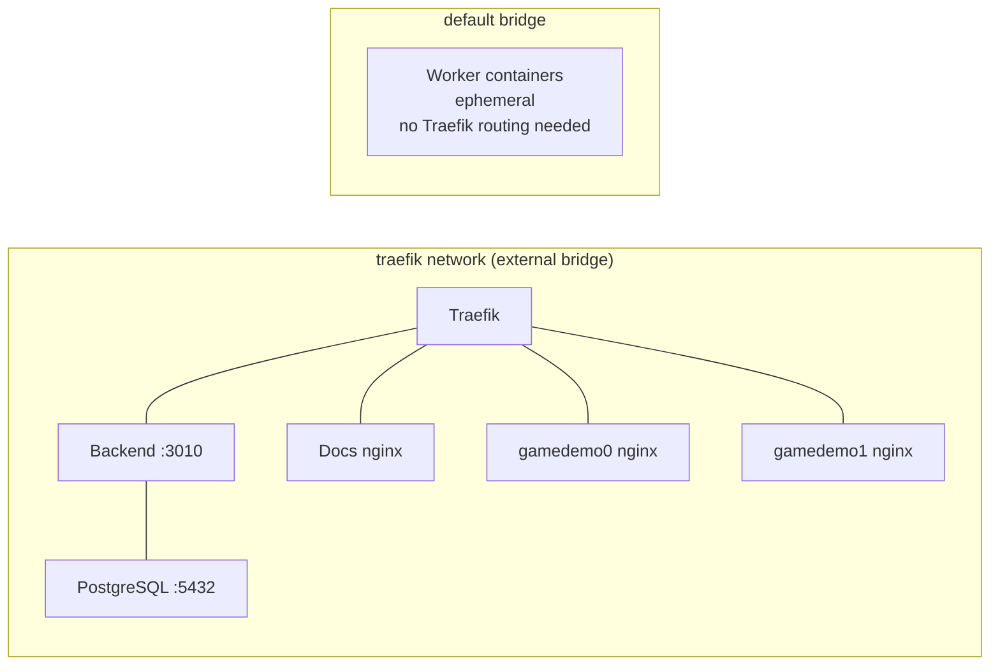
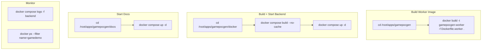

<!-- GENERATED:ARCHITECTURE -->

# System Architecture

# Framework Module Dependencies

---

# Infrastructure Topology

# Docker Compose Services

# Filesystem Layout LXC 102

# Docker Network

# Build and Deploy Commands

---

## Architecture Detail Reference

Detailed subsystem documentation lives in `AI/document/`. Read these on-demand when working on specific areas:

| File | Covers |
|------|--------|
| `AI/document/01-file-map.md` | Backend source files, test files, framework files, infrastructure files |
| `AI/document/02-user-flows.md` | Game generation submission, job polling, gallery auth, deployment flows |
| `AI/document/03-api-surface.md` | All REST API endpoints, request/response shapes, error codes |
| `AI/document/04-data-models.md` | Database schema, JSONB structures for phase_outputs and logs |
| `AI/document/05-data-pipelines.md` | 4-phase generation pipeline, workspace file accumulation, bind mount paths |
| `AI/document/06-state-lifecycle.md` | Job status transitions, worker container lifecycle, game container lifecycle |
| `AI/document/08-config.md` | Environment variables, config files, hardcoded values |
| `AI/document/09-boot-sequence.md` | Backend boot, docs/gallery boot, worker container boot, polling loop |
| `AI/document/10-error-handling.md` | API error flow, job processing errors, deployment errors, gallery errors |
| `AI/document/11-security.md` | Security boundaries, auth flow, XSS prevention, container isolation, secrets |
