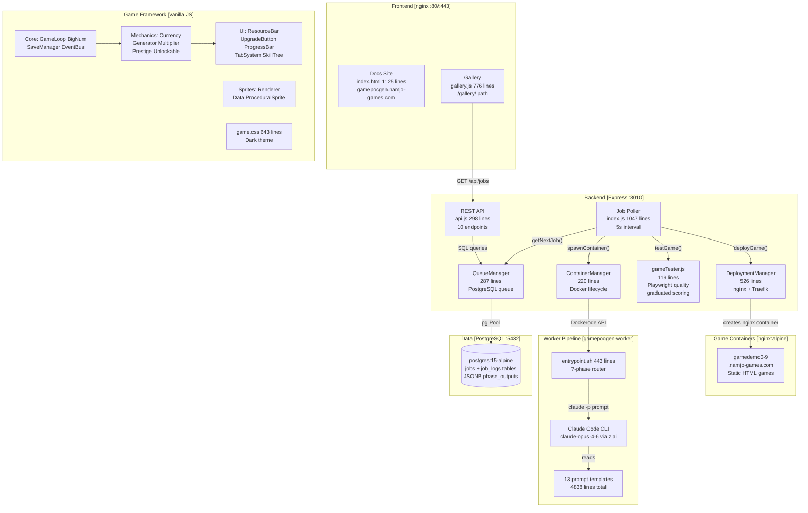
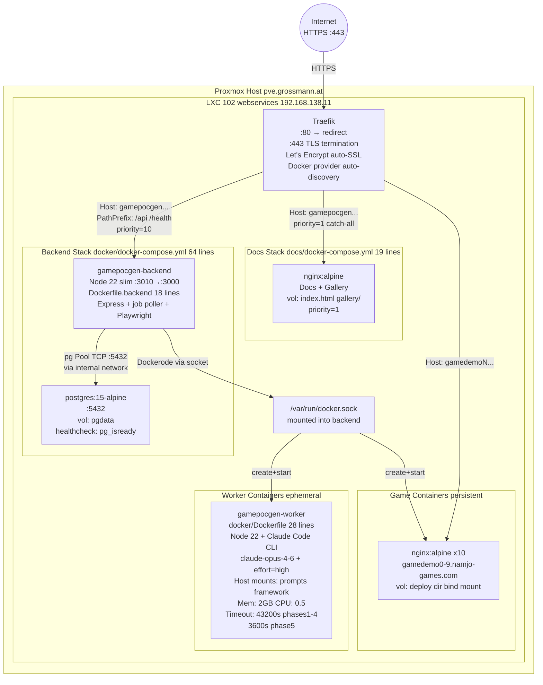
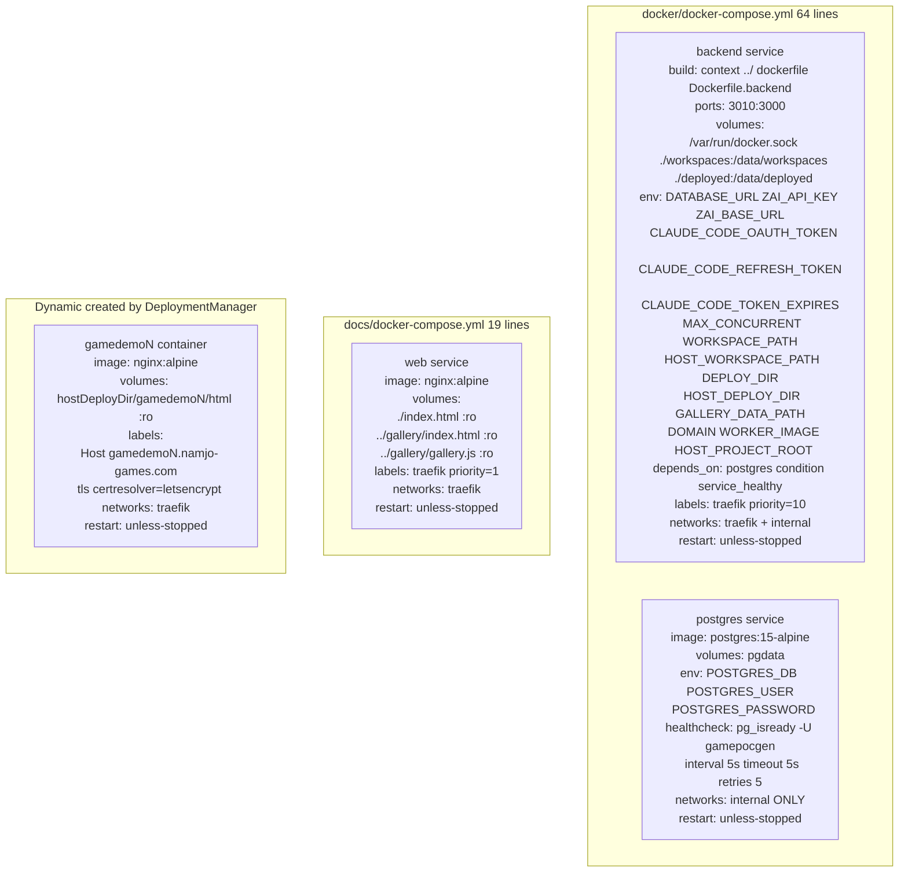
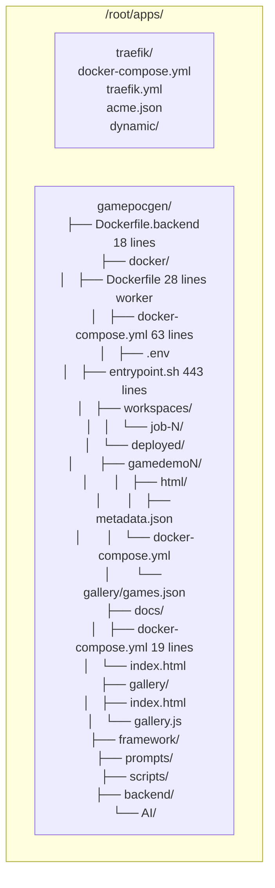
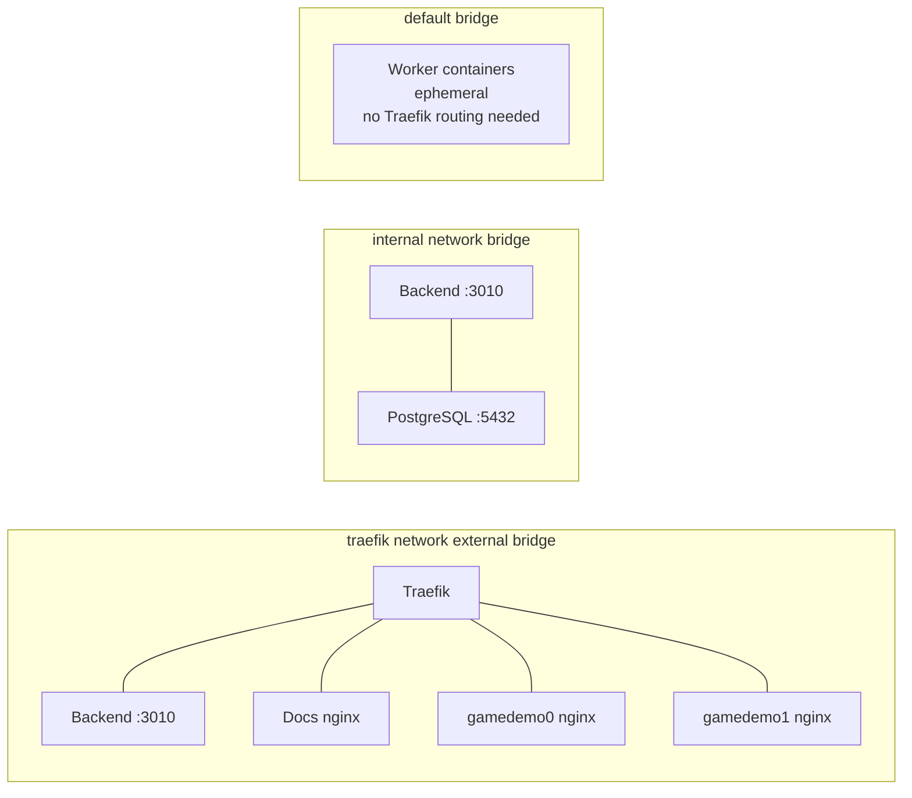
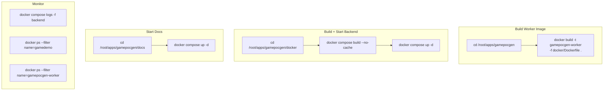

<!-- GENERATED:ARCHITECTURE -->

# System Architecture

# Framework Module Dependencies

---

# Infrastructure Topology

# Docker Compose Services

# Filesystem Layout LXC 102

# Docker Network

# Build and Deploy Commands

---

## Architecture Detail Reference

Detailed subsystem documentation lives in `AI/document/`. Read these on-demand when working on specific areas:

| File | Covers |
|------|--------|
| `AI/document/00-system-overview.md` | High-level system overview, component relationships, and design philosophy |
| `AI/document/01-file-map.md` | Every file's purpose, line count, and dependency graph |
| `AI/document/02-user-flows.md` | Job submission, polling, 5-phase execution, Phase 5 repair loop, gallery auth, deployment |
| `AI/document/03-api-surface.md` | All REST API endpoints, request/response shapes, error codes, comparison mode |
| `AI/document/04-data-models.md` | Database schema (jobs + job_logs tables), JSONB structures, SQL operations |
| `AI/document/05-data-pipelines.md` | 5-phase generation pipeline, workspace accumulation, bind mount paths, env translation |
| `AI/document/06-state-lifecycle.md` | Job status transitions (queued/running/phase_1-5/completed/failed), container lifecycles |
| `AI/document/07-deployment.md` | Deployment flow, nginx container creation, Traefik label routing, game URL assignment |
| `AI/document/08-config.md` | Environment variables, config files, hardcoded values, container resource limits |
| `AI/document/09-boot-sequence.md` | Backend boot, worker boot (apikey vs OAuth), polling loop, Phase 5 repair loop |
| `AI/document/10-error-handling.md` | API errors, job processing errors, Phase 5 repair errors, gallery error states |
| `AI/document/11-security.md` | Security boundaries, OAuth flow, container isolation, secret management |
